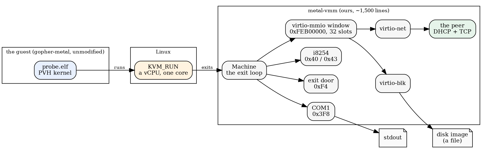
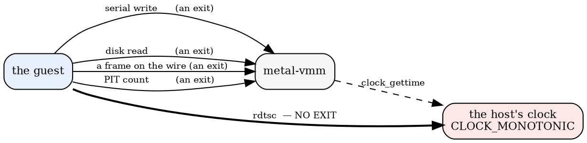
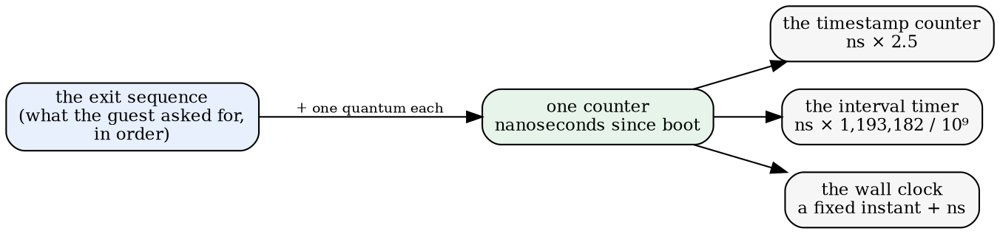
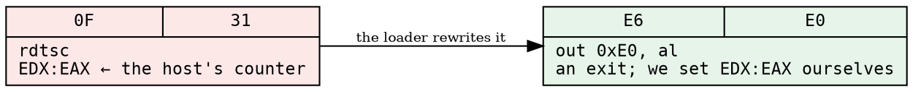

# A hypervisor, and the one input it does not own

*2026-09-18 — metal-vmm, four milestones in; then the fifth, which was the
point of the other four*

Four days ago the question was whether to rent a bare-metal box. The answer was
no, and the reason was a good one: the thing we wanted from bare metal — a
machine that does only what we tell it — is not actually a property of owning
the hardware. A rented machine still has firmware, a management processor, a
network card with its own operating system, and a data centre's idea of what
time it is. What we wanted was **a machine whose every input we can name**, and
that is easier to build than to rent.

So: `metal-vmm`. A virtual machine monitor of our own, aimed at exactly one
kind of guest — gopher-metal's kernels, which poll, run on one core, and take
their clock as an argument.

## Where it stands



Everything in the third box is ours. The guest boots, sizes its heaps from a
memory map we hand it, prints through a serial port we implement, reads and
writes a disk through a block device we implement, gets a DHCP lease from a
server that is three hundred lines in `peer.zig`, and serves an HTTP request
to a TCP client that is three hundred more. Then it exits through a door at
port 0xF4 and its exit code becomes ours.

Milestone by milestone, that took four sittings:

| | |
|---|---|
| **1. wake it up** | PVH boot, 32-bit protected mode, CPUID, the serial port, the exit door |
| **2. give it a disk** | virtio-mmio transport, split virtqueues, virtio-blk |
| **3. give it a wire** | virtio-net, two queues, and the asymmetry between them |
| **4. give it someone to talk to** | DHCP and a TCP client, written here, at the other end of that wire |
| **5. give it a clock of its own** | the rest of this essay |

## QEMU is the oracle

None of that would be worth much without a second opinion. `check.sh` runs the
same guest on the same disk twice — once here, once under QEMU's `microvm` —
and requires the same words out of the serial port, the same exit code, **and
the same disk image afterwards, byte for byte.**

```
PASS block       same words, same verdict (105 ms here, 143 ms under QEMU)
PASS fat16       same words, same verdict (134 ms here, 157 ms under QEMU)
PASS fat16write  same words, same verdict (580 ms here, 564 ms under QEMU)
PASS vfat        same words, same verdict (2281 ms here, 1956 ms under QEMU)
PASS net         same words, same verdict (100 ms here, 129 ms under QEMU)
PASS http        same words, same verdict (230 ms here, 1025 ms under QEMU)
PASS stdhttp     same words, same verdict (235 ms here, 1029 ms under QEMU)
PASS rng         same words, same verdict (129 ms here, 135 ms under QEMU)
```

The oracle earned its keep on the first run: our output had an invisible `0x01`
at the head of every line. The guest's serial init sets the divisor latch and
writes the baud rate to the data port, and a model that does not know that bit
prints the baud rate as a character. Every word looked right. Nothing but a
second implementation would have found it.

The last two rows are the ones I keep re-reading. `stdhttp` is zig's own
`std.http.Server`, unmodified, on a machine with no operating system, under a
hypervisor written here, answering a TCP client also written here — and the
status and body it returns are compared against what **curl** gets from the
same guest under QEMU. Two independent clients, two independent hypervisors,
one answer.

## Why any of this

Because determinism is nearly free for this guest, and determinism is the whole
point.

The people who build deterministic hypervisors for a living — Antithesis, and
FoundationDB's simulator before them — name four hard problems:

1. **every clock read must return a computed time**, not a measured one;
2. **interrupts must be delivered at an exact instruction**, which the CPU's
   performance counters get wrong about once in a trillion;
3. **concurrent cores interleave arbitrarily**, and you must either control the
   interleaving or give up;
4. **input must enter only where the hypervisor says.**

This guest hands over three of the four for nothing. It takes **no interrupts
at all** — it polls. It is single-threaded and refuses to compile otherwise.
Every byte it sees crosses one seam, and there is no tap device and no real
network on the other side of it, deliberately: a host's network is an input we
do not control, which is the one thing a deterministic machine cannot have.

Which leaves the clock. Problem one, alone, unsolved.

## The seam, and the one thing that crosses outside it



Two red arrows, and they are the same problem seen twice.

The guest measures how fast its own timestamp counter runs, because its rate is
the CPU's business and nobody tells you. It does this by counting `rdtsc` ticks
across a known number of interval-timer ticks — the PIT counts at exactly
1,193,182 Hz, which every PC has agreed on since 1981. So:

```dot
digraph calib {
  rankdir=TB; bgcolor="transparent"; nodesep=0.2;
  node [shape=plaintext, fontsize=11, fontname="monospace"];
  a [label="c0 = pit.count()     ← three port ops: an exit each\lt0 = rdtsc            ← no exit at all\l...loop: pit.count() until it has dropped 40,000 ticks\lt1 = rdtsc            ← no exit at all\lhz = (t1-t0) * 1_193_182 / (c0-c)\l"];
}
```

Our PIT advances off `CLOCK_MONOTONIC`, and the guest's `rdtsc` is the host's
own counter, untouched. So the answer that comes out of that division is a
measurement of **this box, this afternoon, under this load**. Two runs of the
same guest disagree about how fast its processor is. Everything downstream —
every timeout, every keepalive, every retransmission — is scaled by a number
that is different every time.

That is the honest crack in the foundation, and it is the whole of milestone 5.

## Time is measured in questions

The fix is not a clever clock — it is the opposite of a clock.

**The machine's time is the number of things the guest has asked the outside
world for.** Every exit advances one virtual counter by a fixed quantum.
Nothing else advances it. The host's clock is never read again.



Three consequences fall out, and each one is worth more than the determinism
on its own.

**The calibration becomes exact.** Work through the arithmetic: if the PIT
count and the timestamp counter are both functions of the same virtual
nanoseconds, then `(t1-t0)` and `(c0-c)` span *the same* interval, and the
division gives back exactly the rate we chose. The guest measures 2.5 GHz
because we decided it runs at 2.5 GHz. It is not being lied to — it is being
told.

**Sleeping becomes free.** A guest that waits half a second waits for the
counter to reach half a second, and the counter moves when the guest asks
questions. Waiting costs exits, not wall time. Every timeout in the system
becomes something we can fast-forward through.

**And the wall clock becomes a decision.** With an RTC driven from the same
counter, the machine boots at the same instant every single time. The dates the
guest writes into FAT16 directory entries stop being today's.

## The part that needs a trick

One problem: `rdtsc` does not exit. That is the point of the instruction — it
is a register read, three cycles, no trip through the hypervisor. KVM does not
offer userspace a way to trap it. You can set the guest's counter to a value
(`KVM_SET_MSRS`) and you can pin its frequency (`KVM_SET_TSC_KHZ`), and that
gets you *close* — set it at every exit and the guest's reads are right to
within the handful of host cycles between the entry and the instruction. Close
is a few hundred cycles of jitter, which is a different number every run, which
is not determinism.

So make it exit. `rdtsc` is two bytes — `0F 31`. And `out imm8, al` is also
two bytes — `E6 ib` — and an `out` is the most ordinary exit there is.



The rewrite happens **in the loader**, not in the guest. The ELF on disk is
untouched, so QEMU still runs exactly the same bytes and stays an honest
oracle. Only our copy in guest memory has the substitution.

The obvious objection is false positives: two bytes is a short pattern, and
patching a `0F 31` that happens to fall inside some other instruction's operand
would corrupt the guest silently. So I counted, across nine kernels — the
number of `rdtsc` instructions a disassembler finds, against the number of
`0F 31` byte pairs in the loadable segment:

```
clock.elf   34 / 34        http.elf     4 / 4        stdhttp.elf  12 / 12
block.elf    2 / 2         net.elf      0 / 0        rng.elf       0 / 0
fat16.elf    2 / 2         vfat.elf     2 / 2        fat16write.elf 2 / 2
```

Nine for nine, zero spurious. Which is not a proof, but it is not luck either:
x86's common opcodes leave `0F 31` an unlikely pair to land on by accident, and
these are small freestanding kernels with no embedded data in their text.
Better still, we have an oracle that would notice: a corrupted guest does not
quietly produce QEMU's exact output for eight probes.

## The probe that has never run here

gopher-metal has a `clock` probe that this hypervisor has never been able to
boot, because it needs a real-time clock and we have none. It is also, by some
distance, the most demanding thing in the suite. It:

- calibrates the timestamp counter against the PIT and prints the rate;
- checks that its monotonic clock never goes backwards over a thousand
  readings;
- checks the PIT-measured rate against a **second, independent device** — the
  time between two RTC seconds-edges must come to one second;
- reads the chip in all four of its register formats (BCD or binary, 12- or
  24-hour) and requires all four to decode to the same moment;
- anchors a wall clock to a seconds-edge and checks it is anchored to the edge
  rather than to the moment it was told.

That probe is the test. If the machine can boot it, and if `tsc_hz`, `unix` and
`civil` come out byte-identical on two runs, then the clock is ours. Which
gives the suite a second oracle alongside QEMU, and a stricter one:

- **QEMU says we are right.** Same guest, same words, same disk.
- **Yesterday's run says we are deterministic.** Same guest, same output,
  every time.

The second is the one that makes a bug reproducible, a fault injectable, and a
measurement exact — and it is the reason for all of it.

## It works

Written, and then run. The clock probe booted here for the first time, on the
first try:

```
gopher-metal clock probe
tsc_hz 2500014511
  .awake: monotonic over 1000 readings
  one RTC second measured as 999994195 ns of .awake
unix 1789732802
civil 2026-9-18 12:0:2
  .real anchored at the RTC edge, not at the moment it was set
  four RTC formats (BCD/binary x 12/24-hour) decode to one moment
  .real: the time it was told, advancing with .awake, re-anchored when told again
PASS
```

`tsc_hz 2500014511` — the rate we chose, to sixteen parts per million, and the
sixteen are the interval timer's own integer division rounding, not noise. The
guest's second opinion agrees: the gap between two real-time-clock seconds-edges
came to 999,994,195 nanoseconds of its monotonic clock, six parts per million
off a second. Two devices, one counter, no argument.

And `civil 2026-9-18 12:0:2`. Noon, plus the two seconds the probe spent
getting to its first edge. Every run. `unix 1789732802` every run.

Three runs, byte for byte identical. Then all nine probes, twice each, words and
exit codes and **disk images**:

```
SAME    clock       10 lines, verdict 0 (1236 ms, then 1224 ms)
SAME    block        9 lines, verdict 0 (101 ms, then 112 ms)
SAME    fat16        7 lines, verdict 0 (158 ms, then 156 ms)
SAME    fat16write   7 lines, verdict 0 (873 ms, then 879 ms)
SAME    vfat         6 lines, verdict 0 (3622 ms, then 4097 ms)
SAME    net          9 lines, verdict 0 (99 ms, then 103 ms)
SAME    http         7 lines, verdict 0 (127 ms, then 124 ms)
SAME    stdhttp      8 lines, verdict 0 (131 ms, then 123 ms)
every probe ran the same way twice
```

QEMU still agrees with every one of them, which is the part that had to be
checked rather than assumed: rewriting instructions in a guest's text is the
kind of thing that produces a machine which is beautifully reproducible and
quietly wrong. Nine probes, same words, same disks.

Two numbers I did not expect.

**The clock probe runs in 1.3 seconds here against QEMU's 9.7.** It spends its
life waiting for real-time-clock seconds-edges, and under QEMU a second is a
second. Here a second is ten thousand questions, and questions are fast. This
is the first time this program has beaten QEMU at anything, and it did it by
not doing the waiting.

**And the price, on the other side: `vfat` went from 2.3 seconds to 4.1.** It
reads the clock eighty-eight thousand times, and each of those is now a trip out
to us. That is the honest cost of owning an input: you pay for every use of it.
A release build of the hypervisor runs it in the same 4.1 seconds, which
confirms where the time goes — not in our code, in the kernel's exit path, about
17 µs a crossing.

One design number needed tuning and is worth writing down, because it was not
obvious from the armchair. The first quantum I picked was 10 µs per question,
and the clock probe took 7.7 seconds. The reason is a detail inside the guest:
between polls of the RTC it naps for 250 µs, and it implements that nap by
spinning on `rdtsc` — which is now an exit each time round. 25 exits per nap,
thousands of naps. At 100 µs per question the same nap is 3 exits, and the probe
takes 1.24 seconds with **identical output**. The quantum is a trade between how
fast virtual time passes and how finely the guest can measure anything, and
neither end of it is more deterministic than the other.

## What stays open after this

Three things, in the order they will matter.

**The disk is still a real file.** Reads and writes go to a shared mapping, so
a run mutates the image. For replay, the image wants to be copy-on-write in
memory with the writes recorded, which is a small change and not today's.

**The random-number device.** Right now `RDRAND` reaches the guest untouched
and the `rng` probe is the one thing compared by verdict rather than by words.
A seeded generator behind virtio-rng makes those words deterministic too, and
makes the seed the run's name.

**And then the actual point: fault injection.** Once the run is a function of
the seed, a hypervisor can choose *when* to be unhelpful — drop this frame,
short this read, delay that answer — and the failure it produces has an exact
recipe. That is what the people who do this for a living are selling, and it is
the reason a person writes a hypervisor instead of using one.

The irony, for the record: this began as an argument for getting closer to the
metal, and the way to get there turned out to be to build the layer that
pretends to be metal. You understand a layer by implementing it, and you own a
machine by writing down every question it is allowed to ask.
