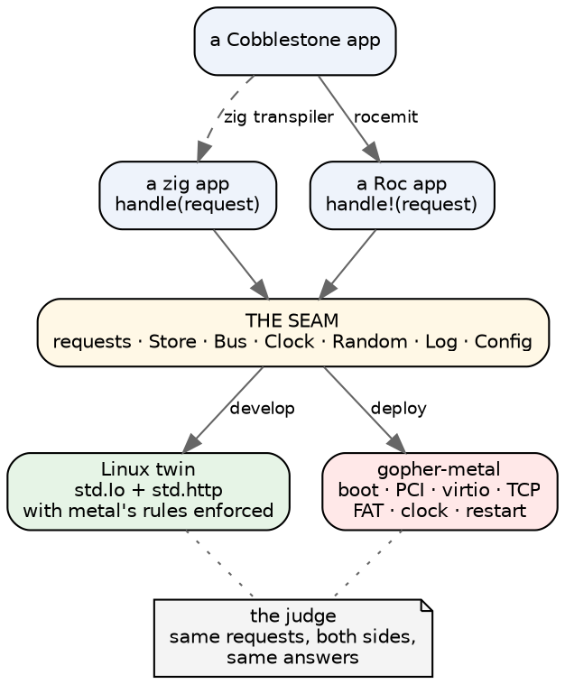

# A web server in a box

*Open-ended thinking, 2026-10-02. What gopher-metal could become if chat were
the first tenant rather than the whole point.*

The idea: a droplet with **no Linux on it** that runs your web application.
You write a function that takes a request and returns a page, and you keep
your data through a small disk API. Everything else (booting, the network
card, TCP, the disk, the clock, restarting after a crash) is the platform's
problem. You develop on Linux, where your tools are, and you deploy to a
droplet that has no operating system at all.

Three languages could sit on top: zig, Roc and Cobblestone. My short answer is
that they shouldn't get three platforms. They should get **one floor with
three front doors**, and the floor already exists.

## What we already have

gopher-metal today is that floor, built for one tenant. In plain terms it
does:

- **Boot:** our own loader, on a real DigitalOcean droplet.
- **Devices:** it finds the network cards and disks on the PCI bus and drives
  them (virtio).
- **Network:** TCP, so it speaks HTTP to anyone who connects.
- **Disk:** FAT16 now, with FAT32 in CC's hands, plus a disk check at every
  boot.
- **Running state:** a clock, a log of recent lines, and (built, switched off)
  restarting after a crash.

On top of that sits angry-gopher, 14,000 lines written for Linux, **unchanged
except for one line per file**: `const Io = std.Io;` becomes "use the
machine's I/O instead". That's the most important thing this project has
found, and the whole idea below rests on it:

> **An application written against a narrow enough I/O interface does not
> care whether Linux is under it.**

The second most important thing is the **judge**. Every change is checked by
running the same application on Linux and on metal, sending both the same
requests, and requiring the same answers. That's how we found, for example,
that FAT folds case and Linux doesn't. No amount of careful reading would
have caught as much.

## What "the seam" should be

angry-gopher reaches the disk through 121 calls into zig's standard library's
directory and file interface. That worked because zig's interface was already
there, but it's far wider than an application needs, and wide seams are where
the two machines quietly disagree. A platform for other people's applications
should offer less.

Here's a first guess at the whole list:

| the application gets | what it is for |
|---|---|
| `handle(request) -> response` | the route table: the only entry point |
| **Store**: read, write whole, append, list, remove, replace | the data, as named files in folders |
| **Clock**: now | timestamps, "last seen" |
| **Random**: bytes | session ids, upload names, salts |
| **Log**: a line | what the admin page shows |
| **Bus**: publish to a topic, subscribe a response to a topic | live updates: the one thing chat needs that a plain web page doesn't |
| **Config**: a value by name | the few settings a deploy needs |

Each row deserves a word.

**Requests in, responses out.** The platform owns every connection. The
application never sees a socket, and that's what makes it portable: there's
nothing machine-shaped to hold.

**Live updates are the hard part, and they belong to the platform.** A chat
tab holds a stream open and expects new messages to arrive on it. If
applications hold their own connections, every application reinvents what
gopher-metal had to build: which streams are open, which message goes to
which tab, what happens when a reader is slow. With a **Bus** in the
platform, the application says "this response is a subscription to topic
`conversation/1_4`", and elsewhere "publish this message to `conversation/1_4`".
The platform does the bookkeeping, the same on Linux and on metal. That one
feature is most of what separates a chat system from a guestbook.

**The Store is files, not a database.** It's deliberately what FAT can hold.
"Replace" means write the new version, then swap it in, so a crash midway
leaves the old file, never half of each (gopher-metal already has this as its
`replace` probe). There are no links, no permissions and no watching for
changes. Names are short and case doesn't matter.

**Crypto may need to be a platform service.** Chat needs password hashing and
signed session cookies. zig has those built in. Roc doesn't really, and
writing your own is how security bugs are born. Whether the platform offers
"hash a password" and "sign this" is a real decision, not a detail.

## The rule that matters most: Linux must be as strict as metal

"Develop on Linux, deploy on metal" has a trap in it, and we stepped in it
this week. On Linux, `Steve` and `steve` are different names. On FAT they're
the same file. So an application that works perfectly on Linux can lose data
on metal, and you'd find out in production.

The fix is a rule for whoever builds the Linux side: **the Linux
implementation of the Store enforces metal's limits**. It refuses a name
FAT would fold into another, a name too long, a character FAT forbids. It
should fail loudly on your laptop for exactly the reasons the droplet would
fail later. The Linux twin isn't "the real thing with fewer rules". It's the
droplet's rules, running somewhere you can debug.

The same goes the other way for anything metal can't do. If metal has one
core and handles one request at a time, the Linux twin shouldn't quietly run
requests in parallel and hide a race that metal would never hit, or the
reverse.

## The judge, for free

Here is the part I'd most want any application on this platform to inherit
without asking. Because every application talks to the world only through
the seam above, the platform can **record a session on Linux and replay it on
metal**: the same requests, in the same order, against a copy of the same
data, with the answers compared. That's our chat judge, generalised.

A new application would get a free regression net between its two homes. The
memory note from when gopher-metal was parked said "a new project loses the
oracle directly". With the seam drawn this way, it doesn't: the Linux twin is
the oracle.

## Zig: the nearest door

This is mostly done, because it's what we have.

- **What an application writes:** a zig module with a `handle` function, using
  the Store and Bus interfaces instead of zig's whole standard library.
- **Linux:** the platform's Linux side is a normal zig program built with
  `std.Io` and `std.http.Server`. prod's angry-gopher already is one.
- **Metal:** the same module built against gopher-metal's kernel. `port.sh`
  shows it takes one changed line per file today, and a narrow seam would make
  it zero.

What's missing is mostly *subtraction*: pulling angry-gopher's own pieces (its
message bus, its upload handling, its sessions) down into the platform where
they're shared, and making an application declare its seam rather than reach
past it. A second application is what would show which pieces are really
general. ("Abstraction earns its keep on the second user.") Lyn Rummy is the
obvious candidate. It already runs on the same server, and its needs are
different enough from chat's (game state, puzzles) to keep us honest.

## Roc: the best fit, nearly built

Roc's idea of a platform is exactly this design, and it's the reason Roc is
interesting here. In Roc, the application is pure: it can't touch the world
on its own. The **platform** declares a short list of effects, such as
`Store.write!` and `Bus.publish!`, and supplies their implementation. An app
written for that platform can do what the list allows and nothing else. A
seam that's enforced by the language, not by discipline, is what we had to
build the judge to approximate in zig.

And Roc already does "same app, two hosts": the canvas apps run natively and
in a browser from one set of files, and the compiler generates the glue. A
web-server platform would be the same arrangement with different hosts:

- **Linux host:** a zig program around the Roc app, using zig's standard
  HTTP server.
- **Metal host:** gopher-metal's kernel around the same Roc app.

**On your build-machinery question, there's real evidence, not just hope.**
On 2026-09-16, `roc-apps/floor` tried exactly this. It added a bare-metal root
(`floor/platform/bare.zig`), asked Roc for its freestanding target
(`x64elf`), and Roc compiled and linked a Roc program plus a zig host into
one static, OS-free x86 image whose entry point was our own startup code. The
essay is `notes/the-floor-on-bare-metal.md`. What stopped it from booting
wasn't the compiler but the **final step of assembling the image**: Roc does
that step itself and gives the platform no way to say "keep this boot header
here" or "leave the Linux loader reference out". It needs a few lines of what
the toolchain calls a linker script, and Roc offered nowhere to put them.

There are two ways past that. Neither is research:

1. **Let zig do the final step.** If Roc can hand over the compiled
   application as a plain object file, zig's build assembles the kernel image
   with gopher-metal's own layout, the same way it builds `gopher.elf` today.
   This is the clean answer, and the first thing to check is whether the
   current compiler offers it.
2. **Fix the image after Roc builds it.** A small tool rewrites the three
   things that are wrong (keep the boot header, drop the loader reference,
   give thread-local storage somewhere to live). It's uglier, but it's ours
   and it's small.

**The risks are about the language, not the machine.** Roc's new compiler is
young. We've had to build it from source for fixes (#11422), and some app
shapes cost more than you'd expect: lists get copied while they're still
reachable, and we have a whole note on the six shapes that do it. Memory is
the other question. A Roc app gets its memory from the host, and a web server
suggests a lovely answer: **each request gets its own scratch area, thrown
away when the response is sent**. A pure function per request has nothing to
keep from one request to the next, which suits Roc, though it needs
measuring before anyone trusts it.

## Cobblestone: three ways to the floor

Cobblestone already has a bare-metal identity of its own. The compiler's seed
runs on bare x86 under QEMU; Codex's x86 back end emits code that boots (fib
prints 6765); and there's a 2,291-line FAT16 written in Codex. So the
question "can Cobblestone run without Linux" was answered long ago, in
Cobblestone's own way.

The question here is different: *a web application* without Linux, on a
droplet. For that, Codex's own machine is missing everything a server is made
of: the network card, TCP, the droplet's PCI devices. As far as I know none
of those exist on the Codex side. I haven't checked Damian's tree for
networking, so treat that as a hedge, not a finding.

So I see three ways for Cobblestone to reach this floor, in order of how
little has to be built:

1. **Codex → Roc → the Roc platform.** rocemit already turns Codex into Roc
   (526 test programs and counting). A Codex app would arrive at the same Roc
   platform as everyone else. This also matches the standing direction:
   Codex ports to Roc, and machines and devices go in zig hosts.
2. **Codex → zig → the zig platform.** The zig transpiler turns Codex into zig
   at a fixed point today. The generated zig would be written against the
   Store and Bus seam.
3. **Codex's own x86, on our floor.** The most Cobblestone-native and the
   most work: the Codex back end would have to call into the floor's services
   by an agreed convention. That's interesting as research, but it's not the
   road to a running app.

Your hunch that "develop on Linux" matters less for Cobblestone is probably
right, for an interesting reason: Cobblestone's developers already live with
a machine-shaped toolchain (QEMU guests, the seed). But routes 1 and 2 give
Cobblestone a Linux twin anyway, for free, through Roc or zig. The
development story comes along with the route.

## The picture

## Outside the box

Two things aren't about the floor, and they decide whether "no Linux" is
true end to end.

**Encryption (HTTPS).** Today Caddy on prod handles HTTPS and certificates,
and passes plain HTTP to metal over the private network. Doing HTTPS on metal
is a big project. Certificate renewal alone is a service. But DigitalOcean's
managed load balancers do HTTPS themselves and forward plain HTTP to droplets
on the private network. If that holds up (it's DigitalOcean's product, not
ours, so check the details), then the whole path from the browser to your
code has no Linux of ours in it.

**Backups and administration.** With no shell on the machine, "look at the
disk" means detaching the volume or reading it through the app. The admin
page and the boot-time disk check are a start. A platform would want a
standard "download a copy of the Store" route for the admin, and a standard
way to load a Store from a copy: the migration we're rehearsing now, as a
feature.

## Questions I can't answer for you

- **One app per droplet, or several?** One is far simpler: no isolation
  between tenants, and a crash takes down only itself. Droplets are cheap. I'd
  start with one and see whether anyone misses the other.
- **Is the seam above too small?** Background work (a nightly job, a cleanup)
  isn't in it. Neither is outbound HTTP (calling another service). Chat
  doesn't need either; something else might.
- **Who is the second application?** Lyn Rummy in zig would test the seam
  cheaply. Something small in Roc would test the Roc door. The answer decides
  which door gets built first.
- **Where does Cobblestone want to be?** If the direction is "Codex ports to
  Roc", route 1 is the obvious one, and Cobblestone's bare-metal story becomes
  Roc's.

## Where I'd start

1. **Draw the seam in zig, inside angry-gopher**: a Store and a Bus that
   chat uses instead of reaching into `std.Io` directly. Nothing else changes.
   The judge stays green, and we learn the seam's true size.
2. **A Store on Linux with FAT's rules**, so the case-folding class of bug
   shows up in development, not on the droplet.
3. **One small Roc app on the Linux host**, using the same seam, then the same
   app on metal. That's the moment the build question gets answered for real,
   probably through route 1 under "Roc" above.

Each of those is a few days, each is checked by the judge, and none of them
puts anything in production that isn't there now.
