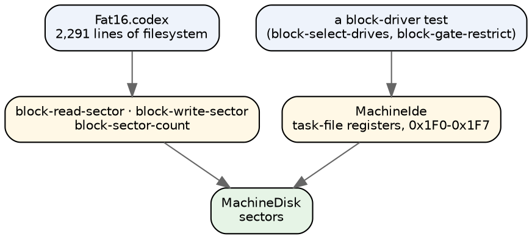
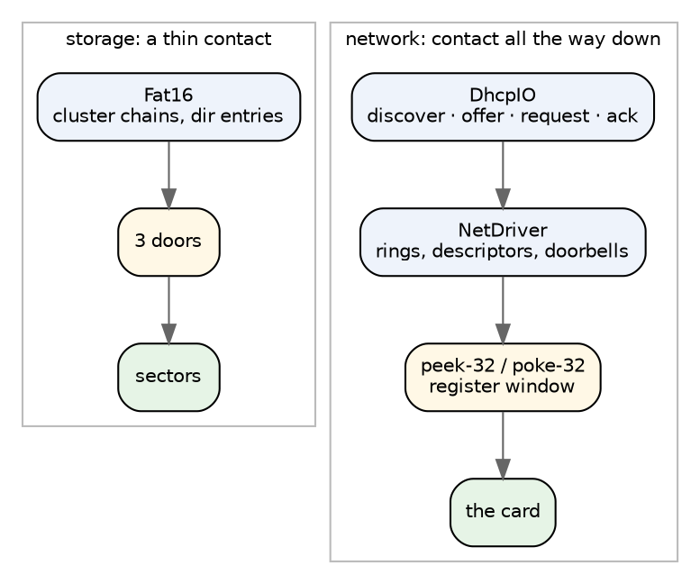
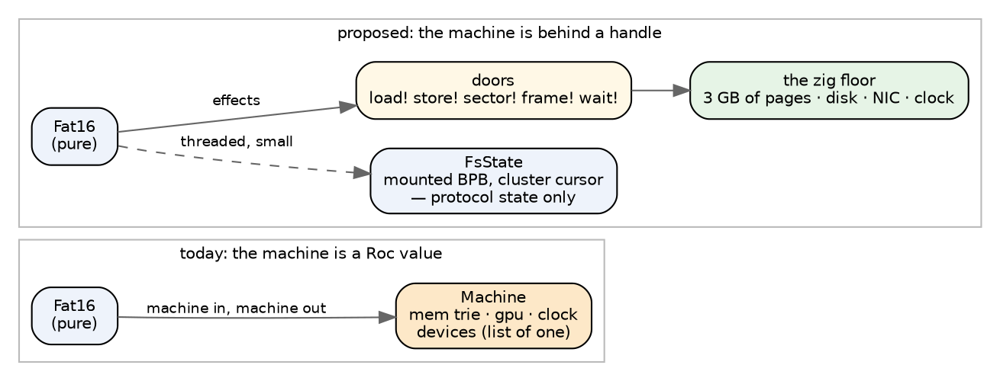
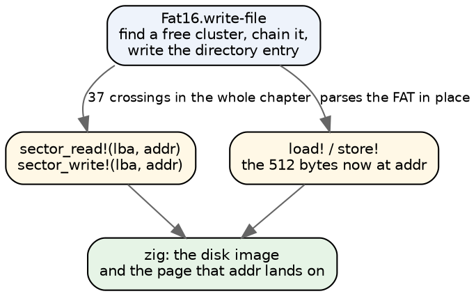
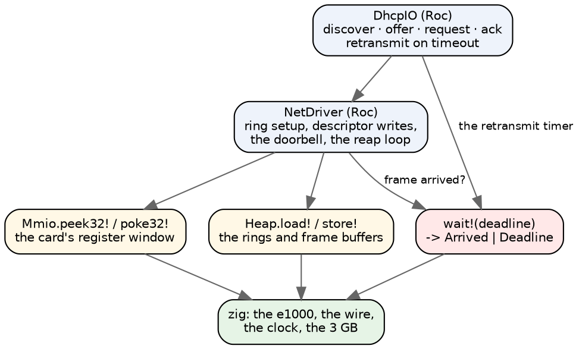

# A Zig floor under a Roc kernel

The batch page at <https://roc.lynrummy.com/machine/batch/> runs five programs:
`fat16-list`, `fat16-write`, `dhcp-acquire`, `gop-padded-stride`,
`scene-on-screen`. Three of them are protocol programs — a filesystem and a
network handshake — and all five run on a machine we wrote in Roc: 4,773 lines
across nineteen modules, one value threaded through every door.

It works, and it was the right way to find out what the doors are. But it is the
wrong shape for the job, and the question on the table is what the right shape
is: a Zig host, probably a Roc platform, that owns the low-level machine and
still leaves a Roc programmer room to prototype operating-system ideas.

This is a sketch of where I think the cut goes, what it costs, and the one piece
we do not have yet.

## The hypothesis, sharpened

The framing was "find a nice seam where Zig provides primitives and mutates the
machine, while Roc does protocol-level work." I want to push on the word
*seam* — singular.

I think looking for one seam is the trap. A filesystem and a network driver do
not want the same altitude, and they are both things we want to prototype in
Roc. What makes this work is that **the floor is a ladder**: Zig exposes the same
device at more than one height, and the Roc programmer picks the rung that suits
the experiment. What gets standardized is not the altitude — it is the *shape of
every rung*.

Three rules, which the rest of this essay argues for:

1. **Zig owns every mutable byte.** Roc holds handles and pure protocol state.
2. **Payload never crosses the seam. Addresses do.** A sector read is
   "put sector 9 at address A", not "give me 512 bytes".
3. **One door crossing per protocol event, never per byte.**

And one addition that I think matters more than the device primitives
themselves, argued at the end: the floor has to expose *time and arrival*, not
just devices. Without that, Roc can only write polling loops, and most of the OS
concepts worth prototyping are about *when*.

## Three things the repo already tells us

None of this is speculative. We have run the experiment three times without
naming it.

**The batch platform already moved the disk to Zig, and it was fine.** The
machine page's drives are not modelled in Roc at all — `machine/batch/platform/Drive.roc`
is four door signatures and a comment, and `host.zig` answers them out of two buffers
the page loads. `fat16-write` on that page is a Roc filesystem over a Zig disk
already.

**The framebuffer platform moved memory and the GPU to Zig, and it is the
fastest thing we have.** `framebuffer/platform/Heap.roc` is a nine-line door;
underneath it, `core.zig` (522 lines) keeps 3 GB in 1 MB pages, and `gpu.zig`
(626 lines) is codex-vm's rasterizer. The Roc side, `roc/Mem.roc`, is 80 lines
and carries exactly one piece of state: a bump pointer.

**And `Machine.roc` already offers the same device at two altitudes.** This one
surprised me when I went looking. `block-read-sector` does *not* go through the
IDE model — it calls `MachineDisk` directly. `MachineIde` exists separately, for
programs that drive the task-file registers at 0x1F0–0x1F7 themselves. Two rungs,
same disk, chosen by what the program is trying to be.



The ladder is already there. It was never designed; it fell out of what the
programs asked for. That is usually a good sign.

## What the programs actually ask for

I counted the device builtins in the two protocol chapters, and the numbers make
the case better than any argument.

| chapter | lines | what it touches the machine with |
|---|---|---|
| `foreword/core/Fat16.codex` | 2,291 | `block-read-sector` ×25, `block-write-sector` ×10, `block-sector-count` ×2 |
| `os/net/DhcpIO.codex` | 81 | nothing directly — it goes through NetDriver |
| `os/net/NetDriver.codex` | 237 | `poke-32` ×8, `peek-32` ×3, plus ring offsets and card-kind constants |

FAT16 is 2,291 lines of real filesystem logic — cluster chains, directory
entries, the allocation table — reaching the machine through **three** doors.
That is the ideal case for a Zig floor: almost the entire program is protocol,
and the machine contact is a rounding error.

`NetDriver` is the opposite and the interesting one. It is small, and almost all
of it is machine contact: it pokes registers, it knows where the transmit and
receive rings live, it knows an e1000 from an NE2000. It is *device-level code*
— and it is also exactly the kind of thing you would want to write in Roc if you
were prototyping an OS. Ring buffers and doorbells are the fun part.



## The seam is easy to get wrong in both directions

**Too high** is the failure I would worry about most, because it is the
comfortable one. If Zig implements the driver and hands Roc a `send-frame!` /
`recv-frame!` door, then DHCP still works, the page still runs, and we have lost
the thing we were trying to build. `DhcpIO` is 81 lines. A platform where Roc
gets to write those 81 lines and nothing below them is not an OS prototyping
surface; it is a socket API. The whole reason `NetDriver` is interesting is that
it is *under* the protocol.

**Too low** is the failure we have already measured. `machine/batch/PERF.md` is
four days of that: a `poke-32` per pixel through a memory trie, 3,800 ms for one
320×240 frame; Roc's default platform spending 22.6 s of a 22.4 s run inside
`mmap`/`munmap` because every allocation is a page map, 1,940,357 of them; a
one-field record update costing 2.19 s instead of 0.13 s because a 512-byte
record sat inline beside it. We fixed those one at a time — a trie walk per span
instead of per byte, the GPU planes flat, the device record behind a list of one
— and got `gop-padded-stride` from 3,800 ms to 716 ms. Every one of those fixes
was working around the same fact: **Roc was holding the mutable state.**

So the rule that decides the altitude is traffic, and it is quantitative:

| door family | crossings | example | who holds the bytes |
|---|---|---|---|
| byte | per access, millions | `Heap.load!` / `store!` | Zig |
| register | per driver step, thousands | `Mmio.peek32!` / `poke32!`, `Port.in!` / `out!` | Zig |
| transfer | per protocol event, tens | sector in/out, frame in/out, DMA completion | Zig |
| event | per wait, tens | `wait!`, `poll!` | Zig |

Nothing in that table says "Roc holds bytes", and that is the point.

## The state question matters more than the API

Here is the part I would actually put in the design document.

Today the Roc value *is* the machine. `Machine` is `{ mem, gpu, clock, devices }`
where `mem` is a persistent trie over 2^36 bytes and `devices` is a list of one
holding sixteen more fields. Every door takes a machine and hands back a new one.
The comment at the top of the record is a confession:

> **A PIXEL TOUCHES FOUR FIELDS.** Every door hands back a new machine record,
> and Roc copies a record's inline fields whole, nested records included.

The `devices : List(Machine.Devices)` trick — a list of exactly one element,
opened and closed around each write — exists solely because a list element is
behind a pointer and an inline record is not. That is a clever fix to a problem
we chose to have.

The alternative: **Zig owns every mutable byte; the Roc value carries only what
is genuinely protocol state.**



Two things fall out of this immediately, and both are worth more than the speed.

**DMA becomes honest.** A network card writes received frames into main memory
by itself — that is what "DMA" means, direct memory access, and it is the whole
reason a receive ring exists. If Zig owns the memory *and* the card, the card
writing into memory is one Zig function touching one Zig array. If Roc owns the
memory, the card has to hand a `List(U8)` across the seam and Roc has to walk it
into the trie. Today `block_read_sector!` does exactly that twice over: the host
builds a fresh `RocList` per sector with `RocList.fromSlice`, then `Machine.land`
bump-allocates 512 bytes in the trie and copies the list in byte by byte. Two
copies and an allocation to move 512 bytes that never needed to leave the host.

Rule 2 kills both: the door is `sector_read!(lba, addr)`, and nothing crosses but
two integers.

**The address map becomes one place.** `Machine.region` is currently a chain of
range comparisons in Roc deciding whether an address is RAM, the GPU, the NIC,
the HPET, the LAPIC, the IOAPIC, or a named stop. That is a page-table walk
written in a language that has to rebuild a record to do it. In Zig it is what it
should be: a lookup on the page that already exists, and a device window is a
page whose backing is a function instead of memory.

## FAT16, across the new seam



All 2,291 lines of `Fat16` stay Roc, unchanged in character. The FAT is parsed
out of memory the same way it is today, through `load!`. What changes is that the
sector arrives by address instead of by value, and that the bytes it lands on
belong to the host. This is the easy half, and it is the half that already works
on the batch page.

## DHCP, which is the real test



The driver stays in Roc. It writes descriptors into memory it does not own, pokes
a register to ring the doorbell, and later walks the ring looking for a completed
descriptor. All of that is Roc code over Zig-owned bytes, and all of it is the
part worth prototyping. The card — the thing that actually reads the descriptor
and puts a frame in the buffer — is Zig, because it has to mutate memory behind
the program's back, which is precisely what Roc should never be asked to model.

That diagram has a red box in it, and it is the part we do not have.

## The missing door is time

Every operating-system concept worth prototyping is about *when*, not *what*.
Retransmit after a timeout. Block until the disk finishes. Yield when the
quantum expires. Wake on an interrupt. Those are the ideas. Devices are just the
excuse to have them.

Our current machine has no honest answer here. `Machine.access_cost` is a
constant — 143 ticks, about 10 µs — added to a fake clock every time a program
touches a device register. The comment above it is three paragraphs of
arithmetic reverse-engineered from what the test verdicts need to be true:
`e1000-tx-deadline` wants under 1.6 ms per access, `timer-registers` wants under
20 µs, `e1000-link-deadline` wants 10 µs to add up to 8 s across half a million
reads. That constant is a fiction tuned until three tests agree.

A Zig floor should replace it with something real, and I think this is the
highest-value thing in the whole design:

```
Clock := [].{
	now! : {} => U64                        # nanoseconds, monotonic
	wait! : U64 => Clock.Woke               # until deadline, or an event
}

Clock.Woke : [Deadline, Arrived(U64)]       # which device woke us
```

One door, and suddenly Roc can express: block, time out, retransmit, poll with a
floor, schedule. `DhcpIO`'s retransmit becomes a real retransmit instead of a
counted loop. A second Roc process becomes conceivable, because "this one is
waiting" is now a thing you can say.

And the floor can offer this door in two flavours without the Roc side knowing:
wall time for the browser and native runs, and a *virtual* clock that only
advances when everything is blocked — which is how you get a deterministic run
back. More on that next.

## What this costs, honestly

**The machine stops being a value, and we lose things that are free today.**
Right now `Machine` is pure data. You can snapshot it by keeping a reference,
fork a run by using the old one, diff two runs field by field, and replay
anything exactly. Nothing in the Zig design gives you that for free — a mutable
3 GB does not fork.

I do not think this is fatal, for two reasons.

First, it is recoverable as a door. Zig owns the memory in 1 MB pages already
(`core.zig`); a snapshot is a copy-on-write mark on the page table, which is how
real virtual machines do it and is maybe fifty lines. `snapshot!` answering a
handle, `restore!(handle)`, and the fork property is back — *if* we decide we
want it. I would not build it in the first cut, but I would not design it out
either. Keeping the page table as the only path to a byte is what preserves the
option.

Second, determinism does not actually come from purity here — it comes from the
clock. A pure machine with a wall clock is not reproducible either. A mutable
machine with a virtual clock is. If `wait!` advances a virtual clock when every
Roc process is blocked, runs repeat exactly, and that is the property the ladder
needs.

**The second cost is that we would have two machines.** I am not proposing we
delete `machine/roc`. I would keep it, and I would keep it *deliberately*,
because we already know what that arrangement buys: the framebuffer's mode 2 and
mode 3 are two hosts over one `core.zig`, and `verify.tsv` holds a hash that was
first taken where the Roc `MachineGpu` and the Zig GPU agreed. Two
implementations of one door set, checking each other, is how we caught things
before. The Roc machine becomes the reference oracle; the Zig floor becomes the
one you run.

**The third cost is real and I do not have a good answer.** A Roc program that
writes a bad descriptor into a Zig-owned ring gets a Zig-side symptom — a
garbled frame, a hang, a stop naming an address — instead of a Roc type error or
a pattern-match failure on a value you can print. Today when `MachineNe2k`
misbehaves you can inspect the card record. Tomorrow you cannot. The mitigation
is that the floor has to be *loud*: every door validates, and every refusal names
the address, the register and the expected width, the way `Machine.unbacked`
already does. Cheap to say, easy to skimp on, and the thing most likely to make
this unpleasant to work in if we skimp.

## Where the policy should live

One boundary I would draw explicitly, because it is easy to slide the wrong way.

`MachineCaps` is the boot process's capability word — one word per process at
offset 56 of a 256-byte entry in the process table at 20480, checked by the block
doors before they answer. That is *policy*, and policy is an OS concept, which
means it belongs in Roc. The Zig floor should enforce exactly one thing: that an
address is backed. Whether *this process* is allowed to read *that disk* is a
question the Roc kernel answers.

Said as a rule: **the floor knows what is physically possible; the Roc side knows
what is permitted.** If we ever find ourselves adding a permission check to
`core.zig`, something has gone up that should have stayed down.

## What I would build first

The smallest thing that tests the thesis rather than assuming it, and it is
smaller than it sounds because two thirds of it exist.

Take the framebuffer platform as the base — it already has `Heap`, `Port`, pages,
and two hosts over one core. Add:

1. `Disk.roc` — `sector_read!(lba, addr)`, `sector_write!(lba, addr)`,
   `sector_count!()`. Address-to-address, per rule 2. The backing is
   `machine/batch/platform/host.zig`'s buffers, which already work.
2. `Mmio.roc` — `peek32!(addr)`, `poke32!(addr, v)` over a register window, plus
   one card behind it. Start with the NE2000 rather than the e1000: 278 lines in
   the Roc model against 669, and `dhcp-acquire` already uses it.
3. `Clock.roc` — `now!` and `wait!`, virtual clock first.

Then port exactly two programs: `fat16-write` and `dhcp-acquire`. They are the
two the batch page already runs, both have verdicts, and they sit at opposite
ends of the ladder — one barely touches the floor, the other lives on it.

The measurement that decides whether the design is right is not the wall clock.
It is **crossings per protocol event**. Count the door calls for one FAT16 file
write and one DHCP acquire. If a sector write is a handful of crossings and a
DHCP exchange is tens, the seam is in the right place. If either one is thousands,
the rung is too low and the answer is a fatter door, not a faster one.

The wall clock is worth taking too, against the numbers in `PERF.md` — but as
confirmation, not as the criterion. We have been burned before by optimizing a
number instead of fixing a shape.

## The short version

- Not one seam — a ladder, with the same device offered at two or three heights.
  `Machine.roc` already does this for the disk without anyone deciding to.
- Zig owns every mutable byte. Roc holds handles and protocol state. This is what
  removes the trie, the record copies and the list-of-one trick all at once,
  and it is what lets a device write to memory the way a real one does.
- Payload never crosses. Addresses do.
- Drivers stay in Roc. If Zig writes the driver there is no OS left to prototype.
- The door we are missing is not a device — it is `wait!`. Time and arrival are
  what turn a pile of primitives into something you can build a kernel on, and
  a virtual clock is also how the runs stay reproducible.
- Keep `machine/roc` as the oracle. Two implementations of one door set is an
  arrangement that has already paid for itself once.

The thing I am least sure about is the register rung — whether `peek32!` /
`poke32!` per descriptor field is cheap enough to write a driver over, or whether
it turns into the pixel-per-poke problem one floor up. That is a measurement, not
an argument, and it is the first one I would take.
