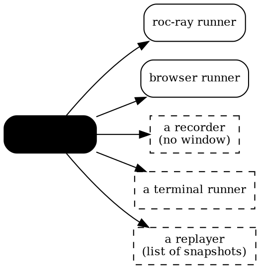

# An app is a value

*2026-09-20 — what Roc made easy about six small interactive programs, and what
that opens up*

Six programs run on roc.lynrummy.com and as native binaries from one set of
files. None of them is large. The point is not that they exist; it is that
adding a seventh is now an afternoon, and that several things nobody has built
yet are nearly free. This is about why, and what to do with it.

## There is no framework here

The whole contract is a record:

```roc
CanvasApp(model) : {
    size : { width : F64, height : F64 },
    fps : I32,
    init : model,
    advance : model, Input.Snapshot, F32 -> model,
    frame : model -> List(Shapes.Shape),
    sounds : model -> U32,
    tones : List({ freq : I32, ms : I32 }),
    title : Str,
}
```

An app is a value of that type. A runner is a function that takes one. You do
not inherit from anything, register anything, implement an interface, or fill
in lifecycle callbacks. `snake_native.roc` is five lines, and four of them are
imports.

That sounds like a small thing and it is the reason everything else works. A
value can be passed to two different runners, held in a test, put in a list,
made by a function. The usual arrangement — a framework that owns `main` and
calls down into your code — makes all of those awkward and one of them
impossible.

Roc did not force this; you can write a framework in any language. What Roc
made *cheap* was the alternative: a record of eight fields costs nothing to
declare, and a function is a value without any ceremony about it.

## Structural types unified across a boundary nobody designed for

The best moment of the week was an anticlimax.

The frames used to be flattened to 32-bit integers by hand on the Roc side and
read back by hand in JavaScript. Replacing that meant the *platform* declaring
what a frame really is:

```roc
frame : Box(model) -> List(Frame.Shape)
```

where `Frame.Shape` is a tag union defined in the platform, and the apps'
frames are `Shapes.Shape`, a tag union defined in a package. Different files,
different authors-in-spirit, no shared declaration, no conformance statement.
They are the same type because they have the same shape.

**Every app compiled unchanged.** Not "changed one import line" — unchanged. A
single line moved in the one adapter file. In a nominal language this would
have been a conversion function, or an interface both sides implement, or a
shared crate that both depend on and that becomes a coordination point forever.

Structural typing gets criticised for letting unrelated things unify by
accident. Here it let deliberately-identical things unify without a ritual, at
exactly the boundary where a ritual would have been most expensive.

## Purity is doing work, not decoration

`advance` and `frame` are pure. That is not a stylistic preference here; three
concrete things depend on it.

**The same value runs in two places.** A `render! : model, Frame => {}` can
only be called by something that can make a `Frame`, so its caller must be a
platform underneath you. `frame : model -> List(Shape)` can be called by
anything, including a language that has never heard of Roc.

**Input is data, so a test writes one down.** There is no harness:

```roc
expect Rules.move_player({ x: 0, y: 0 }, Input.none.with_key_down(KeyD), 0.5) == { x: 180, y: 0 }
```

That is a test of an interactive program, driving the keyboard, next to the
code, run by the compiler with `roc test`.

**A run is reproducible by construction.** Same model, same snapshots, same
frames — not by discipline, but because there is nowhere for a difference to
come from.

## The compiler knows its own layouts, and will tell you

`roc glue` hands a script the type table: every type, its size, its alignment,
each record field's byte offset, each tag union's discriminant offset and
width. So the JavaScript that reads a frame out of wasm memory is *generated*,
by the same compiler that built the wasm:

```js
const read_t33 = (view, at) => {
  switch (view.getUint8(at + 200)) {
    case 0: return ({ tag: "Blend", value: read_t34(view, at + 0) });
    case 1: return ({ tag: "Disc", value: read_t35(view, at + 0) });
    ...
```

Two hand-written halves of one format became one declaration. It is also 5.4×
faster than the flattening it replaced, which was a surprise and is mostly an
accident of the hand-written version being a worse program.

Most languages make you choose between a compiler that knows layouts and won't
say, or an FFI where you write the layout down again. Roc's glue is the
unusual third thing: layouts as data, for you to generate whatever you need
from.

## Where it is rough

Balance, briefly, because it matters if anyone follows this path.

Two nominal types with the same qualified name are ambiguous to the compiler
even when the modules are distinct, and a module alias does not fix it; that is
why our input snapshot is called `Input` and not `Devices`. An import that
escapes its package root reports cleanly under `roc check` and crashes the
build — filed upstream. `app` is a reserved word, which is a surprise when you
want to name a value that. A handful of builtins you expect are missing.

None of these cost more than an hour, but they are all the same kind of thing:
a young language with a sharp design and a compiler still growing into it.

## Where this goes

The interesting part is how much is now cheap.



**More apps.** Anything that is a model, a step and a picture fits with no new
mechanism: a clock, a sorting visualiser, an L-system you can zoom, a Turing
machine you step by hand, a metronome, a plot of a file that redraws as it
changes, a Lissajous toy, Conway's life. None of those needs anything that is
not already in `lib/`. Two of roc-ray's own games are left and want one real
addition — a loaded image with a handle — which is the only extension on the
list that touches the seam at all.

**More runners, which is the cheaper direction.** There are two implementations
of the contract; a third does not touch a single app.

- A **recorder** with no window, stepping at a fixed rate and writing PNGs or a
  GIF. It needs `init`, `advance` and `frame`, all of which it has. This turns
  every app into its own documentation.
- A **replayer**. Because `advance` is pure and `Input.Snapshot` is data, a
  whole session is a list of snapshots. Record one, replay it exactly, on
  either platform. That gives demo modes, bug reports that reproduce, and
  regression tests that compare frames — and it costs a list and a loop,
  because the determinism is already paid for.
- A **terminal runner** drawing with half-blocks. Silly, and a good test of
  whether the frame vocabulary is really platform-independent.

**The library grows where the seam does not.** Sprites, a tilemap, real audio:
each is a new `Shapes` variant or a resource handle, and none of them changes
`CanvasApp`. That is the property to protect. Every time something wanted to
join the seam this week and turned out to belong in the library instead, the
design got better.

**The word "framework" is wrong, and the right word is useful.** A framework
calls you. This does not call anything — you hand it a value and something else
decides what to do with it. It is closer to a *format*: like a font file, or a
PDF, the interesting property is that a thing you make can be opened by a
program you did not write. Six programs and two openers today; the ratio is
what to grow.

**And there is something to offer.** Roc ships glue specs for Zig, Rust and C.
There is no JavaScript one. Ours is a few hundred lines, generates readers for
scalars, records, lists and tag unions, and is exercised by six real pages.
That seems worth cleaning up and handing over.

## The limit, stated plainly

One honest boundary, because it shapes what to attempt next. A frame that is a
value wins in proportion to how much smaller the model is than the picture. A
screensaver is a few hundred bytes of state fanning out to every pixel, so
recomputing everything each frame is free. The paint program's model *is* its
picture, and there the design visibly strains: it sends the whole canvas sixty
times a second to say that one cell changed.

So the next genuinely new thing is a resource that lives on the far side and
receives edits — which is also what sprites and loaded images want. One
mechanism, three payoffs.

That is a good position: five programs the design carries comfortably, one it
carries while grunting, and a clear statement of what the sixth is asking for.
Most designs do not tell you that much about themselves this early.
