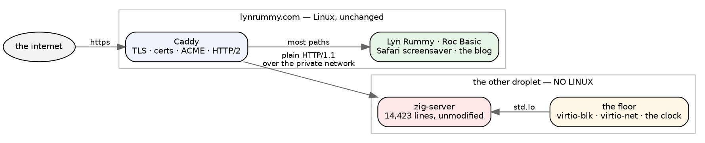
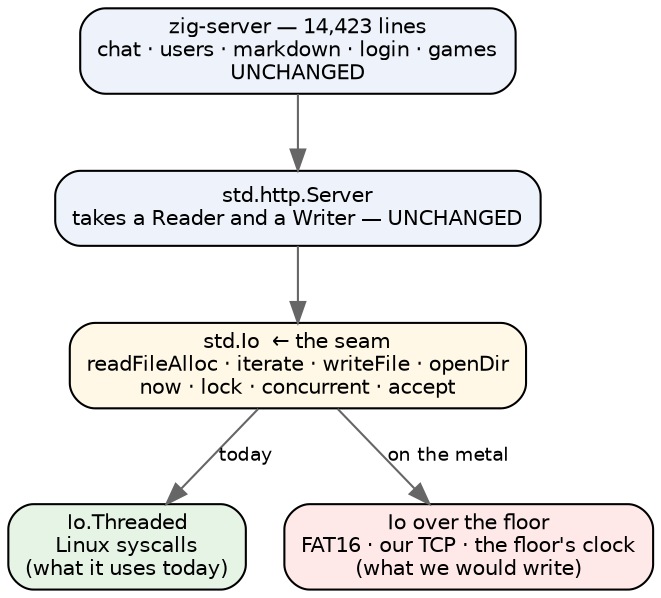

# angry-gopher without Linux

A plan for running the chat server on the floor — no kernel, no libc, no
syscalls — with Caddy on lynrummy.com still doing what it does today.

Short answer to the question that prompted this: **yes, Caddy can front another
box, and that fact is the single most important thing in this plan.** It moves
the hardest problem out of the project entirely.

## The topology, and why it deletes the hard part

`reverse_proxy` does not care whether its upstream is a local port or a host on
the other side of a private network. So:



**TLS never reaches the unikernel.** No certificate handling, no ACME, no
X.509, no cipher suites — the one piece of this whole idea I would genuinely
dread writing, and it stays on the Linux box where it already works. The bare
machine speaks plain HTTP/1.1 on a private address with no public IP at all,
which also means no firewall story and no hostile-internet exposure.

lynrummy.com carries on exactly as it does: Lyn Rummy, Roc Basic, the Safari
screensaver, the blog, all from the Linux droplet. One path — or one subdomain
— proxies across. If the other box is down, that path 502s and nothing else
notices. **The blast radius is one route.**

## The discovery that makes this tractable

I expected the port to be a rewrite. It is not, because of something zig 0.16
did: **all I/O goes through an `Io` interface passed as a parameter**, and the
chat server already threads it everywhere.

```
pub fn handle(req: *Request, io: Io, alloc: Alloc, sub: []const u8) !void
```

`Io.Dir` appears 121 times. `Io.Clock` ten. `Io.Mutex` ten. The application
never calls an operating system; it calls whatever `Io` it was handed. In
`main` that is `std.Io.Threaded`, which happens to be implemented with Linux
syscalls. Nothing anywhere else knows that.

So the port is not a rewrite of the server. It is **one new implementation of
`Io`**:



And `std.http.Server` needs no modification whatever — it is constructed from a
reader and a writer:

```zig
var server = std.http.Server.init(&sr.interface, &sw.interface);
```

Give it a reader and writer over our own TCP and the entire HTTP/1.1
implementation comes along for free. You offered to let me modify zig's http
library; it turns out not to be necessary.

## The exact surface to implement

I counted what the application actually asks of `Io`, because the size of this
number is the size of the project.

| what | uses | note |
|---|---|---|
| `readFileAlloc` | 42 | whole file, no seeking |
| `iterate` | 32 | list a directory |
| `writeFile` | 21 | whole file |
| `openDir` | 17 | |
| `statFile` / `stat` | 17 | size and mtime |
| `createFile` / `openFile` | 8 | |
| `deleteTree` / `deleteFile` | 5 | |
| `access` | 1 | |
| `Io.Clock` (`now`, `nowUnix`) | ~50 | |
| `Io.Mutex` | 10 | **all free** — see below |
| `Io.Group.concurrent` | 12 | the one hard one |

**Eleven filesystem operations, all whole-file or directory-level.** No partial
writes, no seeking, no memory mapping. That is a filesystem API FAT16 answers
comfortably — and we have a FAT16 that passes its verdict six ways on the floor
already.

**The ten mutexes cost nothing.** They exist because Linux threads interleave.
One core, no preemption, an explicit event loop: a lock that can never be
contended is a function call that returns. That is not getting away with
something — it is the concurrency model becoming explicit instead of inherited.

**And the accept loop is already the right shape.** From `server.zig`:

> `handleConn` serves exactly ONE request, then closes the connection
> (`connection: close`). Keep-alive is deliberately OFF: the accept loop is
> single-threaded…

There is even an inline fallback already written for when the task pool is
exhausted. A strictly sequential accept-serve-close loop is not a compromise we
would be making; it is the model the code was written for.

## What actually has to be built

```dot
digraph parts {
  rankdir=TB; bgcolor="transparent";
  node [shape=box style="rounded,filled" fontname="Helvetica" fontsize=10 fillcolor="#ffffff"];
  edge [fontname="Helvetica" fontsize=9 color="#666666"];

  subgraph cluster_have {
    label="exists"; fontname="Helvetica"; fontsize=10; color="#bbbbbb";
    h1 [label="the floor: memory, clock,\nfaults, three roots" fillcolor="#e6f4e6"];
    h2 [label="FAT16 in Roc\nverdict green six ways" fillcolor="#e6f4e6"];
    h3 [label="zig-server, 14,423 lines" fillcolor="#e6f4e6"];
    h4 [label="std.http.Server" fillcolor="#e6f4e6"];
  }

  subgraph cluster_build {
    label="to build"; fontname="Helvetica"; fontsize=10; color="#bbbbbb";
    b1 [label="virtio-blk  (in flight)" fillcolor="#fff8e6"];
    b2 [label="virtio-net" fillcolor="#fff8e6"];
    b3 [label="TCP/IP: ethernet, ARP, IPv4, TCP\n— THE BIG ONE" fillcolor="#ffe8e8"];
    b4 [label="Io over the floor" fillcolor="#fff8e6"];
    b5 [label="a scheduler (only for SSE)" fillcolor="#ffe8e8"];
  }
}
```



Two of those are genuinely large and the rest are plumbing. TCP is the one that
decides the timeline: connection state, sequence numbers, retransmission,
windows, and the close dance. A correct-enough TCP for one HTTP request per
connection over a *private network with no packet loss* is far less work than a
general one — no congestion control worth the name, small windows, and a
listener that only ever accepts.

## Three decisions worth making deliberately

**Where does TCP live — Roc or zig?** The floor's thesis says the interesting
protocol work belongs in Roc, and Damian has `Tcp.codex` (411 lines) and
`NetworkStack.codex` (693) that rocemit would port. But the entire application
above is zig and wants a `net.Stream`, so a Roc TCP puts a language boundary in
the middle of every byte the server reads. **I would write TCP in zig for v1**
and keep Damian's stack as a second implementation to check it against — the
same arrangement `machine/roc` has with the floor, which has already earned its
keep twice. The rule the floor was built on was *put the seam where the traffic
is low*, and per-segment is not low.

**Where does storage live?** Use **the Roc FAT16**. It works today, the
application's file API is whole-file which is exactly what FAT16 is good at, and
it makes the arrangement the one we actually wanted: a zig floor, a Roc kernel,
a zig application. Writing a second storage layer in zig would be writing a
filesystem for no reason.

The honest caveat: **FAT16 has no journal.** A crash mid-write can leave a
directory entry pointing at a half-written chain. Chat data is small and
append-shaped, so write-new-then-rename gets most of the way, but "the power
went out" has a worse answer here than on ext4. This deserves a decision rather
than a discovery.

**What about SSE?** `chat_sse.zig` and `bus.zig` hold connections open to push
live updates — the one thing a sequential accept loop cannot do. That is what
makes it stage five rather than stage two, and it is where `wait!` stops being
decorative.

## The staging

Each stage ends with something that either works or does not, and no stage
needs the next one to be worth having.

**Stage 0 — virtio-blk over mmio, `fat16-write` under `-M microvm`.** In flight.
Its verdict is already pinned six ways in `floor/verify.tsv`; this makes a
seventh column. *Done when:* the console matches the verdict with a real
virtqueue underneath.

**Stage 1 — virtio-net and enough TCP to answer once.** A fixed 200 with a
fixed body, no application at all. *Done when:* `curl` from the Linux droplet
across the private network prints "hello from no Linux."

**Stage 2 — the `Io` shim, and the real binary.** Storage in RAM, strictly
sequential, no SSE. Serve `/driving` and `/puzzles` — real pages from the real
code that only read. *Done when:* the page renders byte-identically to the
Linux one. **This is the stage that proves the thesis**, because it is 14,000
lines of unmodified application running with no operating system under it.

**Stage 3 — FAT16 behind `Io.Dir`.** Now `/chat` can read and write. *Done
when:* a message posted to the bare machine survives a reboot.

**Stage 4 — Caddy proxies one route.** A staging channel, or read-only traffic,
on a real URL. *Done when:* it has served a week without anyone noticing.

**Stage 5 — a scheduler, and SSE.** Live chat.

## When to stop

This is a big project and it should have an exit, so: **stop at stage 2 if
stage 2 is where the interest is.** "The chat server runs with no Linux under
it" is the whole intellectual payoff, and stages 3 to 5 are the price of it
being *useful* rather than *true*. Those are separable purchases and there is no
shame in buying only the first.

I would also stop if the `Io` surface turns out to have a long tail — the eleven
operations above are what the application calls directly, and `std.Io` has more
in it than that. Stage 2 finds out quickly and cheaply, which is a reason to do
it early rather than build TCP first.

## The risks I would name up front

- **No journal.** Covered above; needs a decision, not a discovery.
- **No debugger.** A serial line and printf is the entire toolkit. The floor's
  loud doors matter more here than anywhere.
- **DigitalOcean is virtio-*pci*, not mmio.** Local microvm work does not
  transfer for free; PCI enumeration is a real extra step, though
  `MachinePci.roc` models it already.
- **Deploy and rollback.** `ops/deploy` ships one static binary to a running
  Linux box. A unikernel is a whole disk image and a reboot. That is a different
  operational story and it is not harder, just entirely different.
- **Backups.** Whatever writes the FAT16 volume is the only thing that can read
  it. A way to get the data off, from the Linux side, is a stage-3 requirement
  and not an afterthought.

## The short version

- **Caddy fronting another box is the unlock**: TLS, certs and HTTP/2 stay on
  Linux, the bare machine speaks plain HTTP on a private address, and the blast
  radius is one route.
- **`std.Io` is the seam.** The chat server takes `io: Io` everywhere and calls
  no operating system directly, so the port is one implementation of `Io`, not a
  rewrite of 14,423 lines.
- `std.http.Server` needs no modification at all — it is built from a reader and
  a writer.
- The surface is **eleven filesystem operations**, all whole-file, which FAT16
  answers; a clock; and one hard thing, concurrency, which only SSE needs.
- **The ten mutexes are free** on one core with no preemption.
- TCP in zig for v1, with Damian's Roc stack as the checker. Storage in the Roc
  FAT16 we already have, which makes it zig floor, Roc kernel, zig application.
- Stage 2 is the payoff and a legitimate place to stop.
