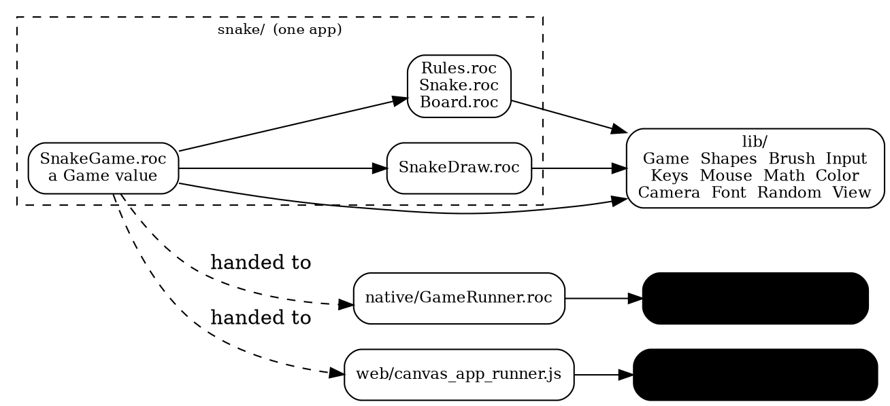
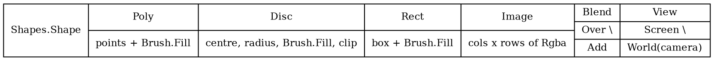
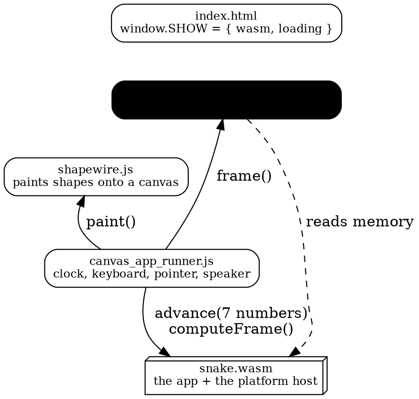
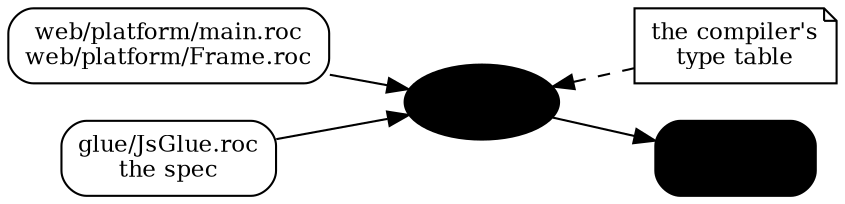

# Canvas apps in Roc, on two platforms

*How `roc-apps/arcade` is put together: one set of files per app, running as a
native program on roc-ray and as a page in a browser.*

## The shape of it

An app is a Roc value. Two runners know how to run one: `GameRunner.roc` on
roc-ray, and `canvas_app_runner.js` in a browser. Between the app and either
runner sits `lib/`, a Roc package every app shares.



Six apps are built this way: `snake`, `pong`, `breakout`, `camera`,
`workshop`, `trick_or_treat`.

## What an app is

`lib/Game.roc` is the type. An app is a record of eight fields over its own
model:

```roc
Game(model) : {
    size : { width : F64, height : F64 },
    fps : I32,
    init : model,
    advance : model, Input.Snapshot, F32 -> model,
    frame : model -> List(Shapes.Shape),
    sounds : model -> U32,
    tones : List({ freq : I32, ms : I32 }),
    title : Str,
}
```

`advance` takes one step, given what the keyboard and pointer look like now and
how many seconds the step covers. `frame` answers what to draw. `sounds`
answers a bit per tone the last step set off. The app imports no platform, so
the same value is handed to either runner.

An app names its own value out loud. `snake_web.roc` and `snake_native.roc` are
five lines each:

```roc
program = GameApp.program(SnakeGame.game)      # the page
program = GameRunner.program(SnakeGame.game)   # roc-ray
```

## What a frame is

A list of shapes, in the app's own coordinates. Four shapes and two marks:



A mark is not drawn. It changes how the shapes after it are painted, until the
next mark of its kind. `Blend(Add)` lights rather than paints; `View(World(c))`
puts the shapes after it in a camera's world, and `View(Screen)` brings them
back to the window. A frame starts on the screen, painting over.

A `Brush.Fill` is a flat colour or one of six gradients, each carrying its own
geometry, so a fill means the same thing to every painter.

## Input

`Input.Snapshot` is a value: which keys are held, which were struck since the
last tick, and the pointer's position, buttons and wheel. Each runner builds
one — `GameRunner` from roc-ray's `Devices.Snapshot`, `canvas_app_runner.js`
from the browser's keyboard and pointer events — and a test writes one down:

```roc
Input.none.with_key_down(KeyW)
```

## The roc-ray side

`native/GameRunner.roc` opens a window at the app's `size`, paces to its `fps`,
converts roc-ray's snapshot into an `Input.Snapshot`, and paints the frame.

Painting walks the frame once and cuts it into runs at every mark, because
raylib takes a blend and a camera as scopes. Each run is drawn inside the
scopes its marks named. A shape with a gradient goes through one fragment
shader (`lib/BrushGlsl.roc`) that does the brush arithmetic on the scene
position; a flat colour is drawn directly. The whole frame is painted into a
render texture at twice the window and scaled back down, which is where the
anti-aliasing comes from.

    arcade/native.sh snake                 a binary
    TARGET=x64win arcade/native.sh snake    for Windows

## The web side

Three files reach the browser, plus the app's wasm:



The page loads them in that order; each defines one name the next can see.

**The clock is the app's.** Elapsed time is banked and steps are taken as they
fall due, so the app runs at its own `fps` whatever the display does, and one
animation frame may take several steps or none.

**The speaker** reads `tones` for each tone's pitch and length, and plays the
ones `sounds` reports, one WebAudio oscillator each, with a pip per tone drawn
in the corner.

    arcade/build.sh snake                        a page
    node arcade/web/page_check.mjs snake         run it headlessly
    node arcade/web/camera_check.mjs             the camera, on both ends

## The platform, and the glue

The page's half of Roc is a platform in `web/platform/`. It declares what it
needs from an app, and what a frame is:

```roc
frame : Box(model) -> List(Frame.Shape)
```

`web/platform/Frame.roc` spells that type out. Because it is a structural
union, `lib/Shapes.roc`'s `Shape` unifies with it by shape rather than by name,
so an app hands its frame over unchanged.

`roc glue` reads the compiler's own type table for that platform and runs a
spec over it. `glue/JsGlue.roc` is the spec: it emits one JavaScript reader per
type, each taking a `DataView` over the wasm memory and a byte offset, at the
32-bit layout wasm uses.



`build.sh` runs it on every build, with the same compiler that builds the wasm,
and copies the result beside the page:

```bash
"$ROC" glue "$HERE/../glue/JsGlue.roc" "$OUT" "$HERE/web/platform/main.roc"
```

The output is generated, never checked in and never edited.

### What the generated file contains

A reader per type. Scalars are one `DataView` call:

```js
const read_t38 = (view, at) => view.getFloat64(at, true);
```

A record is its fields at the offsets the compiler committed to — note that
those are the compiler's order, not the source's:

```js
// a record
const read_t41 = (view, at) => ({ a: read_t38(view, at + 0), b: read_t38(view, at + 8),
                                  g: read_t38(view, at + 16), r: read_t38(view, at + 24), });
```

A list is a pointer and a length, with the element stride the compiler gave:

```js
const read_t34 = (view, at) => {
  const start = view.getUint32(at, true);
  const length = view.getUint32(at + 4, true);
  const out = [];
  for (let i = 0; i < length; i++) out.push(read_t33(view, start + i * 208));
  return out;
};
```

A tag union is a discriminant and a payload at one address:

```js
const read_t33 = (view, at) => {
  switch (view.getUint8(at + 200)) {
    case 0: return ({ tag: "Blend", value: read_t34(view, at + 0) });
    case 1: return ({ tag: "Disc", value: read_t35(view, at + 0) });
    ...
  }
};
```

Alongside the numbered readers, each provided function's result gets a name
taken from the function, so a page binds a name rather than a position:

```js
return { read_t1, ..., init: read_t25, advance: read_t31, frame: read_t34, ... };
```

### Using it

The runner asks the host where the frame is, then reads it:

```js
frame: () => {
  const at = exports.computeFrame();
  return RocGlue.frame(new DataView(exports.memory.buffer), at);
},
```

`computeFrame()` is the effect: it asks Roc for a new frame and answers the
address of the Roc list. The `DataView` is built after that call and on its own
line, because asking for a frame can grow wasm memory, and growing it detaches
every view over the old buffer.

What comes back is plain JavaScript — `{ tag: "Disc", value: { x, y, r, fill,
clip } }` — and `shapewire.js` paints it.

### Giving the frame back

The platform also requires a `release`, which every app answers the same way:

```roc
release : List(Shapes.Shape) -> {}
release = |_frame| {}
```

The host holds one frame at a time. Before asking for the next, it hands the
last one back through `roc_release` and Roc drops it, using the layout it
already has. The host keeps no knowledge of what a shape looks like.

## The files

```
arcade/
    snake_web.roc  snake_native.roc      the two apps, five lines each
    snake/                               the app: its rules, its drawing, its page
    lib/                                 the Roc every app shares
    native/GameRunner.roc                the roc-ray runner
    web/
        platform/main.roc                what the page needs from an app
        platform/Frame.roc               what a frame is
        platform/host.zig                the wasm exports
        canvas_app_runner.js             clock, input, speaker
        shapewire.js                     painting
        page_check.mjs  camera_check.mjs
    build.sh   native.sh
glue/JsGlue.roc                          the glue spec
```

## The checks

`page_check.mjs` runs a built page the way a browser would, against a canvas
that records instead of painting. `KEYS=3:Space` presses keys and
`DRAG=80,80,500,500` drags the pointer, so an app that waits for input is
driven. It reports frames, how many of them were distinct pictures, canvas
calls and fills, and a hash of everything drawn, so one run can be compared
with another.

`camera_check.mjs` hands `shapewire.js` a view mark and checks the canvas
matrix it builds against the same map written the geometric way —
`screen = zoom · R(rotation) · (world − target) + offset` — at four cameras and
four points.
