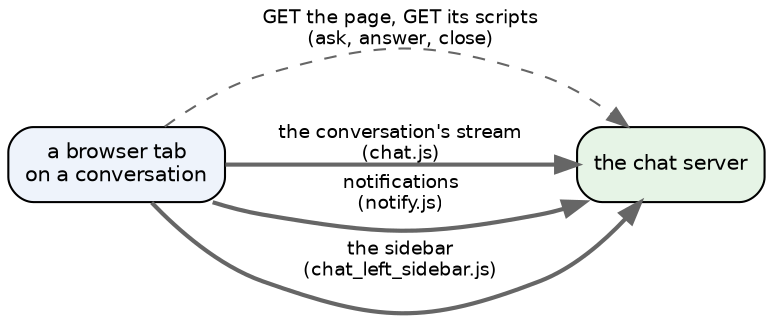
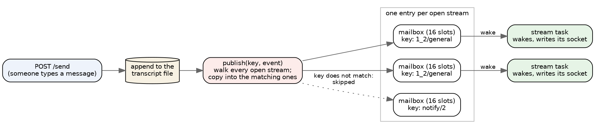
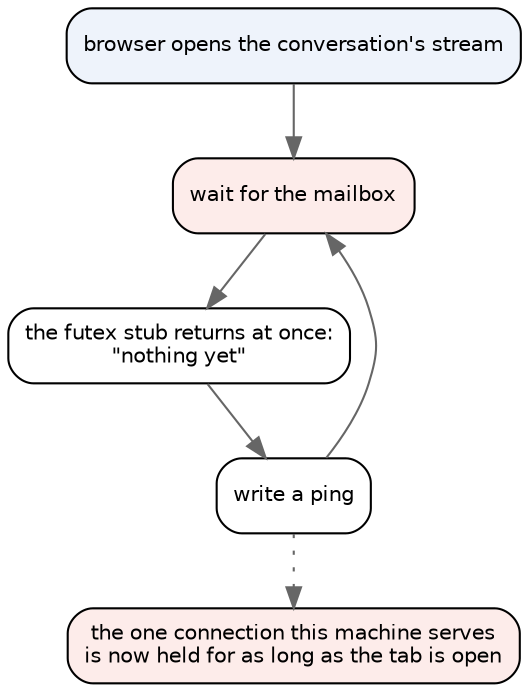
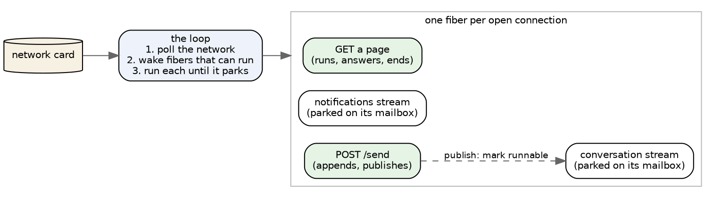

# How chat talks: HTTP, SSE, and a machine with one loop

The chat server does two kinds of talking. Most of it is ordinary HTTP: a
browser asks, the server answers, the connection closes. The rest is
**Server-Sent Events** (SSE): a browser opens a connection and the server keeps
it open, writing a line whenever something happens. Chat's live updates — a new
message appearing without a reload — are all SSE.

This note is about that second kind: what it looks like in the code today, why
it is the one thing stopping chat from running on the bare-metal machine, and
what the machine would need. It is the opening of the HTTP/SSE work on
gopher-metal, the same way
[angry-gopher without Linux](http://143.244.172.148:9100/notes/angry-gopher-without-linux.md)
opened the whole effort.

## Short answers first

**"With SSE we are just iterating through open HTTP sessions, correct?"** Very
nearly. When a message is sent, the server walks a list with one entry per open
stream and drops a copy of the event into the mailbox of every stream that
cares. It does *not* write to those streams' sockets itself — each stream has
its own task, which wakes up, takes the event out of its mailbox and writes it.
On Linux those tasks run on a thread pool. On a one-core machine with one loop
they would simply take turns.

**"I was assuming we already had some notion of polling."** Not in the chat
client — the only timer there repaints "5 minutes ago" labels every 20 seconds.
But the browser has one built in: an SSE connection that closes is reopened
automatically, and it tells the server the last event it saw. That turns out
to be a cheap bridge, described below.

**"Handling every request under one lock is not preposterous at our scale."**
Agreed, and it is the natural shape for this machine: one core, no preemption,
so whatever is running runs alone until it has to wait. The costs of that shape
are specific and measurable, and they are listed at the end.

## What a chat tab actually opens

A conversation page is one ordinary request for the page, a burst of requests
for its scripts, and then **three connections that stay open for as long as
the tab does**:

The thick lines are SSE. Other pages open their own: the activity page, the
image and code transcripts. So "one person reading chat" is several
connections that never finish, and a server that can only hold one connection
at a time cannot serve even one person.

The three streams come in two shapes:

- **The conversation's stream has a memory.** Every event carries a number
  (`id: 41`), which is the message's position in the transcript file. A
  browser that reconnects sends back the last number it saw, and the server
  replays everything after it *from the file* before going live. Nothing is
  lost across a reconnect.
- **The notification and sidebar streams do not.** They forward events as they
  happen and keep nothing. An event published while nobody is listening is
  gone — which is fine for them, because the page re-renders the same
  information when it loads.

## How Linux serves it today

`server.zig` accepts a connection and hands it to a task from a thread pool.
Each connection carries exactly one request and then closes — keep-alive is
deliberately off. A request for a page finishes in milliseconds. A request for
a stream never finishes: its task sits waiting on its mailbox.

The mailboxes belong to **the bus** (`bus.zig`), and this is where the
"iterating through sessions" happens:

Three details matter for what follows:

1. **Publish never blocks.** A mailbox holds sixteen events; a full one drops
   the new event rather than making the sender wait. For the conversation
   stream a drop is recoverable (the file has it); for the others it is a
   missed hint.
2. **The wake-up is a futex** — the operating system's "sleep until this number
   changes" primitive. The task waiting on its mailbox sleeps on a counter;
   publish bumps the counter and wakes it.
3. **Waiting has a deadline.** A stream that hears nothing for 25 seconds wakes
   anyway and writes a one-line ping. That is how a closed tab is noticed: the
   ping fails to send, the task ends, and its mailbox is removed.

A small aside: the comment on `handleConn` still explains keep-alive being off
by saying connections are served one at a time off the accept loop. They were,
once; the loop in `main` now hands each connection to a concurrent task, so
that reasoning is stale even though keep-alive being off is still a fine
choice.

## What the bare-metal machine does with this today

gopher-metal serves **one connection at a time**, in a loop: accept, read one
request, answer, close, repeat. Everything above is compiled in unchanged — but
the futex is a stub, because on a machine with one loop there has never been
anyone else to wake. Its "wait until the counter changes" returns immediately.

So the moment a real browser opens a conversation:

The stream spins, writing pings as fast as the network takes them, and every
other visitor waits behind it. **This is a blocker, not a gap in polish**, and
nothing in our tests has ever seen it: the judge drives the server with curl,
and curl does not run JavaScript, so it has never opened a stream.

## The options

### A. A bridge the browser already has: short-lived streams (ruled out)

The conversation stream already knows how to resume. So the machine could
answer a stream request by sending everything after the browser's last event,
adding one line — `retry: 3000` — and **closing**. The browser reopens it three
seconds later with its new last-event number, gets anything new, and so on.

That is polling, done by the browser, with **no change to the client** and
nothing held open. Its costs are plain:

- a message takes up to the retry interval to appear;
- every open tab makes a request per stream per interval;
- **the notification and sidebar streams lose what happens between polls**,
  because they have no memory to resume from. They would need a small
  per-user queue on the server, or we accept that those hints arrive only on
  the next page load.

It is a bridge, not the destination. It would let a real browser use chat on
the machine while B is built.

### B. One loop, many connections, each running on its own small stack

This is the destination, and it keeps the application exactly as it is.

Each connection gets a **fiber**: a small stack of its own, on which the
unchanged request code runs. When that code has to wait — for bytes from the
network, or for its mailbox — the fiber **parks**: its place is saved and the
loop moves on. The loop polls the network card, and wakes any fiber whose
socket has bytes, whose mailbox was published to, or whose 25-second ping is
due.

Nothing runs at the same time as anything else, so **everything is under one
lock** — the model you described — without anyone writing a lock. The
application's own mutexes stay meaningful: they mark the stretches of code
that must not be interleaved, and the machine can check that no fiber ever
parks while holding one.

The encouraging part is how much already exists:

- **zig's standard library ships the fiber switch.** `std/Io/fiber.zig` is 323
  lines that save and restore a stack pointer, and it imports nothing but the
  compiler's description of the target — no operating system at all. That is
  the same move as the memory work, where std's own allocator now runs on the
  machine's pages.
- **The seam is already in place.** The futex and task-group stubs in
  `src/io.zig` are exactly where "park this fiber" and "wake that one" go. The
  application calls them today; they just do nothing yet.
- **The stack sizes are measured.** The deepest chat page measured so far,
  the activity page, needs about 85 KB of stack. A stream sitting on its
  mailbox should need far less (not yet measured). Three fibers per open tab is
  a few hundred kilobytes of the machine's half-gigabyte.

What has to be built, in the order it can be made solid:

1. **A network layer that holds many connections.** Today's holds exactly one.
   Judged by several clients at once, each answered correctly.
2. **Fibers and a run queue**, with timers for the pings. Judged by a probe
   that parks and wakes many fibers and checks each ran exactly when it should.
3. **The real futex and task group** in `src/io.zig`, on top of 2.
4. **A judge that opens streams.** A client that holds a conversation stream
   open, sends a message on another connection, and requires it to arrive —
   on Linux and on the machine, and the same.

### C. Streams as state the host keeps

*(This section first argued that C breaks "one source, two hosts". Steve
challenged that, rightly: a state machine compiled into both builds is still
one source. What follows is the corrected case.)*

A stream, stripped down, is a few words of state — which socket, which
mailbox, whose view, when it last pinged — and a ten-line loop: take an event
and write this viewer's frame for it, or ping after 25 quiet seconds. The frame
itself is already computed by a pure function (`liveFrame`).

So the application could **describe** a stream — its bus key, its backlog, how
to render an event for this viewer — and hand the connection to the **host** to
keep:

- **Linux** can keep it exactly as today, a task per stream behind the same
  interface. Nothing changes in behaviour; it can move to a table later if it
  wants one, and it would save a parked thread and its stack per open stream.
- **The machine** keeps a table in its loop, and each turn it drains every
  stream's mailbox and pings the quiet ones — literally iterating through the
  open sessions. No fibers, no scheduler, no context switch.
- **The bus does not change.** Publish still copies into mailboxes; only who
  drains them differs by host.

It is the same kind of seam as the memory work: the application is shared, and
each host supplies the part that is about the machine. The step function —
(state, event) → (frames to write, new state) — can be tested on the host,
which the streaming loop today cannot.

**What C gives up against B:** a request that must *wait part-way through* —
a slow client trickling an upload body — would hold every stream until it
finishes, where a fiber would park. Everything else that stalls (a login, a big
answer) stalls B just as much, because B has no preemption either. Behind Caddy
on a private network slow uploads are unlikely, and Caddy can buffer request
bodies before forwarding them.

**What C saves:** the scheduler, the context switches, a stack per stream, and
the rules about never parking while holding a lock — general-purpose kernel
machinery, where the aim is a kernel tailored to what chat does.

### Not considered: threads

One core, no preemption, and no wish to add either.

## What "everything under one lock" costs

At our scale the answer is "not much", but the costs are specific, and the
machine now measures them per request:

- **A login stalls everything.** bcrypt at cost 10 is commonly quoted at
  around a tenth of a second of pure computation — I have not measured it on
  this machine yet — and nothing else runs while it does.
- **A big answer stalls everything.** The raw transcript of a long conversation
  is written out in one go; the soak's 200 KB transcript took well over 100 ms
  under software emulation.
- **A new stream replays its backlog first.** Opening a long conversation reads
  and renders its history before anything else gets a turn.

None of those is a reason to add threads. Each has a local fix if it ever
matters — a fiber can yield part-way through a long write, for instance — and
the per-request timings will say which one matters first.

## Where this landed

**A is ruled out** (Steve). Between B and C, my recommendation is now **C, with
B in reserve** if a request ever genuinely needs to wait part-way through.

Step one is the same for both: **a network layer that holds many connections**,
judged by several clients at once. After that, for C:

1. the stream interface — the application describes, the host keeps — with
   Linux implementing it as today, judged by the existing tests;
2. the machine's stream table in its loop, draining mailboxes and pinging;
3. a judge that opens streams: hold a conversation stream open, send a message
   on another connection, and require it to arrive, on both hosts, the same.

Still open: **how many open tabs to size for**, which sets the length of the
connection table and is the first real capacity number this machine will have.
