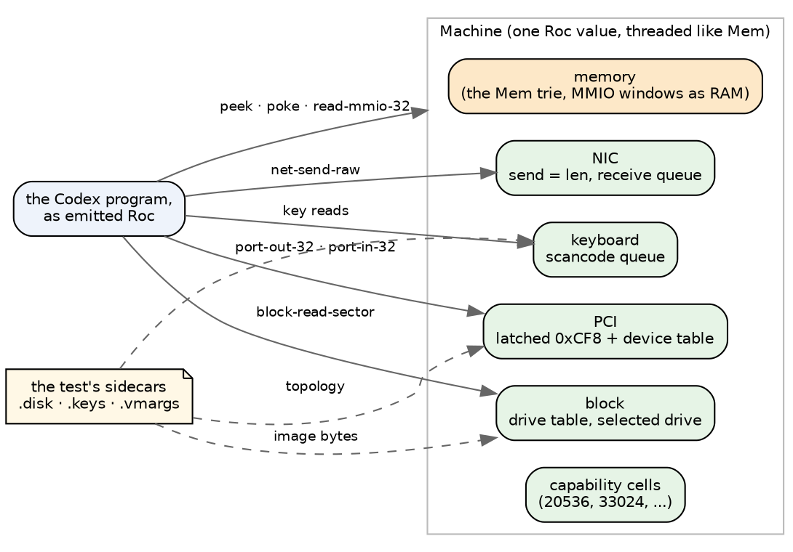
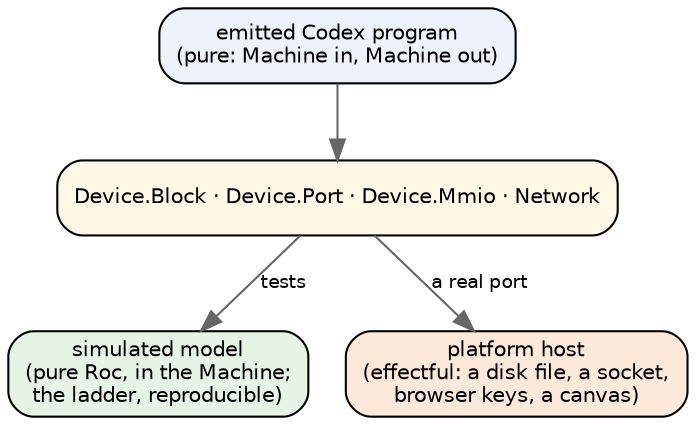

# Devices in Roc: porting Codex's hardware

*A plan for the memory and device builtins, which block most of the Roc
ladder's remaining refusals. You started from a loose notion: Roc should
eventually drive "real" devices, and it can already simulate them, as the
BASIC REPL shows. This essay tries to turn that into structure.*

## The finding that shapes everything

**Upstream's hardware verdicts do not come from hardware.** They come from
`tools/codex-vm.c`, a 16,969-line hypervisor (Windows Hypervisor Platform)
that `build/test.ps1` runs every test in. Its device models are:

- a PCI configuration table;
- IDE over an in-memory disk image;
- an NE2000 at 0x300 with a user-mode NAT and DHCP;
- an e1000 model with fault flags;
- PIT, PIC, RTC, LAPIC and HPET timers;
- the GPU rasterizer's ports;
- a PS/2 scancode queue;
- board MMIO windows that behave as RAM.

A test picks its machine with sidecar files: `.disk` attaches an image,
`.keys` queues scancodes, `.vmargs` adds flags such as
`-pci-bridge-levels 4`.

So "emulate upstream" has a precise meaning here: **port codex-vm's device
models, as Roc values, and configure them from the same sidecars.** We would
not be inventing a simulation. We would be mirroring the one the verdicts
were captured on.

## What the refusals actually need

rocemit refuses a unit when any definition it emits mentions a hardware
builtin, and it emits cited chapters whole. So the first question is which
units ever *run* the call. `tests/hw_census.py` asks `codexrun`, which fails
only when a call executes:

| first hardware builtin | refused | run it | never run it, verdict matches |
|---|---|---|---|
| `port-out-32` (PCI) | 62 | 35 | 14 |
| `block-read-sector` | 35 | 19 | 5 |
| `read-mmio-32` (boards) | 23 | 15 | 3 |
| `net-send-raw` (NE2000) | 21 | 4, and 6 more reach PCI first | 5 |
| `uefi-read-key-ex`, as a value | 19 | 5 | 14 |
| processes, fork, atomics, GPU memory | about 30 | nearly all | a few |

The rest of each row stopped first on `alloc-bytes`, which `codexrun` lacks and
the Roc arm has, or failed for another reason.

**About 45 units never touch their hardware.** A research pass over the tests
themselves puts the device-free set nearer 75. That count includes units that
reach a port and ignore the answer, and units that expect the no-device
result; it is inferred, not measured.

Of the units that do need a device, per family:

| family | what the verdicts depend on |
|---|---|
| PCI (72 with the NIC tests) | 7 need a config-space table; 26 need codex-vm's e1000 model; 6 need GPU compute, a clock, CMOS or VBE |
| block (39) | 19 need a committed image's contents; 3 only its size; 4 the raw drive table (`drive 0 sectors 128 lba0 161`) |
| boards (23) | about 17 only need a register window to read back what was written; 4 need the LAPIC and real timers |
| NE2000 (22) | 13 need no network; 6 need a DHCP exchange (`ip=10.0.2.15 gw=10.0.2.2`) |
| GPU memory (10) | 4 need the address guard and RAM; 4 need the rasterizer |
| keyboard (21) | 5 need a scancode timeline from `.keys`; 2 need the empty answer |
| SMP (7) | assert kernel cells written by other cores; a simulation could only preset them, which proves nothing |

## The shape: one machine, threaded as a value

We already have two pieces of this, and they point the same way.

**`Mem` in rocemit.** An address space is a persistent trie. A call-graph
closure finds every definition that touches it, and those definitions take it
and hand it back, exactly as a GPU kernel threads its `Device`.

**`Devices` in BASIC.** One record holds the terminal, the screen, colour RAM,
a framebuffer and the address space. A poke is dispatched by address: the
screen window, colour RAM, the framebuffer, or ordinary memory. The machine is
a value, so the browser can keep every past state.

codex-vm is the same shape again: one machine; a port write dispatched by port
number; an MMIO load dispatched by address. The plan is to grow `Mem` into that
machine:

Why one record and not a threaded value per device:
- **The devices share memory.** A block read puts its 512 bytes on the
  heap. The NE2000 copies frames through fixed addresses. GPU triangles live
  at 0xBE000000.
- **The tests read capability cells in that same memory.**
- **BASIC's machine is one record for exactly that reason**, and the threading
  we already have carries one value just as easily as it carries `Mem`.

## The order, cheapest first

**0. Stop refusing at emit time.**
- A hardware builtin becomes a call that crashes, naming itself, when it runs.
- Upstream's plugs already do this. The zig plug turns an unimplemented
  builtin into a `@compileError` stub that only matters if the path is reached
  (`zig-refusal-dead.codex` runs to `7 8 10`). The wasm plug compiles port I/O
  to `unreachable`.
- The rule changes from "refuses what it has not built" to "refuses, at run
  time, what it has not built". That is the rule codexrun already follows.
- It needs no device model, and it should pass the roughly 45 units above
  outright.

**1. The machine record, with memory windows.** `read-mmio-32` and
`poke-mmio-32` go onto the same memory, because codex-vm's board windows are
RAM and `Board.codex` says so (`:134-141`). About 17 board units need nothing
more.

**2. Capability cells and the no-device answers.** A drive position with
nothing attached, firmware that returns -1 for a key, a `read-line` with no
input: the cheap constants several families expect.

**3. PCI configuration space.**
- A latched 0xCF8 address, and a table of devices answering reads on 0xCFC:
  0xFFFFFFFF for an empty slot, BAR sizing, bridge bus numbers at 0x18.
- The table is configured from `.vmargs`.
- codex-vm's default table (VGA 1234:1111, xHCI, HDA 8086:2668) is written at
  `codex-vm.c:15654-15740`.

**4. The block device.**
- A drive table of image bytes, a selected drive, and a 512-byte read
  allocated in memory, as the bare-metal helper does.
- The test's committed `.disk` seeds the drive table. 13 of the FAT units
  share one 16 MB image.

**5. The keyboard queue** from `.keys`, and a quiet NIC: send answers the
length, receive answers nothing.

**Later, or never:**
- **The e1000 register model** (26 units): the largest family, and the most
  code.
- **A scripted DHCP exchange** (6).
- **The GPU rasterizer** (4).
- **LAPIC and timer semantics** (4).
- **SMP** (7): not worth simulating.

## Where real devices come in

This is the part of your notion I think the structure answers. **Codex's
effect rows already name the seams**:
- `port-out-32 : Int, Int -[Device.Port]-> Int`
- `block-read-sector : Int -[Device.Block]-> Int`
- `read-mmio-32 : Int, Int -[Device.Mmio]-> Int`
- `net-send-raw : Int, Int -[Network.Write]-> Int`

Each row is a device interface. A simulated device and a real one are two
implementations of the same row.

In Roc that split is the platform's:

**BASIC already does the host half in miniature.** Its screen is memory in
the machine, and its wasm platform's `view` hands those bytes to the page,
which draws them. The page is the real display; the machine never knows.

A Roc disk drive would work the same way, as would a network socket or a
keyboard:
- the pure model answers during a test;
- a platform function answers in a real program;
- the emitted program is the same text in both cases.

**The discipline that makes this work:** a device model holds only what
codex-vm's model holds, and is configured only from what a test's sidecars
say. Then the ladder grades the simulation against upstream's verdicts, and a
real device is a swap at the platform rather than a rewrite.

## What I do not know yet

- **Whether Roc's Echo platform can read a 16 MB image at run time.** The
  ladder runs units on Echo. If it cannot, the disk fixtures need a platform
  of our own. Baking an image into a module is the obvious alternative, but
  the compile-time evaluator makes that a risk: it once materialised 64 MB
  for `List.repeat`.
- **How much of codex-vm's e1000 model the 26 units exercise.** The research
  read their expectations but not the model's size.
- **Whether step 0 is a rule change you want.** It moves one refusal from emit
  time to run time, for hardware only. I think it is the faithful choice,
  since it is what upstream's own zig and wasm plugs do, but it changes the
  emitter's stated contract.

## What I need from you

1. **Step 0 first**: hardware builtins crash at run time instead of
   refusing the unit.
2. **One Machine record, grown from `Mem`**, rather than a threaded value per
   device.
3. **The order**: memory windows, cells, PCI, block, keyboard. The e1000, DHCP,
   rasterizer, timers and SMP wait.

---

*Measurements: `tests/hw_census.py` at roc-apps `6a90d29`, with `codexrun`
at rust-codex-compiler `5b39849`, against Update 60. The per-family breakdown
comes from reading Update 60's tests, chapters, `build/test.ps1` and
`tools/codex-vm.c`. It is inferred where it says so; nothing on the upstream
side was run.*
