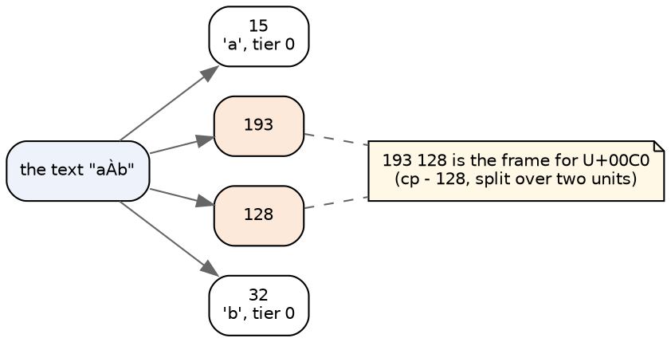
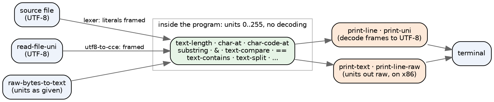

# Codex Text in Roc: units, not characters

*Part 2 of the CCE round trip. Part 1 fixed one builtin. This is the design for
the rest, researched against Update 60's own backends. Your direction:
emulate upstream; be faithful to Codex's text rather than Roc's; the Roc
helpers should be what the zig plug's are.*

## Where part 1 left it

`raw-bytes-to-text` decoded its bytes as UTF-8 in both of our arms. Upstream
copies them in as units, so even ASCII broke (65 came back as unit 75). With
that fixed:

- **`arm64-http-test` passes.**
- **The Roc ladder is 530 of 1,032.**
- **Every CCE row inside the alphabet matches.**

What is left is one kind of row, the characters outside the alphabet:

    ops/unicode-bytes-roundtrip   192 units=[ 0 0 ]    expected [ 193 128 ]
    forewords/encode-json-escapes u00C0 len=3 15 0 32  expected len=4 15 193 128 32
    validation-rules              greek=ERR            expected greek=ok

No builtin fix reaches these. **Our Text cannot hold them**, because both of
our arms model a Text as a string of real characters.

## What a Codex Text is

Upstream is explicit. `CCE.codex:410-413`: UTF-8 is never an internal
representation. `:465-469`: a Text is a byte sequence, and `char-at` indexes
bytes. Every backend agrees on the shape:

| backend | a Text at runtime |
|---|---|
| x86-64 (bare metal) | a pointer to an i64 length, then one byte per unit (`X86_64Builtins.codex:79-86`) |
| zig plug | a `[]const u8` slice (`ZigEmitter.codex:4129`) |
| wasm plug | an i32 length, then units (`WasmEmitter.codex:3681-3697`) |
| C# plug | a .NET string whose chars are units (`CSharpEmitterExpressions.codex:995`) |

A unit is 0..255. Tier 0 is the alphabet, codes 1..127, one unit per
character. **A character outside it is FRAMED:** 2, 3 or 4 units, with bands
starting at 128, 2176 and 67712. The framing is UTF-8-like but is not UTF-8.

That is `encode-json-escapes`'s verdict, `len=4 units= 15 193 128 32`, captured
on bare metal. Its `text-length` is 4, not 3.

## Where text enters and leaves

The units live inside the program. Translation happens only at the edges,
which is exactly the shape you described for a port:

- **Literals.** The compiler reads its source with `read-file-uni` and then
  `utf8-to-cce` (`opening.codex:2346-2347`). A literal's body is a substring of
  that CCE source (`Desugarer.codex:116`), and `(text-lit ...)` in the IR
  carries the units raw (`IRTextEmitter.codex:71-85`). So `"À"` in source is
  two units by the time any backend sees it. A code point no tier covers
  becomes unit 68, `?`, and is then framed.
- **Files.** On x86, `read-file-uni` maps bytes below 128 through the table,
  drops CR, stops at NUL, and keeps high bytes raw; `utf8-to-cce` frames them.
- **Printing.** x86's `print-line` loop (`X86_64IO.codex:297-355`) decodes: a
  unit below 128 through the table, a frame through `__cce_print_multi`.
  `print-text` and `print-line-raw` write units raw.

## Every text builtin, unit by unit

Upstream, per x86 and the zig part Steve named as the template, against our
Rust side today:

| builtin | upstream | zig part | ours today |
|---|---|---|---|
| `text-length` | units | `cx_text_len` = `s.len` | characters |
| `char-at`, `char-code-at` | one unit | `cx_char_at` | one character, through the alphabet |
| `substring` | units, traps out of range | `cx_substring` | characters |
| `&`, `text-concat-list` | append units | `cx_concat`, `cx_text_concat_list` | append characters |
| `text-compare`, `==` | unsigned unit order | `cx_text_compare`, `cx_text_eq` | alphabet order over characters |
| `char-code`, `code-to-char` | identity on the integer | no part: `(x)` | through the alphabet; 193 becomes NUL |
| `char-to-text` | one unit, low byte | `cx_char_to_text` | one character |
| `char-encode` | frame 1-4 units | `cx_char_encode` | one character (shares `char-to-text`'s rule) |
| `show` of a Char | **its code, as digits** | `cx_show_int` | the character |
| `text-contains`, `-starts-with`, `-replace`, `-split` | byte-wise, frame-blind | `cx_text_contains` ... | over characters |
| `text-to-integer` | digits are units 3..12, 73 is minus | `cx_text_to_integer` | Rust parse after trim |
| `raw-bytes-to-text` | low byte per unit | **no part** (zig refuses it) | alphabet below 128, NUL above (part 1) |
| `read-file-uni` | UTF-8 to units, framed | `cx_read_file_uni` | `from_utf8_lossy` |
| `print-line`, `print-uni` | decode to UTF-8 | `cx_print_line`, `cx_print` via `cx_cce_to_utf8` | the string as it is |

**`show` of a Char is the surprise.** Upstream prints its integer code. Ours
prints the character, and the Roc emitter follows ours. No current ladder
verdict shows that disagreement, as far as the passing units go, but that is
not measured.

## Where upstream disagrees with itself

"Emulate upstream" needs an arbiter where the backends differ, and they do:

- **`print-text` and `print-line-raw`:** x86 writes units raw; zig decodes them.
- **A 4-unit frame on print:** x86 misdecodes it (the 2-unit path takes every
  lead it does not recognise); zig and the foreword decode it.
- **wasm** decodes only 2- and 3-unit frames (backlog 2.23 is open on a
  related divergence); **C#** prints `193 128` as two U+FFFD.
- **`char-to-text`'s truncation:** the foreword's prose puts it in
  `code-to-char`, the code puts it in `char-to-text`.
- **An uncovered code point:** the compiler substitutes `?` (68); the
  foreword's own boundary drops it.

**My recommendation: the representation and the helper shapes come from the
zig plug, and the behavior, wherever the two differ, comes from x86.** The
verdicts in `codex/test` were captured on bare metal, so x86 is what the
ladder grades against, and a zig-faithful helper that prints differently
would fail it.

The one place this is untested either way: **no `.expected` in the tree
pins how a framed unit prints.** The five failing units compute with frames
and print only ASCII. Only `ops/tier0-cyrillic-print` and one app print
non-ASCII, and both use tier-0 single units.

## What changes on our side

**The Rust interpreter** (`interp.rs`, `charcode.rs`, `lexer.rs`):

1. A Text becomes a sequence of units, 0..255: bytes, not a `String`. This is
   simpler than today's representation (a `String` plus marks for the
   multi-byte characters).
2. The unit builtins in the table index and count units.
3. `char-code` and `code-to-char` become the identity; `char-to-text` keeps
   the low byte; `char-encode` frames.
4. `show` of a Char prints its code.
5. `text-compare` and equality are unsigned unit order.
6. Literals are framed when read; an uncovered code point becomes 68.
7. `read-file-uni` does what x86's does.
8. Printing decodes as x86's loop does, and the raw writers write units.

**The Roc emitter** (`roc_emit.rs`, and the `Cce` module it writes):

1. A Codex Text is a Roc `List(U8)`, not a `Str`. This is forced rather than
   chosen: a Roc `Str` must be valid UTF-8, and a lone 193 is not.
2. **One Roc function per zig text part**, named for it, in one emitted module
   (`Text.roc`, say): `len`, `char_at`, `substring`, `concat`, `compare`,
   `eq`, `char_to_text`, `char_encode`, `contains`, `split`, `to_integer`,
   `show_int` ... Each is written by reading its `cx_*` part first.
3. A literal emits as its units: `[15, 193, 128, 32]`.
4. `Str` appears only at the edge: printing is `cx_cce_to_utf8`'s port
   (x86's decode) feeding `line!`, and anything from the platform is framed
   on the way in.

**What this costs, stated plainly:**
- Every text builtin in the emitter changes spelling. Safari, the GPU kernels
  and the games all use text, so their emitted Roc changes everywhere text
  is. Their gates are the check.
- The interpreter runs the whole compiler (`ir-interp`, the self-host), and
  text is everywhere in a compiler. The representation change is the riskiest
  step, and `ir-interp` against `codexir` is the instrument.
- A `List(U8)` text is less pleasant to read in emitted Roc than a `Str`.
  That is the price of faithfulness, and it is the price you named.

## The order

1. **The interpreter first**: units, the unit builtins, `show`, literals,
   printing. Gate: the five CCE units pass under `codexrun`, and run-interp,
   ir-interp and safari's specs stay green.
2. **Then the emitter's `Text` module**, built part by part from the zig
   table, with literals as unit lists. Gate: the Roc ladder, safari, gpu and
   games.
3. **Then the sweep**, and a count of what moved.

## Decided (Steve, 2026-09-13)

1. **Printing follows x86**, including where zig differs (raw `print-text`
   and `print-line-raw`, how a 4-unit frame decodes).
2. **`show` of a Char prints its code**, as upstream does.
3. **A Text is `List(U8)` in the emitted Roc**, with `Str` only at the edges.

Safari, the program the emitter was built for, prints only ASCII verdict
lines, and its screensaver modules hold almost no text. So this costs little
where it would have hurt most.

---

*Sources: Update 60 (`9fff850c`), read rather than run; citations are to
upstream files. The measurements are the Roc ladder and `codexrun` at
rust-codex-compiler `ae837b2` plus part 1.*
