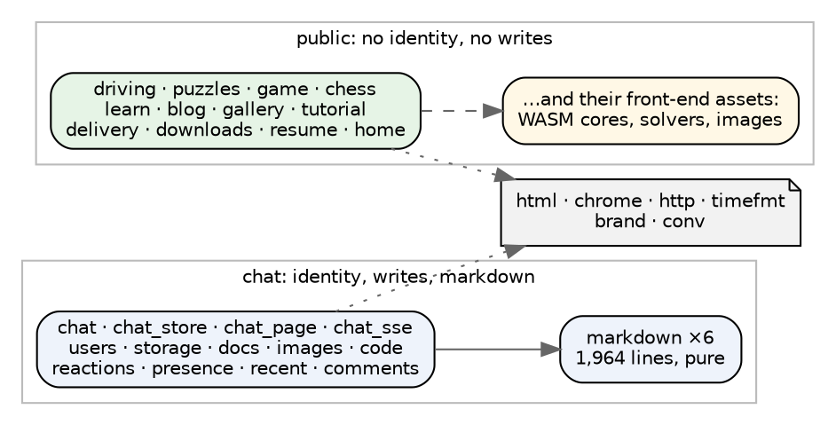
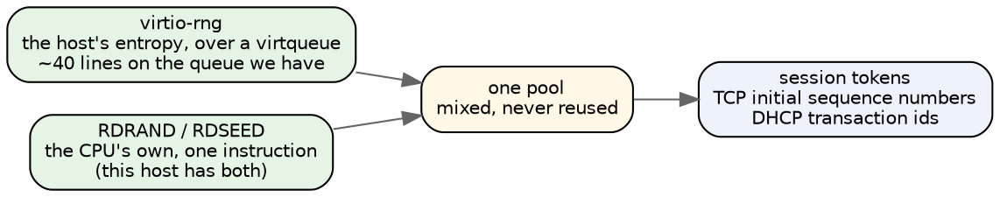

# Five users and a bare machine

Two questions on the table: whether to split chat out from the rest of
angry-gopher, and what to do about identity once it runs on a machine with no
operating system. They turn out to be the same question, and the answer to both
is smaller than it looks — because of one fact that changes the problem class.

**There are five users.** Steve, Apoorva, Damian, Debbie, and Claude. Two very
active, one intermittent, one an AI that posted for the first time yesterday.

Almost everything else follows from taking that seriously.

## The reframe: this is attribution, not access control

Nearly the whole site is public. `/driving`, `/puzzles`, `/game`, `/chess`,
`/blog`, `/learn`, `/gallery` — none of them keep anybody out, and none of them
ever will. Lyn Rummy asks who you are but has no passwords, and can happily
become "type your name".

So identity is not gating anything. The only thing it does is **put the right
name on a chat message**. That is a different problem from access control, and
it has different economics:

- Access control must be **unforgeable**, because the cost of a breach is
  whatever is behind the door.
- Attribution must be **accountable and correctable**, because the cost of a
  mistake is a wrong name on a message, and the remedy is to fix it.

If the realistic worst case is "a stranger who found the URL posts as Damian",
then the question is not "how do we make that impossible" but "how quickly can
we undo it and stop it recurring". For five people who know each other, a
revoke button beats a cryptosystem.

That reframing is the whole essay. Everything below is downstream of it.

## The split is a deployment, not a refactor

Here is the thing I want to argue hardest, because it saves the most work:
**nothing needs to be split in the codebase.**

The chat/not-chat line is exactly the identity line, and it is already visible
in the module graph:

One repository, one source tree, **two deployments**:

- **lynrummy.com stays on Linux**, serving the public pages exactly as it does
  now, with all their assets. Nothing changes and nothing is at risk.
- **The appliance links only the chat subgraph** and is reached through Caddy at
  one route.

The kernel decides what it links; Caddy decides what goes where. Neither needs
the source tree rearranged, and either can be reverted by changing a route.

This matters more on bare metal than it would on Linux, and the reason is
concrete: every embedded asset is bytes in a kernel image. `/driving` needed two
(`safari.wasm`, `blitter.js`). `/chat` pulls about twenty. The public pages drag
in a WASM screensaver, a puzzle solver, chess toys and a tutorial mascot — all
of which Linux is perfectly happy to serve and the appliance has no business
carrying.

**Lyn Rummy is not a problem here at all**, because it stays on the Linux side.
Changing it to "type your name" is worth doing for its own sake, but it is not
on this critical path.

## Entropy first, because it is the one thing that must be right

This is the piece to build next regardless of which identity design wins, and
it is small.

Right now the machine has **no randomness whatsoever**. The DHCP transaction id
is `0x6D657461` in the source. The TCP initial sequence number is `0x4D455441`.
Both are fine for a probe on a private wire and both are indefensible the moment
anything issues a session token.

Two sources, and we can have both:

**virtio-rng is the right primary**, and it is nearly free for us: QEMU ships
`virtio-rng-device` on the same mmio bus we already drive, and a request is one
descriptor on a virtqueue we have already written twice. It is also the correct
answer on a real hypervisor, where the host has a properly seeded pool and the
guest does not.

**RDRAND is the right backstop** — one instruction, no device, available on
every CPU since 2012, and present on this box (`/proc/cpuinfo` has `rdrand` and
`rdseed`). Taking both and mixing costs nothing and means a machine with either
one working is a machine that can mint a token.

Neither is hard. What matters is that **after this, exactly one thing has to be
right for identity to be sound**, and it is a well-understood thing with two
independent implementations underneath it.

## Identity, with five users in mind

### The one I would build: capability URLs

Each person gets one long random URL, once. `chat.lynrummy.com/u/<32 bytes>`.
Bookmark it; that is the credential. The server keeps five rows of token → name.

```dot
digraph cap {
  rankdir=LR; bgcolor="transparent";
  node [shape=box style="rounded,filled" fontname="Helvetica" fontsize=10 fillcolor="#ffffff"];
  edge [fontname="Helvetica" fontsize=9 color="#666666"];

  mint [label="Steve mints one\n32 bytes from the pool" fillcolor="#fff8e6"];
  send [label="hands it over\nonce, however he likes" fillcolor="#f2f2f2"];
  book [label="they bookmark it" fillcolor="#eef3fb"];
  post [label="every request carries it\n→ a name on a message" fillcolor="#e6f4e6"];
  rev [label="revoke = delete the row\nre-issue = mint another" fillcolor="#ffe8e8"];

  mint -> send -> book -> post;
  post -> rev [label="if it ever leaks" style=dashed];
}
```

Why this and not something stronger:

- **There is no login page, no password, no reset flow, no email, and no
  session table beyond five rows.** Every one of those is a thing that does not
  have to work on a machine with no operating system.
- It is exactly as strong as a session cookie, which is what every other option
  degrades to after the first request anyway.
- **Revocation is one row.** With five users, "Damian, your link leaked, here is
  a new one" is a thirty-second conversation, and that is the correctable
  remedy the attribution framing asks for.
- It works for Claude without any special case, because a bearer token is what a
  bot wants regardless.
- It makes the appliance **self-sufficient**: no front box in the trust path, no
  OAuth provider, no certificates to install. The bare machine owns the whole
  story, which is most of what makes it a satisfying object.

The honest weaknesses: a URL is visible in the address bar and in browser
history, and a leaked link is a leaked account until it is revoked. Both are
real. Neither is worse than a leaked cookie, and both are survivable when the
population is five people who can text each other.

### The one that is stronger and I would not start with

**Client certificates, terminated at Caddy.** Five certs, issued once, and
Caddy passes the subject upstream. Cryptographically this is the best answer on
the table and it costs the appliance nothing — it reads a header.

It fails on the same thing every time: installing a client certificate on a
phone is genuinely unpleasant, and Debbie is intermittent. An identity scheme
whose enrolment step is worse than the thing it protects will not be used. Keep
it in the drawer for the day the threat model changes.

### Steelmanning the front-box split

Steve put this on the table and said it felt awkward: do identity on the Linux
box, and let the appliance be a dumb thing that writes files, parses markdown
and serves JS.

**It is less awkward than it feels, and it is worth saying why.** Caddy already
terminates TLS, so it is *already* the trust boundary — that was the decision
that made this whole project tractable. `forward_auth` to a small authenticator
and an injected `X-User: damian` is not a hack; it is how most reverse-proxy
authentication works, and the appliance may trust the header for a good reason
rather than a lazy one: it has no public address, and nothing but Caddy can
reach it.

So the objection is not architectural. It is this: **the appliance stops being
testable on its own.** Today every probe boots, does its thing and prints a
verdict with nothing else running. Move identity out and "who is this" becomes
unanswerable without a second machine, which costs us the property that has made
every step of this project checkable in one command.

That is a real price, and it buys very little that capability URLs do not
already give us. If identity ever gets hard — OAuth, SSO, more than a handful of
people — moving it to the front box is exactly the right move. It is not
earning its cost at five users.

### OAuth, and what it would actually buy

Worth naming so it can be dismissed on the merits rather than on taste. OAuth
buys: no credential of ours to store, a recovery story we do not implement, and
identities users already have. Those are real and they are why it wins at scale.

At five users it costs: a dependency on someone else's availability, a redirect
flow through the appliance, JSON and JWT parsing on a machine with no
allocator worth the name, and clock correctness — **and our clock is currently
a guess of two gigahertz against an unmeasured timestamp counter.** Token
expiry needs a real clock. That alone puts it behind the entropy work, and
behind a wall clock we do not have.

Later, and only if the population changes.

## What I would do, in order

1. **virtio-rng, and RDRAND beside it.** The one thing that must be right, and
   the smallest piece here. Until it exists nothing should mint a token, and the
   TCP sequence number stays a constant in the source with a comment saying so.
2. **A real clock, or an honest admission that there is not one.** Right now
   `Io.Clock` reports nanoseconds derived from an assumed 2 GHz. Calibrating the
   TSC against the PIT is about thirty lines and turns a guess into a
   measurement. Anything with an expiry needs it.
3. **Capability URLs, five rows.** Mint with the pool from step 1.
4. **Link only the chat subgraph into the kernel**, and route one path to it in
   Caddy. No repository surgery.
5. Leave Lyn Rummy on Linux and give it a name box when convenient.

## The short version

- **Five users changes the problem class.** This is attribution, not access
  control: nobody is being kept out of anything, and the remedy for a wrong name
  is to fix it, not to have prevented it.
- **The split is a deployment, not a refactor.** One source tree; Linux keeps
  the public pages and their assets, the appliance links the chat subgraph, and
  Caddy decides. Revertible by changing a route.
- **Entropy first**, because after it exactly one thing has to be right.
  virtio-rng over the queue we already have, with RDRAND as a backstop; both are
  available here today.
- **Capability URLs** fit the five-user shape: no login, no passwords, no reset
  flow, revocation in one row, and the appliance owns the whole story.
- **The front-box split is not architecturally awkward** — Caddy is already the
  trust boundary — but it costs the property that every step so far has been
  checkable on one machine, and it buys little at this size.
- **OAuth is behind a working clock**, which we do not yet have.
