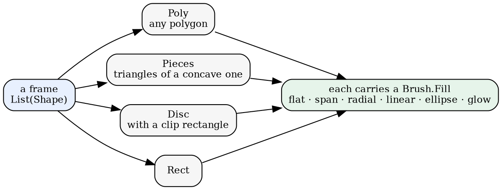
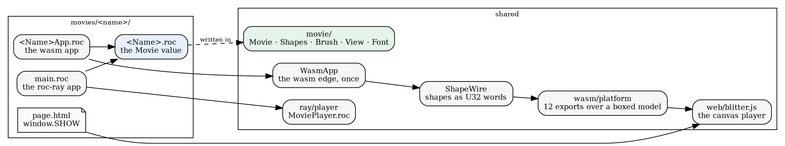
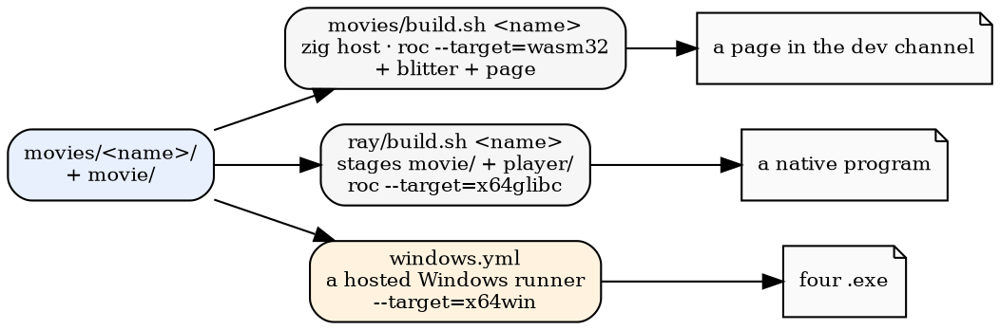

# Four movies, one seam

*2026-09-19 — what the four movies in roc-apps share, and how one of them gets
from a directory to a web page, a Windows executable, and roc.lynrummy.com*

There are four movies now. One of them is a driving screensaver whose 120
modules came out of a Codex compiler; one is a fountain of particles; one is a
plot drawing itself; one is a child walking up to a Halloween house. They have
nothing in common as subjects, and almost everything in common as programs.

This is a tour of what they share and how they get built. (roc-apps holds more
than movies — a BASIC interpreter, Damian's classic games, Cobblestone's WGSL
kernels run on the CPU, a Roc model of a machine with disks and a network,
and Codex drawing straight onto a framebuffer — but this is about the movies.)

## A movie is a value

**The whole seam is one record.** Not a module found by name, not a class, not
a callback registry: a record of functions that a movie hands to a player.

```
Movie(model) : {
    size : { width : F64, height : F64 },
    fps : I32,
    init : model,
    advance : model -> model,
    back : model -> model,
    skip : model -> model,
    frame : model -> List(Shape),
    roll : model -> F64,
    clock : model -> F64,
    title : Str,
    stem : Str,
}
```

That is all of it. **Nothing in the type names a subject** — no ride, no sky,
no sun, no skeleton. A player that has one of these can play any of them, and
a second movie is a second value of the same type.

Several of those fields are there because a movie disagreed with the player
and won. `size` exists because Safari's frame was 960 by 600 and the player simply
knew that, until a 640-by-360 movie arrived and drew itself into a corner.
`back` returns the model unchanged for a movie that cannot rewind, and **that
is a fair answer rather than a failure**: Safari can go back because a frame of
it is thirteen numbers and it keeps two thousand of them; the plot can because
a frame is a function of its clock; the particles cannot, because a velocity
accumulates gravity and there is no summary to keep.

The app that plays one says which it is, out loud, in four lines:

```roc
app [Model, program] { rr: platform "roc-ray/platform/main.roc" }
import MoviePlayer
import Halloween
Model : MoviePlayer.Model(Halloween.Model)
program = MoviePlayer.program(Halloween.movie)
```

An earlier version of this bound the movie by convention — the build staged a
directory and the player imported a module of a fixed name. It worked and it
was horrible: the one line that says what this program *is* was not in the
program.

## What sits under the seam

A frame is a list of shapes, and there are four of them:



`movie/` is the vocabulary every movie is written in — eleven files, about 1330
lines:

| file | what |
|---|---|
| `Movie.roc` | the type above |
| `Shapes.roc` | the four shapes, and what a polygon can be: a thick line is a quad, a rounded rectangle is a swept corner, a yawed figure is every x pulled toward an axis |
| `Brush.roc` | six fill modes and the colour each gives a point |
| `View.roc` | metres to pixels: right, forward, height, an eye at a height with a heading, and a polygon cut against the near plane |
| `Font.roc` | 68 glyphs as stroke polylines, which become thick-line quads |
| `BrushGlsl.roc`, `ShapeWire.roc`, `WasmApp.roc` | the edges, below |
| `Trig.roc`, `DeviceMath.roc` | the arithmetic those need |

None of it is anybody's private helper. `Shapes.line` was written for
capture_plot's gridlines, and it is what every bone in the Halloween skeletons
is drawn with. `View.roc` was written for Halloween and is a generic camera —
Safari has an older one of its own with a 600-pixel screen and an adult's eye
baked in, which is exactly why a second one was written rather than bent.

**The line between the movie and the player is drawn at "what does this mean"
versus "how does this platform do it".** The clearest case: roc-ray fills only
*convex* polygons, so a concave one has to be ear-clipped into triangles. That
is not the movie's problem. `Shapes.cut` lives in the shared vocabulary and the
roc-ray player calls it on every frame; the canvas player never does, because a
canvas fills a concave polygon itself and would rather have the polygon.

## Two players, and neither knows a subject



**The canvas side.** `WasmApp.program` takes a `Movie` and names none, the same
way `MoviePlayer.program` does: it boxes the model for the host, and `render`
answers the frame's shapes packed by `ShapeWire` — a kind, a brush mode, the
brush's words, then the geometry, as `U32`s in linear memory. So a movie's wasm
app is five lines, `import` and `program =`, and it was three copies of the
same eighty-line file before anybody noticed they were byte for byte identical
apart from the name they imported. An app that answers something differently
says so by name:

```roc
program = { ..WasmApp.program(SafariMovie.movie), scene, probe_frame, probe_expand }
```

That is Safari's whole app: the route segment it calls a scene, and the two
command counts the Node smoke run times its stages by. `blitter.js` unpacks the
wire and fills. It knows the six brush modes and the four shapes, and nothing
else. It
used to know a great deal else: the platform once required a rider's segment
and tilt, a camera focal length, a gaze yaw, two sky colours, four numbers
about the sun and three about a truck — twenty exports, of which the page
bound half and used to paint a country sky *itself*. A second movie could not
have satisfied any of it.

**The roc-ray side.** `MoviePlayer.roc` is 328 lines and takes a `Movie` and
names none: the window, the keys, the supersampling, the screenshot. The same
keys work in both players, because they are the player's, not the movie's —
space to pause, up and down to step a frame, `J` for the movie's own idea of a
jump, `P` for a screenshot named by the movie's clock.

**A rate is a movie's, too.** Every movie's motion is written per tick — a
velocity, a gravity, a walk of eight hundred frames — so a player that runs at
its own rate plays the movie at the wrong speed. That one went unnoticed for a
while: the page was paced by accident, because one step per animation frame is
one step per display refresh, and roc-ray sat at raylib's default of 240 frames
a second. The same movie ran four times faster on the desktop. `fps` is a field
of `Movie` now, next to `size`, and for the same reason: the player should ask
rather than know. The desktop hands it to raylib as a cap that waits; the page
banks elapsed time and takes steps as they fall due, which also fixes it for a
144 Hz monitor.

**And a field can be in the wrong place for years.** `roll` — how far the camera
is banked — was part of the frame, which reads well until you notice that the
page asks for the frame and the roll as two separate calls. Answering `roll()`
built every shape in the frame and threw them all away, so Safari painted each
displayed frame twice. It is `movie.roll(m)` now, beside `frame`; Safari's own
is a function of the ride and never needed the shapes. **The seam being small
is what made that visible**: with twelve fields to look at, a field that is
paid for twice stands out.

The third painter is `Brush`. A gradient has to mean the same thing in three
places — a CPU rasteriser in Roc, a GLSL fragment shader on roc-ray, and a
canvas gradient in JavaScript — so the mode numbers are one contract
(`BrushGlsl.mode_of`) and the arithmetic is written once in `Brush.shade`.

## Four directories that look the same

Every movie is the same five things:

```
movies/<name>/
    <Name>.roc        the movie
    <Name>App.roc     the wasm app
    main.roc          the roc-ray app
    page.html         the page
    …                 whatever other Roc it owns
```

That is a recent tidying and it is worth a sentence. Safari's Roc lived under
`safari/roc/`, its platform under `safari/wasm/`, its blitter under
`safari/web/`, and its roc-ray app under `ray/apps/safari/` — because for a
long time there was one movie and it was Safari. The other three each had a
piece in four different places and a `modules` file listing the directories to
stage. Now the shared things are shared (`wasm/`, `web/`, `movie/`,
`ray/player/`), the movies are movies, and there is nothing left for a
`modules` file to say.

The sizes are worth seeing, because they say what the seam is worth:

| movie | lines of Roc |
|---|---|
| safari | 10,146 (120 modules, and their specs) |
| halloween | 935 |
| capture_plot | 251 |
| particles | 238 |

A movie in 238 lines is only possible because the 1250 lines under it and the
800 lines of player beside it are already there.

## Getting built



Both scripts do the same three things: copy `movie/*.roc` and the movie's own
`*.roc` into a staging directory, rewrite the app's platform reference to where
the platform actually is, and build. Nothing is generated and nothing is
symlinked; a staging directory is a flat pile of Roc with one app in it.

Windows goes through a hosted runner, because Roc's `x64win` link is MSVC-ABI
and wants an installed Windows SDK that a Linux box cannot provide. The
workflow builds every movie, runs each one headless to prove it links and
loads, and uploads the executables. Two of them then run again in a hidden
window against Mesa's llvmpipe — software OpenGL on the CPU — with their keys
scripted by frame number, and save screenshots. That is the only way anyone
sees these drawn without a display.

**The check that matters most is the cheapest one.** `web/page_check.mjs` runs
a built page the way a browser would: a fake DOM, a canvas that records instead
of painting, the real wasm. It cannot say whether a frame *looks* right —
nothing can, without eyes — but it says the page runs, draws, and keeps
drawing. It exists because for a while every check ran the wasm from Node and
never executed `blitter.js`, and a reference error in the blitter reached the
browser as four blank pages.

## Getting deployed


Three channels, one Caddy, and every page's URLs relative — so a page moves
from one channel to the next unchanged. A build only ever writes dev.
**Staging never changes under you**: a deliberate copy, with a file recording
what the build read (the Roc nightly, the commits, each module's hash), is what
moves it, and that copy is a commit. The prod deploy refuses to run if staging
has uncommitted changes, copies with `rsync --delete`, and then proves the copy
verbatim — every file's sha256 on prod must equal staging's, with none missing
and none extra.

## What it cost to find out

The seam was not designed up front. It was extracted from a 400-line
`main.roc` that knew about `sky_top`, `sky_horizon` and a sun, with a fragment
shader full of Safari's own arithmetic. The way it got found was to port a
movie that had nothing to do with driving, and then another, and then to write
one by hand — and each of those pulled something out of Safari that was never
Safari's: the shape vocabulary, the brush modes, the text, the camera.

**An abstraction earns its keep on the second user.** Three of the four movies
here exist partly to be that second user, and the fourth one — 238 lines of
particles — is what the bill came to.
