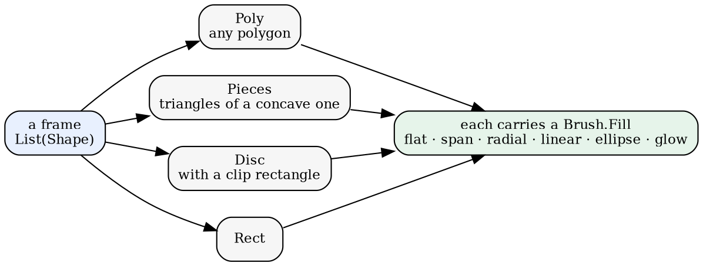
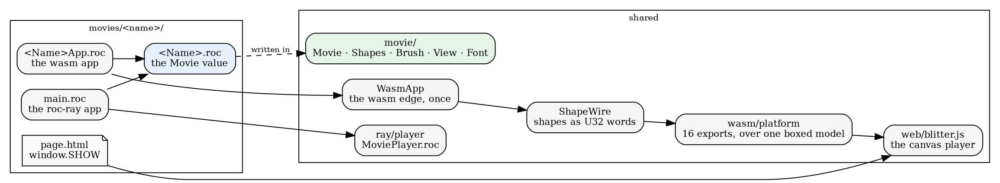
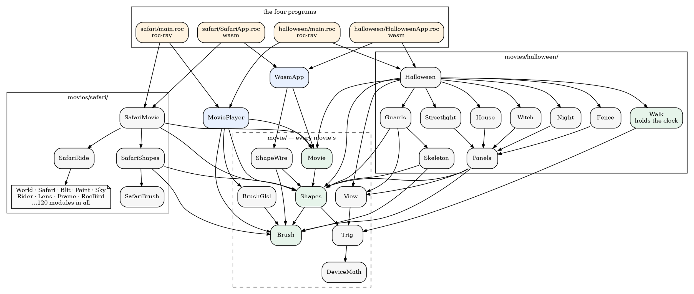
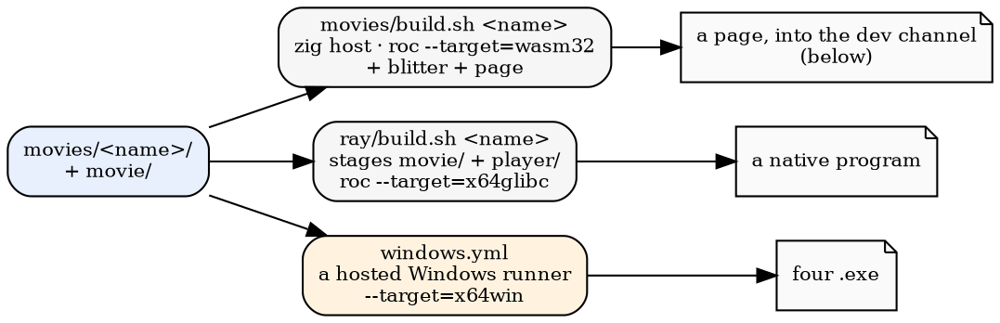

# Four movies, one interface

*2026-09-19 — the architecture of the movies in roc-apps: what they share, how
they are built, and how they are deployed*

There are four movies: a driving screensaver (safari), a fountain of particles,
a plot drawing itself (capture_plot), and a child walking up to a Halloween
house. Each is played by one of two players — one drawing to a browser canvas,
one to a native window through roc-ray, a raylib platform for Roc — and each
builds for either. They share one interface and one library.

roc-apps holds other things that are not movies, among them a BASIC
interpreter, a set of classic games and a Roc model of a machine with disks and
a network. This is about the movies.

## A movie is a value

A movie is a record of functions. A player is a function of one.

```roc
Movie(model) : {
    size : { width : F64, height : F64 },
    fps : I32,
    init : model,
    advance : model -> model,
    back : model -> model,
    skip : model -> model,
    scene : model -> I64,
    scenes : I64,
    frame : model -> List(Shapes.Shape),
    roll : model -> F64,
    clock : model -> F64,
    title : Str,
    stem : Str,
}
```

No field names a subject. Four of them are worth a note:

- `size` and `fps` belong to the movie rather than to the player. Motion is
  written per tick, so a player running at its own rate shows the movie at the
  wrong speed, and a player with its own frame size draws it at the wrong
  scale.
- `back` may return the model unchanged. safari can rewind because a frame of
  it is thirteen numbers and it keeps two thousand of them; capture_plot can
  because a frame is a function of its clock; particles cannot, because a
  velocity accumulates gravity and there is no summary to keep.
- `roll` — how far the camera is banked — is separate from `frame` because the
  canvas player fetches the two in separate calls, and building a frame to
  answer only the roll would discard every shape in it.
- `skip` is a jump defined by the movie: safari's goes to the next of its
  nineteen route segments, while a one-scene movie advances a second.

The program that plays one names it:

```roc
app [Model, program] { rr: platform "roc-ray/platform/main.roc" }
import MoviePlayer
import Halloween
Model : MoviePlayer.Model(Halloween.Model)
program = MoviePlayer.program(Halloween.movie)
```

## The shared library

A frame is a list of shapes:



`movie/` is the vocabulary every movie is written in — eleven files, about
1,340 lines:

| file | what |
|---|---|
| `Movie.roc` | the type above |
| `Shapes.roc` | the four shapes, and what a polygon can be: a thick line is a quad, a rounded rectangle is a swept corner, a yawed figure is every x pulled toward an axis |
| `Brush.roc` | six fill modes and the colour each gives a point |
| `View.roc` | metres to pixels: right, forward, height, an eye at a height with a heading, and a polygon cut against the near plane |
| `Font.roc` | 68 glyphs as stroke polylines, which become thick-line quads |
| `WasmApp.roc`, `ShapeWire.roc`, `BrushGlsl.roc` | the two platform edges |
| `Trig.roc`, `DeviceMath.roc` | the arithmetic those need |
| `FontProof.roc` | the glyphs printed as ASCII art, for checking them without a screen |

Modules here have users in more than one movie: `Shapes.line`, a thick line as
the quad it is, draws capture_plot's gridlines and every bone in halloween's
skeletons. `View.roc` is the camera halloween is placed through; safari has an
older one of its own, with a 600-pixel screen and an adult's eye height fixed
in it.

A movie says what a frame contains; a player decides how its platform draws
that. roc-ray fills only convex polygons, so a concave one is ear-clipped into
triangles — `Shapes.cut` is in the shared library, the roc-ray player calls it
on every frame, and the canvas player never does, because a canvas fills a
concave polygon itself.

## Two players



**The canvas player.** `WasmApp.program` takes a `Movie` and names no
particular one. It boxes the model for the host, and `render` answers the
frame's shapes packed by `ShapeWire` — a kind, a brush mode, the brush's words,
then the geometry, as `U32`s in linear memory. A movie's wasm app is five
lines. One that answers something differently says so by name:

```roc
program = { ..WasmApp.program(SafariMovie.movie), probe_frame, probe_expand }
```

That is safari's whole app. Its two extra answers are counts of draw commands,
which a Node script uses to time the stages of building a safari frame
separately. `blitter.js` unpacks the wire and fills; it knows the six brush
modes and the four shapes.

**The roc-ray player.** `MoviePlayer.roc` is 331 lines and also takes a `Movie`
and names no particular one: the window, the keys, the supersampling, the
screenshot.

Keys belong to the player. Both bind space to pause, up and down to step a
frame, `J` to `skip`, and `D` to a debug overlay; the roc-ray player also binds
`P` to a screenshot named by the movie's clock. Both pace themselves by `fps`:
roc-ray caps its frame rate there, and the canvas player banks elapsed time and
steps as steps fall due, rather than stepping once per display refresh.

A gradient has to mean the same thing in three renderers — a CPU rasteriser in
Roc, a GLSL fragment shader on roc-ray, and a canvas gradient in JavaScript.
The mode numbers are one contract (`BrushGlsl.mode_of`), and the arithmetic is
written once, in `Brush.shade`.

## The directories

Every movie is laid out the same way:

```
movies/<name>/
    <Name>.roc        the movie
    <Name>App.roc     the wasm app
    main.roc          the roc-ray app
    page.html         the page
    …                 any other Roc the movie owns
```

Those four files are all that is required; capture_plot and particles have
nothing else, while halloween has nine more and safari a hundred and twenty.
Everything shared sits beside them: `movie/` the library, `ray/player/` and
`web/blitter.js` the players, `wasm/` the platform and its host.

A build takes the directory name and nothing else. `movies/build.sh halloween`
stages `movie/*.roc` and `movies/halloween/*.roc` together and finds the app by
globbing `*App.roc`; `ray/build.sh halloween` stages the same plus the player,
and builds `main.roc`.

| movie | Roc, including its own tests and tools |
|---|---|
| safari | 10,084 lines in 123 modules |
| halloween | 1,011 in 13 |
| capture_plot | 201 in 3 |
| particles | 189 in 3 |

## What depends on what

Two of the four movies, as four programs, converging on the same leaves.
safari's own modules were emitted as Roc by a compiler for another language and
are maintained as Roc now; halloween's were written by hand.



The two players are the only thing between a program and a movie, and both
movies reach both players. Neither movie's own modules are imported by the
other, but all of them reach `Shapes` and `Brush` within two or three steps.

halloween's half is arranged the way safari's is: one module holds the clock
(`Walk`), and the rest take numbers and produce shapes. `House` is passed how
far open its door is, `Witch` how far down the hall she has come, `Guards` how
far the skeletons have turned toward the child; none of them reads a frame
count. `Panels` below them is the three ways anything is placed in metres, and
refers to no house or fence, so it is the candidate to move into `movie/` for a
second movie placing things in a world.

## Getting built



Both scripts do the same three things: copy `movie/*.roc` and the movie's own
`*.roc` into a staging directory, rewrite the app's platform reference to where
the platform actually is, and build. A staging directory is a flat set of Roc files
with one app among them; no file is symlinked, and the rewrite is the only edit
either script makes.

Windows goes through a hosted runner, because Roc's `x64win` link is MSVC-ABI
and wants an installed Windows SDK that a Linux box cannot provide. The
workflow builds every movie, runs each headless to prove it links and loads,
and uploads the executables. Two of them then run again in a hidden window
against Mesa's llvmpipe — software OpenGL on the CPU — with their keys scripted
by frame number, and save screenshots, which is how anyone sees these drawn
without a display.

`web/page_check.mjs` runs a built page the way a browser would: a fake DOM, a
canvas that records instead of painting, the real wasm, and a virtual clock so
the paced loop takes a step per frame. It cannot say whether a frame looks
right, but it says the page runs, draws, and keeps drawing. It checks thirty
frames by default, and `FRAMES=1500` checks all of a long movie.

## Getting deployed


Three channels, one Caddy, and every page's URLs relative, so a page moves from
one channel to the next unchanged. A build only ever writes dev. Moving it on
is a deliberate copy carrying a file that records what the build read — the Roc
nightly, the commits, each module's hash — and that copy is a commit. The prod
deploy refuses to run if staging has uncommitted changes, copies with `rsync
--delete`, and then proves the copy verbatim: every file's sha256 on prod must
equal staging's, with none missing and none extra.
