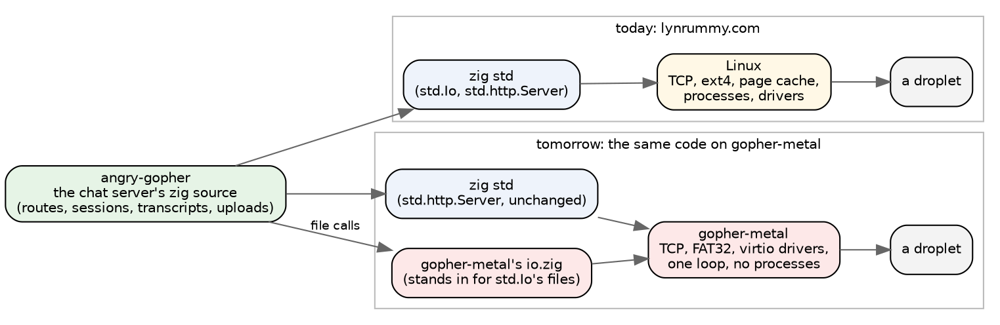
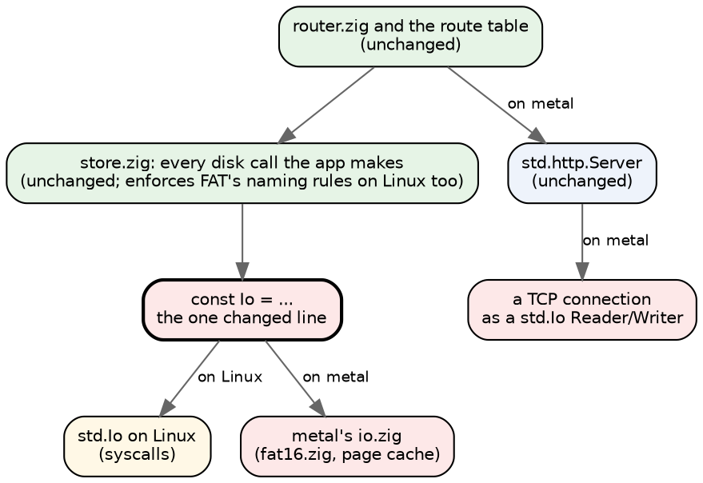
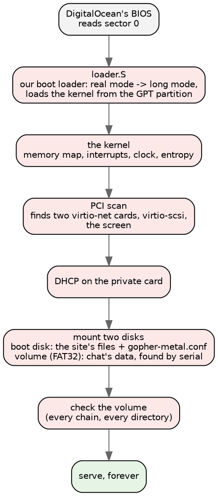
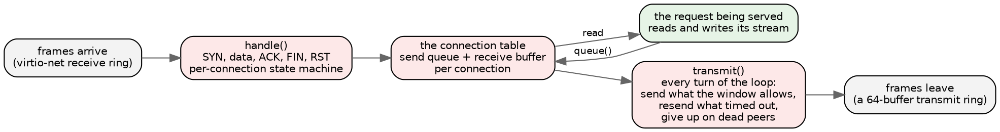
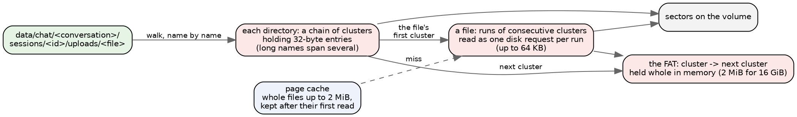
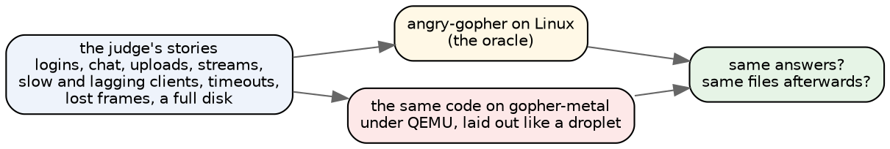
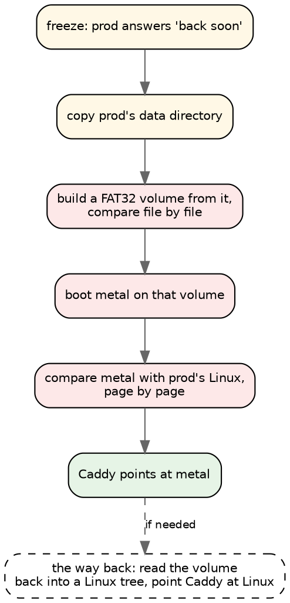

# Gopher Chat on its own kernel

*Draft 1, 2026-10-03. For Apoorva and Damian.*

**Tomorrow, lynrummy.com's chat stops running on Linux.** The same zig code
that serves it today will run on a small kernel of our own, booted straight
onto a DigitalOcean droplet: no Linux, no libc, no processes, no shell. The
application is not rewritten. It is the same source tree, compiled against a
different floor.



The red boxes are ours. Everything green and blue is the same code either way.

## The seam is one line per file

The chat server already did all its file work through zig's `std.Io`
interface: every one of its 121 filesystem calls is spelled
`Io.Dir.cwd().something(io, ...)`. So the port is a script, `port.sh`, that
copies the server's sources and changes one line in each file that has it:

```
const Io = std.Io;   ->   const Io = @import("metal").io;
```

Not one call site moves. `io.zig` provides the same names (`Dir`, `File`,
`readFileAlloc`, `writeFile`, `createFile`, `writePositionalAll`, the
directory iterator, `rename`, `deleteTree`) with FAT underneath instead of a
Linux filesystem. HTTP needed no seam at all: the application builds
`std.http.Server` itself, and std's server only needs a reader and a writer,
which our TCP connections provide.



One piece of groundwork made this honest: angry-gopher's own `store.zig`
enforces FAT's rules (names FAT can hold, case-insensitive identity with the
case kept for display) even when it runs on Linux. So prod's data has been
FAT-shaped for a while, and the two hosts agree about which names exist.

## What a request goes through

TLS stays on prod. Prod's Caddy terminates HTTPS as it does today and
forwards to the metal droplet over DigitalOcean's private network; metal's
public card is not even listening. Inside metal, there is one loop.

```dot
digraph request {
  rankdir=LR; bgcolor="transparent"; nodesep=0.25;
  node [shape=box style="rounded,filled" fontname="Helvetica" fontsize=10 fillcolor="#ffffff"];
  edge [fontname="Helvetica" fontsize=9 color="#666666"];

  browser [label="a browser" fillcolor="#f3f3f3"];
  caddy [label="prod's Caddy\nHTTPS ends here" fillcolor="#fff8e6"];

  subgraph cluster_metal {
    label="the metal droplet"; fontname="Helvetica"; fontsize=10; color="#bbbbbb";
    nic [label="virtio-net\n(private card)" fillcolor="#fde8e8"];
    tcp [label="tcp.zig\na table of connections" fillcolor="#fde8e8"];
    http [label="std.http.Server" fillcolor="#eef3fb"];
    app [label="angry-gopher's routes" fillcolor="#e6f4e6"];
    io [label="io.zig + page cache" fillcolor="#fde8e8"];
    fat [label="fat16.zig\n(FAT16 and FAT32)" fillcolor="#fde8e8"];
    scsi [label="virtio-scsi" fillcolor="#fde8e8"];
  }
  vol [label="a DigitalOcean volume\n(network block storage)" fillcolor="#f3f3f3"];

  browser -> caddy [label="HTTPS"];
  caddy -> nic [label="HTTP over the\nprivate network"];
  nic -> tcp -> http -> app -> io -> fat -> scsi -> vol;
}
```



The kernel serves **one request at a time**, start to finish, but it holds
many connections at once: chat keeps a connection open for every open tab, so
the connection table is the thing that scales, not the request handler. While
one request runs, the network keeps moving for everyone else (ACKs,
retransmissions, new handshakes); their requests wait in the table, not at the
door. Each request gets its own heap, reset afterwards, the way the Linux
server gives each request an arena.

## Boot: from DigitalOcean's BIOS to serving

DigitalOcean lets you upload a disk image and boot a droplet from it. Its
machine is a plain i440FX PC with a legacy BIOS; there is no UEFI and no
multiboot. So the image carries our own boot loader, about 380 lines of
assembly, which reads the kernel off the disk and jumps into it in 64-bit mode.



The serial console and the droplet's screen both carry the log, so
DigitalOcean's recovery console shows what the machine is doing. If the
kernel panics it restarts itself, with a back-off so a crash loop cannot spin.
A watchdog on prod polls it from outside.

## TCP

`tcp.zig` is about 1,100 lines. It is a server's TCP and nothing more:
passive opens only, in-order receive (out-of-order segments are dropped and
the peer resends), and a send side that keeps its promises to the peer.



What it respects: the peer's window (with zero-window probes), the
negotiated segment size, retransmission with a doubling timeout, and a
bounded number of retries before it gives up on a peer. Nothing in it waits;
both directions are state machines the main loop turns.

It is tested three ways: against Linux's TCP on a real tap device, in a
deterministic simulator (`tcp_sim`) where time is a number we control, and
under deliberate loss (the kernel can be told to drop one frame in every N it
sends, so retransmission is exercised on an emulated network that never drops
anything).

Today's speed work was mostly here. A 4 MB picture used to wait about 65 µs
per frame for the network card to hand back its one transmit buffer; now
there are 64, and the card is only interrupted when we need it. From prod, a
4 MB picture went from about 15-22 MB/s to 30-39 MB/s. Linux still does
280-470 MB/s, mostly because it keeps the file in memory; that is the next
lever, after the cutover.

## FAT32

The data lives on a DigitalOcean volume formatted FAT32: no journal, no
permissions, no inodes, just a table of cluster links and directories made of
32-byte entries. It is old and simple, and every operating system can read it,
which matters for the way back (below). `fat16.zig` handles both FAT16 (the
boot disk's small site partition) and FAT32 (the data volume).



The rules that keep it safe:

- **Data before the directory entry.** A file is written before the entry
  that points at it, so a machine that stops mid-write has lost that file,
  not corrupted it. That is the data-loss risk we are accepting: the one file
  being written when the power goes.
- **Both FAT copies, first one first.** If they ever disagree at boot, the
  first is the truth and the second is rewritten from it.
- **A full check at every boot**: every chain, every directory, leaks and
  loops reported.
- **Exact or absent.** The page cache holds exactly what the disk holds for a
  file, or nothing for it; a failed write drops the cached copy.

Tonight's other speed fix was here too: a picture six directories deep took
358 disk requests, of which about 290 were directory sectors read 512 bytes
at a time. Directories are now read a cluster at a time, and a lookup stops
at the name it wants; that picture now takes 100.

## How we know it is the same server

The judge sends the same requests to the application running as an ordinary
Linux process and to the kernel under QEMU, over the same starting files, and
requires the same answers, byte for byte, and the same files on disk
afterwards.



Around that: unit tests for every module, small probe kernels for each device,
dosfstools' `fsck.vfat` over every volume we write, an hours-long soak that watches memory and
connections for a trend, and metal-vmm, a hypervisor of our own that runs the
probe kernels and must agree with QEMU byte for byte. A cloud Claude works
through a queue of reviews and fixes; a Claude on the build box runs the gates
under KVM and merges.

## Tomorrow



The whole runbook has been rehearsed on a copy of prod's data, and it runs
tonight once more as a script against stand-ins. Each step has a go/no-go
line. The way back is part of it: FAT32 is readable by Linux, so metal's data
can be turned back into an ordinary directory tree and served by the Linux
build again.

## What we are worried about, in order

1. **Leaking passwords.** The hashes live on the volume; prod keeps HTTPS;
   metal answers only on the private network. Tonight the cloud Claude is
   reviewing every way a secret could leave the machine (responses, error
   pages, logs, the console, leftover buffers, file paths) and the newest
   network and disk code, with a test for every way out it can close.
2. **Losing data.** No journal means the file being written when the machine
   stops can be lost. A backup can be taken over the private network (rehearsed
   in a fire drill); how often to take one is tomorrow's decision.
3. **Stalls.** One request at a time means a slow one makes others wait. A
   cold 4 MB picture now holds the machine for about 60-70 ms; sending big
   files in pieces is the fix, after the cutover.

*Next drafts can go deeper on any box above: the loader, virtio, the TCP
state machine, FAT's directory format, or the judge.*
