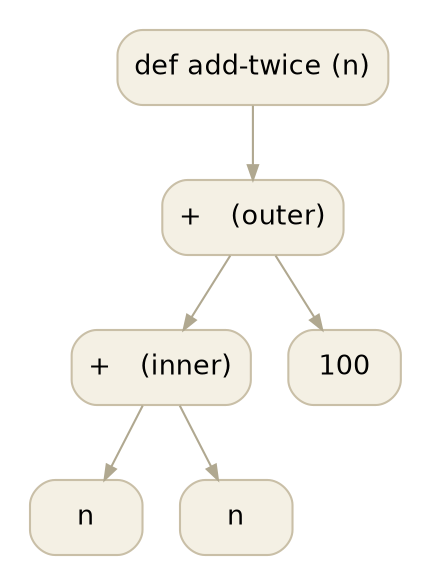
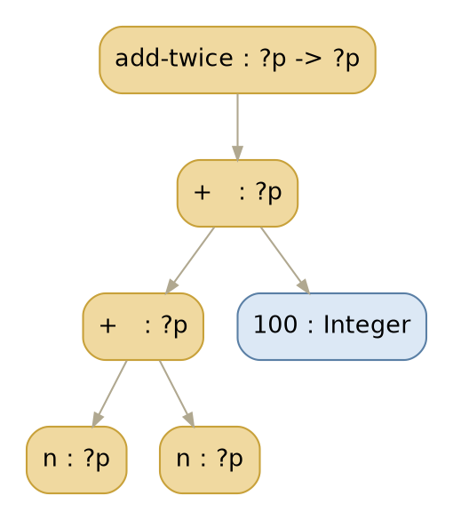
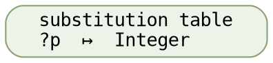
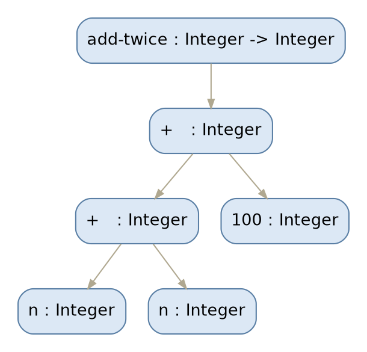
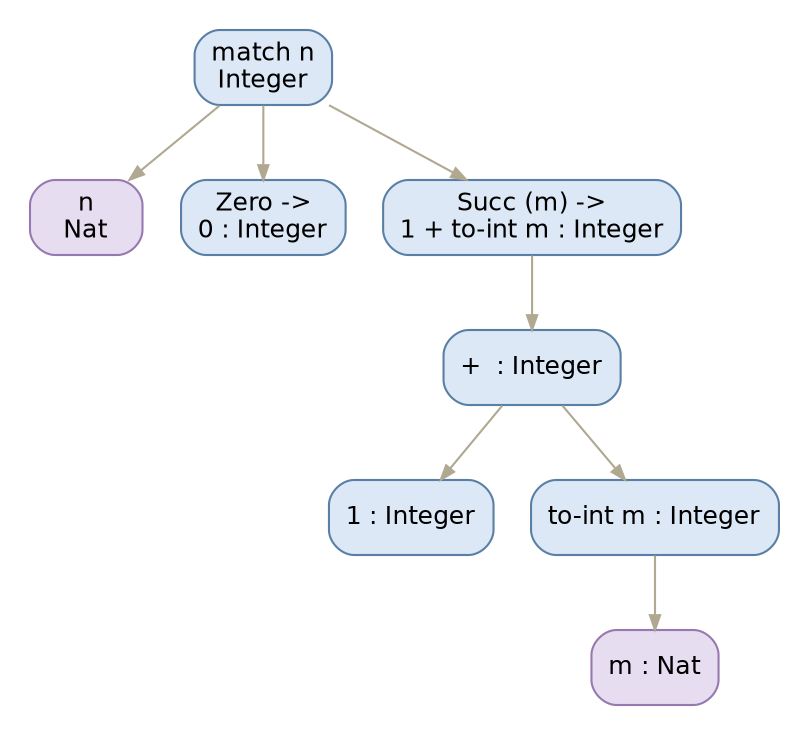

# How a type reaches every node

You said you know how lex, parse, and desugar work, but never learned how types
propagate through the graph of AST nodes. This is that walk, in our own Rust
compiler, shown on the smallest program that makes the mechanism visible. Every
number and type below came out of the compiler — the diagrams are drawn from its
real output, not sketched.

The surprise, and the whole lesson, is this: **the checker does not push types
around the graph.** It never visits a node twice to update it. A type reaches
every node that needs it through a single shared side-table, and one local act
of unification can resolve a dozen nodes at once — because they were all pointing
at the same slot the whole time.

## The graph, before any type

Take a function with no signature at all:

    add-twice (n) = n + n + 100

Desugaring gives the tree the checker will walk. `n + n + 100` associates left,
so it is `(n + n) + 100`. No types yet — desugar does not do types:



## Three primitives, one table

The checker carries a `UnifyState`. The only piece that matters here is a vector
of substitutions, and three operations on it (`check.rs`):

- **`fresh()`** mints a new type variable. It pushes a slot holding *itself* onto
  the vector and hands back `Var(id)`. A slot that holds its own id is an
  *unbound* variable. Minting is the only thing that grows the table, which is
  why `next-id` and `substitutions` move in lockstep.
- **`unify(a, b)`** makes two types equal. When one side is an unbound variable,
  unify writes the other type into that variable's slot. That write is the only
  way a type is ever *learned*.
- **`deep_resolve(t)`** reads a type back, chasing every variable through its
  slot until it hits something concrete. Nothing rewrites the nodes; they are
  resolved on demand, through the table, whenever someone asks.

That is the entire engine. A recursive walk calls `infer` on each node, each node
asks its children for their types and then applies its own rule, and the rules
are almost all just `unify`.

## What an undeclared parameter starts as

Because `add-twice` declares no signature, the checker builds it a *shape*
instead of instantiating one (`build-undeclared-fun-type`): it mints a variable
for the parameter and one for the result, and ties them into an arrow. Call the
parameter's variable `?p`. Both occurrences of `n` are the same binding, so both
`n` leaves infer to the very same `?p`. Here is the tree with the checker's type
slots filled in — *before* the walk reaches the literal:



The inner `+` is where you might expect the type to be decided, and it is not.
Our arithmetic rule is:

```dot
digraph { rankdir=LR; bgcolor="transparent"; node[shape=plaintext fontname="Courier" fontsize=12];
  a [label="OpAdd  =>  unify(lt, rt);  arith_result_ty(resolve lt, resolve rt)"]; }
```

The inner `+` sees `lt = ?p` and `rt = ?p`. Unifying a variable with *itself*
writes nothing. And `arith_result_ty` returns its left operand unchanged unless
*both* sides are already concrete integers — so with two variables it just hands
back `?p`. The inner `n + n` is genuinely still polymorphic. If `add-twice` were
never used any more concretely than this, it would stay `?p -> ?p`, a perfectly
good generic function.

## One unify, and the whole tree resolves

The outer `+` is different. Its left operand resolves to `?p`; its right is the
literal `100`, which is `Integer`. `unify(?p, Integer)` finds `?p` unbound and
**writes `Integer` into its slot.** That is one entry in the table:



Nothing walks back up the tree to update the two `n` leaves or the inner `+`.
They never held `Integer`; they held `?p`, and they still do. But every one of
them is a pointer into the same slot, so the instant that slot changes,
`deep_resolve` reads `Integer` at all of them:



That is the answer to "how does a type propagate around the graph." It does not
travel node to node. It is written once, into a slot the nodes already share, and
every node that referenced the slot is resolved for free. A local act —
unification at one `+` — has global reach, and the reach costs nothing because the
sharing was set up when the variables were minted.

The compiler confirms the arithmetic end to end: `add-twice 21` computes
`21 + 21 + 100`, and `codexrun` prints `142`. The check reports `check-errors 0`
with `next-id 9` variables minted and `substitutions 9` slots — every one
eventually resolved.

## The same walk, on a real definition, on the wire

Scale the identical mechanism up to a definition that survives all the way to
emitted IR — a recursive `to-int` over a `Nat` sum type. Here is the *actual*
`irdump` output for its body, reformatted only with line breaks:

```
(def "to-int" "P1" (params (param "n" (sum "Nat" (args))))
  (fn (sum "Nat" (args)) int-default)
  (match (name "n" (sum "Nat" (args)))
    (branches
      (branch (ctor-pat "Zero" (subs) (sum "Nat" (args)))
              (int-lit 0) (bool-lit true))
      (branch (ctor-pat "Succ" (subs (var-pat "m" (sum "Nat" (args))))
                        (sum "Nat" (args)))
              (binary add-int (int-lit 1)
                      (apply (name "to-int" (fn (sum "Nat" (args)) int-default))
                             (name "m" (sum "Nat" (args))) int-default)
                      int-default)
              (bool-lit true)))
    int-default))
```

Every node carries a type — the trailing S-expression on each form. That is not a
second inference pass; it is exactly the type each node resolved to through the
same table, recorded at its span and read back with `deep_resolve` when the IR is
emitted. Drawn out, with each node's resolved type beneath it:



Here the `+` *does* pin `Integer` at the node: its left operand is the literal
`1`, already concrete, so `arith_result_ty` sees `Integer` on the left and the
recursive call's result meets it. `n` and `m` resolve to `Nat` because the
pattern `Succ (m)` unified the scrutinee against the sum type's declared shape.
Same three primitives, same walk — a bigger tree, and every leaf's type learned
by one unify somewhere and read back through the table.

## Why this shape matters to us

This is why, in this compiler, **lowering is a reader, not a second
inferencer.** The check phase does all the deciding and files each answer by
span; every later phase — lowering, resolving, emitting — just looks the type up
and resolves it. The knowledge is earned once and carried forward through the
table, never re-derived. That is the same principle the whole reference effort
turns on: when a layer already knows something, the next layer should *read* it,
not work it out again. The substitution table is where that carrying-forward
physically lives, and watching a single `unify` light up an entire subtree is the
clearest picture of it I know.

<style>
figure.ast { margin: 20px 0; text-align: center; }
figure.ast svg { max-width: 100%; height: auto; }
.dot-error { color: #a00; font-family: monospace; white-space: pre-wrap; }
</style>
<script src="/assets/viz-standalone.js"></script>
<script>
Viz.instance().then(function (viz) {
  document.querySelectorAll('code.language-dot').forEach(function (code) {
    var pre = code.closest('pre');
    try {
      var svg = viz.renderSVGElement(code.textContent);
      var fig = document.createElement('figure');
      fig.className = 'ast';
      fig.appendChild(svg);
      pre.replaceWith(fig);
    } catch (e) {
      var err = document.createElement('div');
      err.className = 'dot-error';
      err.textContent = 'graphviz: ' + e.message;
      pre.appendChild(err);
    }
  });
}).catch(function (e) {
  console.error('viz load failed', e);
});
</script>
