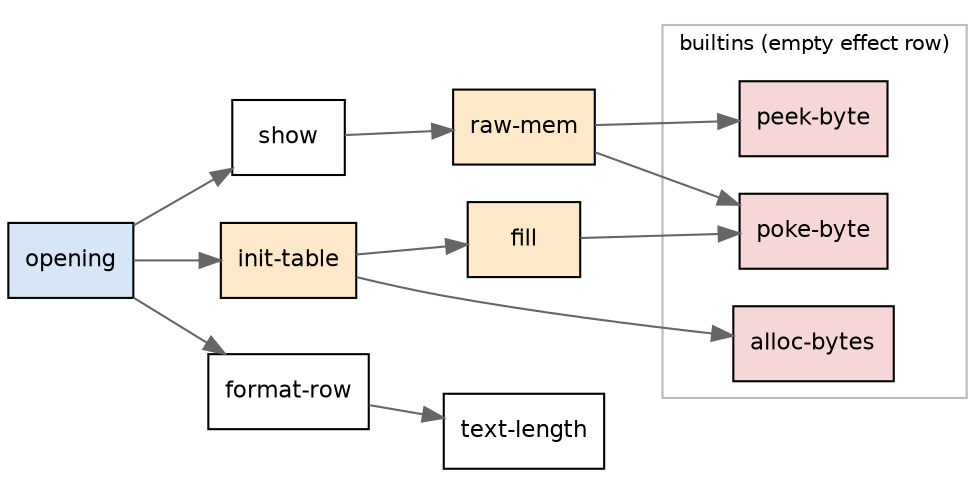
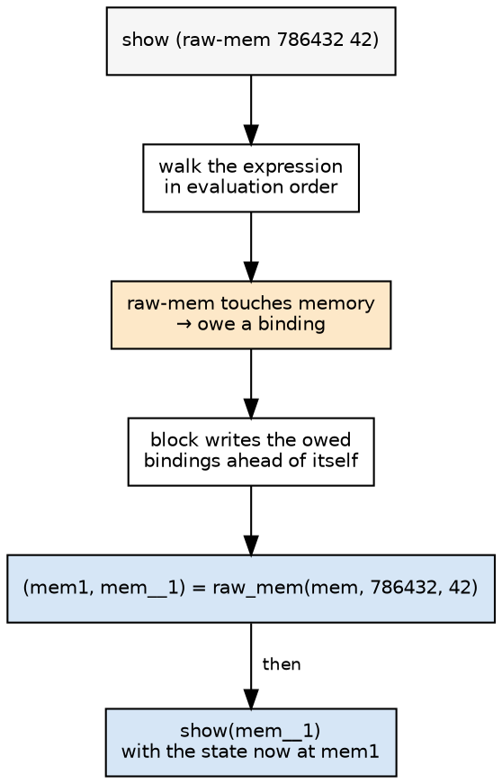
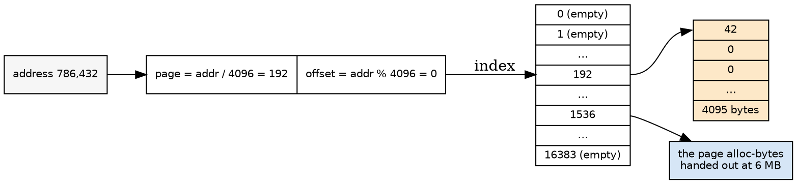
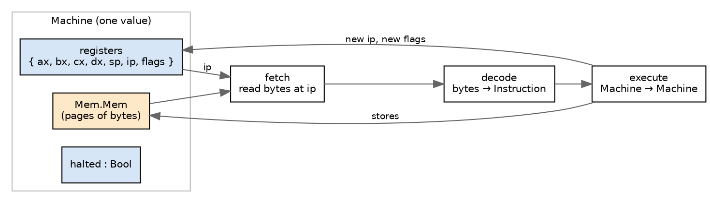

# Memory as a value

*How a Codex program that pokes bytes runs in Roc, and what that makes
possible next.*

`docs/memory-plan.md` in roc-apps is a plan, and a plan assumes you
already know what the thing is. This is the part underneath it: what
Codex's memory actually is, what Roc has instead, and the specific
translation between them. At the end, the machine emulator, which is the
reason any of this is interesting beyond the test count.

---

## The smallest program that needs it

Cobblestone's test corpus has a four-line program called
`cap-heap-poke-pure`:

```
raw-mem : Integer, Integer -> Integer
raw-mem (addr) (val) =
 let w = poke-byte addr 0 val
 in peek-byte addr 0

opening : Text = show (raw-mem 786432 42)
```

It writes 42 to address 786,432 and reads it back. The expected output is
`42`. That is the whole test, and until this week it was one of 204 units
the emitter refused outright.

It is worth sitting with why. Nothing about this program is exotic. It has
no threads, no I/O, no recursion. The difficulty is entirely that Roc has
no such thing as address 786,432.

---

## What Codex's memory is

Codex's memory builtins are thin. Here is the Zig that Cobblestone's own
transpiler emits for two of them:

```zig
var cx_heap_mem: []u8 = &.{};
var cx_hp: i64 = 6291456;

fn cx_poke_byte(b: i64, off: i64, v: i64) i64 {
    cx_buf_want(b + off + 1);
    cx_heap_mem[@as(usize, @intCast(b + off))] = @truncate(@as(u64, @bitCast(v)));
    return 0;
}

fn cx_alloc_bytes(n: i64) i64 {
    const cx_p: i64 = cx_hp;
    cx_hp += n;
    cx_buf_want(cx_hp);
    return cx_p;
}
```

So: one flat byte array, one global bump pointer starting at 6 MB, a
bounds check that panics outside the reservation, and nothing else. No
free. A poke answers `0` — the write is the point, and the value is
discarded. A multi-byte peek assembles little-endian and unsigned, with
`peek-qword` wrapping into `i64`.

There are nine of these: `peek-byte`, `peek-16`, `peek-32`, `peek-qword`,
the four matching pokes, and `alloc-bytes`.

Two details matter later. **The bump pointer starts at 6 MB**, so every
address `alloc-bytes` ever hands out is above 6,291,456. And **programs
also poke literal addresses** far below that — the largest literal in this
part of the corpus is 20,536, a kernel test laying out a capability table,
plus `cap-heap-poke-pure`'s own 786,432. The address space, in practice, is
a small region near zero and a growing region at 6 MB, with a five-megabyte
hole between them.

---

## What Roc has instead

Roc has no mutable globals, no pointers, no `unsafe`, no way to reinterpret
one value's bytes as another's. It is a pure functional language with
reference-counted values.

It does have exactly one form of mutation, and it is the one everything
here turns on: **when a list's reference count is 1, `List.set` writes into
it in place instead of copying.** The compiler does not prove uniqueness
with a type system the way Rust does; it counts at runtime, and takes the
in-place path when the count says it can.

That single fact is what makes emulating memory tractable rather than
absurd. Without it, a 262,144-byte fill would copy a quarter-megabyte
buffer a quarter-million times.

So the shape of the answer is forced:

> **Memory becomes a value that the program carries.** A function that
> writes takes the memory in and hands it back. There is no global to
> write to, so the memory has to be an argument, and since writing
> produces a new memory, it has to be a result too.

This is the standard *store-passing* transformation. It is also exactly
what the emitter already does for GPU kernels, where a `[Device]`
definition takes the device first and answers `(Device, T)`. The GPU work
built that machinery; memory reuses it.

---

## The transformation, concretely

Here is `cap-heap-poke-pure` as the emitter now writes it, byte for byte:

```roc
import Mem

raw_mem : Mem.Mem, I64, I64 -> (Mem.Mem, I64)
raw_mem = |mem, addr, val| ({
	(mem1, _w) = Mem.store(mem, addr, 0, val, 1)
	Mem.load(mem1, addr, 0, 1)
})

main! = |_args| {
	mem = Mem.new
	(_mem1, mem__1) = raw_mem(mem, 786432, 42)
	line!(I64.to_str(mem__1))
	Ok({})
}
```

Read the signature change first. In Codex, `raw-mem` is
`Integer, Integer -> Integer`. In Roc it is
`Mem.Mem, I64, I64 -> (Mem.Mem, I64)`: the address space goes in front of
the arguments and comes back beside the result.

Then read the body. `Mem.store` answers a *new* memory, bound to `mem1`,
and the `peek` that follows reads `mem1` — not `mem`. The data dependency
that was implicit in the global array is now explicit in the names. If the
emitter got that wiring wrong, the program would read the memory as it was
before the write, and the test would print `0`. (It did, twice, while I was
building this. Both times the symptom was a zero where a value belonged,
and both times the cause was visible in the emitted text as a name that
should have been `mem1` and was `mem`.)

`main!` is where the memory comes from. Every other definition receives
one; the program's root is the one place that has to make one, which it
does with `Mem.new`.

---

## Which functions get rewritten, and how we know

Here is the first thing that makes memory harder than the GPU device.

A `[Device]` definition announces itself in its type. Codex's effect system
puts `[Device]` in the arrow, so the emitter reads the type and knows. The
memory builtins have an **empty effect row**:

```
alloc-bytes : (fn int empty int)
```

Codex considers a poke pure. Which means a function like

```
fill : Integer, Integer -> Integer
```

can write 256 KB and its type says nothing at all. There is no type to
read.

So the set has to be *computed*: a definition touches memory if it calls
one of the nine builtins, or calls a definition that does. That is a
closure over the call graph, run to a fixed point — the same shape as the
type-recursion and module-reachability closures the emitter already
computes.



Orange is what the closure finds: `raw-mem` because it calls a builtin
directly, `fill` the same, `init-table` because it calls `fill`. Those get
the rewritten signature. `format-row` and `text-length` do not — they never
reach memory, so they stay ordinary functions and cost nothing. `opening`
is special-cased: it stays the program's `main!` and creates the memory
rather than receiving it.

This selectivity matters for the output. A unit where one leaf function
pokes does not become a unit where every function threads a memory; only
the paths that actually reach a builtin change shape.

---

## Where a poke is allowed to stand

Here is the second thing, and it is the part that took the most work.

Because Codex thinks a poke is pure, it lets you write one **anywhere an
expression can go**. The GPU device could not do that: Codex's effect
system forces a `[Device]` operation to be bound by a statement, so the
emitter only ever had to thread the device through statements, `let`s,
`if`s and calls in tail position.

A poke can be an argument:

```
opening : Text = show (raw-mem 786432 42)
```

`show` is pure. Its argument writes memory. There is no statement to hang
the threading on.

The answer is to **lift the call out**: emit it as a binding ahead of the
expression that reads its result, and substitute the bound name.

```
show (raw-mem 786432 42)

  becomes

(mem1, mem__1) = raw_mem(mem, 786432, 42)
... I64.to_str(mem__1) ...
```

The emitter keeps a small buffer of these owed bindings while it walks an
expression, and whatever construct is currently building a block writes
them out in order ahead of itself. Four cases need care, and they are worth
naming because each one is a way to get it silently wrong:

**An argument list.** The arguments run before the call, and one of them
may have written. So the state handed to the call must be read *after* the
arguments are emitted, not before. Reading it first produces code that
writes the font table into `mem1` and then reads glyphs out of `mem` — the
program runs, prints zeros, and looks like a data bug rather than an
ordering bug. That was one of the two zeros mentioned above.

**A block.** A `let` chain keeps its own bindings, so a poke inside one
cannot be lifted past it — the binding it depends on would be out of scope.
Instead the whole block answers the state alongside its value, and the
*binding of that pair* is what gets lifted. Get this wrong and the writes
happen, into a memory that is then dropped on the floor, which is the other
zero.

**A conditional.** Only one branch runs, so a write inside a branch cannot
be hoisted ahead of the `if` — that would execute it unconditionally. The
`if` answers `(Mem, T)` instead, exactly as a `[Device]` conditional does.

**Short-circuit operands and match arms.** `a and poke(...)` does not
always evaluate its right side, and the emitter refuses it by name rather
than guessing. Same for a `match` arm that pokes. Together those are 40 of
the units still refused — a known, named gap rather than a silent
mistranslation.



---

## What `Mem.roc` is

The module itself is about sixty lines. The type:

```roc
Mem : { pages : List(List(U8)), top : I64 }
```

**Why pages rather than one flat array.** Remember the hole: literal pokes
sit near zero, `alloc-bytes` hands out addresses from 6 MB up. A flat
`List(U8)` big enough to hold both would be six megabytes of zeros before
the first byte anyone reads. A page table indexed by page number costs one
list entry per unmapped page and allocates 4 KB only where a program
actually writes.



16,384 pages of 4 KB is a 64 MB space, comfortably past the runtime's own
reservation. An address outside it crashes with a named message, which is
what the runtime's bounds check does too. An unmapped page reads zero,
which is what the runtime's sparse map does.

`top` is the bump pointer, starting at 6,291,456 to match the runtime's.
`alloc` answers the old top and bumps it; nothing frees, because Codex's
allocator does not.

Sized loads assemble bytes little-endian and unsigned, so `peek-32` of a
word containing `-1` answers `4294967295` and `peek-qword` of the same
answers `-1` — matching the Zig above, wrapping included. Pokes answer 0.

---

## The part that turned into a Roc finding

The first working version of `Mem.roc` ran the corpus's largest memory
program — a 262,144-byte fill — in **18.3 seconds**. The version that
shipped runs it in **3.5**. Nothing about the algorithm changed. What
changed was how many times the code *looks at* a list.

Roc's `List.set` returns a `Result`, because the index may be out of range.
The obvious way to unwrap it is:

```roc
List.set(l, i, v) ?? l          # on failure, answer the list unchanged
```

That fallback names `l`. So `l` is still live when the `set` runs, its
reference count is 2, and the in-place path is off: **every store copies
the whole list.** Writing the fallback as a crash instead —

```roc
List.set(l, i, v) ?? crash("Mem: offset outside a page")
```

— leaves the count at 1 and the store writes in place. On an isolated
32,768-store microbenchmark that is 0.69 s against 0.06 s, and the shape of
the cost is visible in `time`: the slow version spends most of its seconds
in *system* time, because [every allocation in Roc's default Linux runtime
is its own `mmap`](https://github.com/roc-lang/roc/issues/11335).

| form | 32,768 stores | user | sys |
|---|---|---|---|
| `List.set(l, i, v) ?? l` | 0.69 s | 0.17 s | 0.53 s |
| `List.set(l, i, v) ?? []` | 0.38 s | 0.04 s | 0.11 s |
| `List.set(l, i, v) ?? crash(…)` | **0.06 s** | 0.04 s | 0.03 s |

The same rule bit twice more. A length check on the way to a store —
`if List.len(mem.pages) > pi { … } else { … }` — is a second look at
`mem.pages`, so the page *table* gets copied on every write. That is why
the table is a fixed 16,384 entries rather than one that grows: not to save
memory, but so that nothing has to ask how long it is.

The rule, stated plainly, is: **a list you look at twice is a list you
copy.** In a language whose whole mutation story is "the count is 1", the
distance between the fast program and the slow one is a single extra
mention of a name. There is no diagnostic for it and nothing in the type
says it. I think that is worth writing up for the Roc issue tracker on its
own, separately from the two already filed — not as a bug exactly, but as a
performance cliff with no warning sign on it.

And this is the honest caveat on the whole `Mem` design: it is fast for the
same reason it is fragile. The module's comment header says so, because the
next person to add a bounds check to it will make every memory program in
the corpus four times slower and get no feedback at all.

---

## What it actually bought

Of the 204 units the corpus blocked first on a memory builtin:

| outcome | count |
|---|---|
| pass | 24 |
| fail (our CCE-unit modelling, not memory) | 1 |
| diverges (`__heap-save`, which Roc has no analogue for) | 1 |
| still refused, now on a *different* blocker | 178 |

The ladder went from 459 to 483 passing of 1,017. Safari's 54, the 46 GPU
kernels and the three games are all still green.

The 178 is the interesting number, and it is the honest answer to "was
memory the thing standing in the way?" Mostly, no. Here is what they are
blocked on now:

| next blocker | count | what it is |
|---|---|---|
| `port-out-32`, `read-mmio-32`, `net-send-raw` | 88 | hardware |
| short-circuit operand / match arm that pokes | 40 | our gap, named |
| `match` under the threaded state | 12 | our gap, named |
| a function that writes its list parameter | 14 | Codex mutates, Roc does not |
| everything else | 24 | assorted |

Which tells us something about Cobblestone's corpus that I did not know
before doing this: **the programs that use memory are, overwhelmingly,
device drivers.** They poke bytes because they are talking to an e1000e or
a virtio ring or a GOP framebuffer, and memory was only the first of
several things they needed. 52 of the 178 are our own named gaps and are
worth closing. The 88 are asking for a machine.

---

## Which brings us to the machine

You raised the CPU-emulator toy as thinking out loud. Having built `Mem`, I
want to argue it is the natural next thing rather than a detour, and say
concretely what it would look like.

**Everything an emulator needs, we now have.** A flat, sparse, byte-
addressed memory with sized little-endian loads and stores is not *part* of
a CPU emulator — it is most of one. What remains is a register file, an
instruction decoder, and a step function, and all three are ordinary pure
Roc:



The whole emulator is one function, `step : Machine -> Machine`, and the
run is `List.walk` or a tail-recursive loop over it. That is a shape Roc is
genuinely good at and that reads well to a learner: there is no hidden
state anywhere, so "what does this instruction do" is answerable by reading
one branch of one `match`.

**A simplified 8086-ish target is the right size.** Sixteen-bit registers,
a flat 64 KB segment, a dozen or two opcodes — `mov`, `add`, `sub`, `cmp`,
`jmp`, conditional jumps, `push`/`pop`/`call`/`ret`, `int` for output. That
is enough to run a bubble sort, a fibonacci, a string reverse; enough to
teach what a flag register *is*; and small enough that the decoder fits on
one screen.

**The browser seam already exists.** The games track built the piece that
is usually the annoying part: a page that takes keyboard input, hands it to
compiled Roc, and renders what comes back. An emulator wants exactly that
plus a memory pane. The obvious UI is three panels — source/assembly on the
left, registers and flags top right, a hex dump of memory below — with a
step button, and the memory pane highlighting the bytes the last
instruction touched. Because `Mem` is a *value*, the "before" and "after"
of a step are both in hand at once, so highlighting the diff is free rather
than requiring instrumentation. That is a property a mutable-array emulator
does not have, and it is a genuinely nice argument for the functional
version as a *teaching* tool: you can hold every past state, so stepping
backwards is as cheap as stepping forwards.

**What it would do for the bug hunt.** This is the part I care about most.
An emulator is a program with a small amount of code and an enormous state
space, which is the ideal shape for finding compiler bugs: every run is
thousands of iterations of the same `match` over a different state, and any
wrong answer is a single wrong bit that a checksum catches. We could write
the test programs *in assembly*, compute their expected output on any other
emulator, and diff. It would exercise Roc's integer wrapping, its
bit operations, its list uniqueness under a long-running loop, and its
compile-time evaluator — which, since `roc` runs your program at compile
time when the arguments are known, would be asked to emulate a CPU during a
build. I would like very much to see what that does.

**And it would be ours.** Every subject we bug-hunt with right now is
Damian's — his tests, his kernels, his games. An emulator would be a
subject we wrote, in Roc, that we can shrink and mutate freely when
something goes wrong, without the "is this our port or their program"
question that costs a step in every investigation.

The honest cost: a week-ish, most of it in the decoder and the UI, very
little in the memory (which is done) or the loop (which is ten lines). The
honest risk: it is a toy, and toys do not find the bugs that real programs
find. Against that, `ttt-perfect` — the program that found the compile-time
evaluation issue — is also a toy, and the reason it found anything is that
it ran a lot of steps. An emulator runs a lot of steps.

---

## Where this leaves the plan

`docs/memory-plan.md` said five steps. Steps 1 through 4 are done: the
closure, `Mem.roc`, `cap-heap-poke-pure` printing 42, and the 262 KB fill
as the performance probe. Step 5, the sweep, is the table above.

The immediate work is the 52 named gaps — a `match` and a short-circuit
operand that pokes — which is more of the same hoisting logic and should
move most of them. The 88 hardware units are not going to move; they want a
machine, and the interesting version of giving them one is not a stub that
returns zero, but the emulator.

---

*Measurements on the ladder droplet against the Roc nightly of
2026-09-11 (`793f9d8`). The emitter is `src/roc_emit.rs` in
rust-codex-compiler on `zonk-and-default`; the ladder and `docs/memory-plan.md`
are in roc-apps.*

<style>
figure.ast { margin: 20px 0; text-align: center; }
figure.ast svg { max-width: 100%; height: auto; }
.dot-error { color: #a00; font-family: monospace; white-space: pre-wrap; }
</style>
<script src="/assets/viz-standalone.js"></script>
<script>
Viz.instance().then(function (viz) {
  document.querySelectorAll('code.language-dot').forEach(function (code) {
    var pre = code.closest('pre');
    try {
      var svg = viz.renderSVGElement(code.textContent);
      var fig = document.createElement('figure');
      fig.className = 'ast';
      fig.appendChild(svg);
      pre.replaceWith(fig);
    } catch (e) {
      var err = document.createElement('div');
      err.className = 'dot-error';
      err.textContent = 'graphviz: ' + e.message;
      pre.appendChild(err);
    }
  });
}).catch(function (e) {
  console.error('viz load failed', e);
});
</script>
