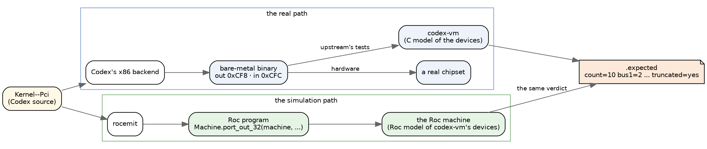
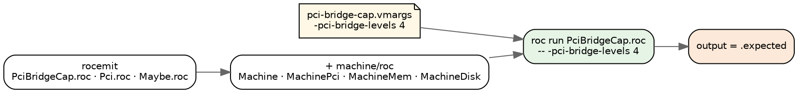
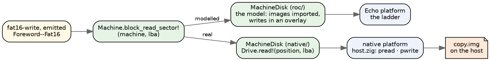
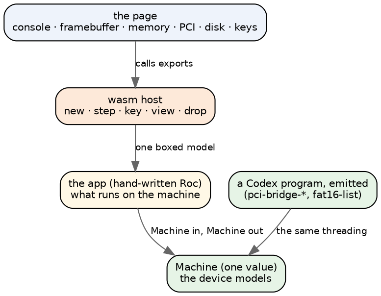
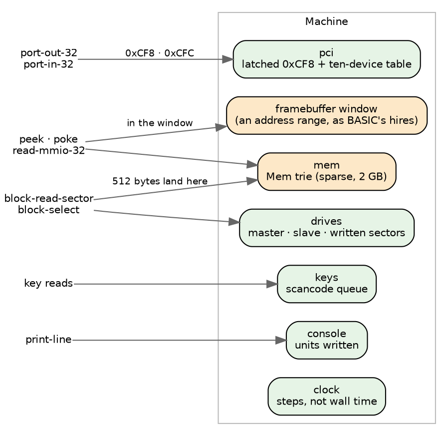
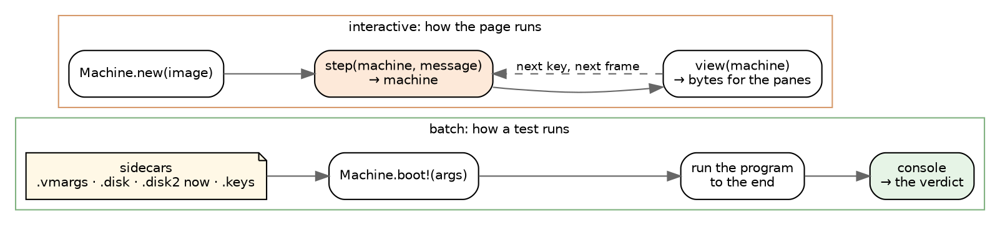
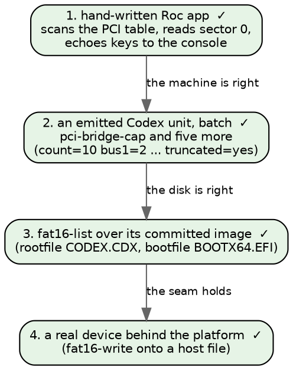

# A Roc machine emulator: the design, in pictures

*The devices plan in Roc: a machine with simulated devices, shown in a browser
and run under emitted Codex programs. Short on purpose. The pictures carry
the design.*

## Where Roc sits

**Roc is only ever the simulation.** One Codex source has two paths. The x86
backend emits the binary that runs on hardware, and Roc is nowhere on that
path. rocemit emits a Roc program that runs on the Roc machine, which plays
the part codex-vm plays for upstream's tests. Both answer to the same verdict.



## Step 2: an emitted program on the machine

`pci-bridge-cap` walks the PCI bus tree through `Kernel--Pci`, which reads
configuration space through two ports. In Codex:

```
pci-config-read-raw (addr) (offset) =
  let w = port-out-32 pci-config-addr addr
  in w + port-in-32 pci-config-data
```

rocemit emits it with the machine threaded through, exactly as written into
the unit's `Pci.roc`:

```roc
pci_config_read_raw : Machine.Machine, I64, I64 -> (Machine.Machine, I64)
pci_config_read_raw = |machine, addr, _offset| ({
	(machine3, machine__4) = ({
	(machine1, w) = Machine.port_out_32(machine, pci_config_addr, addr)
	({
		(machine2, machine__3) = Machine.port_in_32(machine1, pci_config_data)
		(machine2, (w + machine__3))
	})
})
	(machine3, machine__4)
})
```

The door answers from the device table, as codex-vm's `pci_read_config` does:

```roc
port_in_32 : Machine.Machine, I64 -> (Machine.Machine, I64)
port_in_32 = |m, port| {
	p = I64.to_u64_wrap(port)
	if p >= MachinePci.config_data and p <= MachinePci.config_data + 3 {
		(m, U64.to_i64_wrap(MachinePci.read(m.pci, p - MachinePci.config_data)))
	} else {
		crash("machine: port-in-32 from port ${U64.to_str(p)}, which no modelled device claims")
	}
}
```

**How it runs.** rocemit finds the definitions that reach a port by closure
over the call graph, the same closure that already threads `Mem`, and threads
`Machine` instead. The ladder sees `import Machine`, copies `machine/roc` in
beside the emitted modules, and passes the test's `.vmargs` as the command
line; `main!` begins `machine = Machine.boot(args)`.



**The results, on the seven units that read configuration space:**

| unit | `.vmargs` | verdict, and the Roc machine's output |
|---|---|---|
| pci-bridge-cap | `-pci-bridge-levels 4` | `count=10 bus1=2 bus2=2 bus3=2 bus4=0 truncated=yes` |
| pci-bridge-cap-under | `-pci-bridge-levels 3` | `count=9 bus1=2 bus2=2 bus3=1 bus4=0 truncated=no` |
| pci-bridge-backward | `-pci-bridge-levels 2 -pci-bridge-backward` | `count=6 bus1=2 bus2=0 bus3=0 bus4=0 truncated=no` |
| pci-bridge-deep | `-pci-bridge-deep` | `scan count=7 bus1=2 bus2=1 truncated=no` |
| pci-bridge-scan | `-pci-bridge` | `scan count=5 bus1=1 truncated=no` |
| pci-bus-master | none | `dev0-before=3 dev0-after=7 ... dev1-untouched=3` |
| diag-pci-map-judge | none | still refused, on `__heap-advance` |

**The flags move the answer.** The same emitted program under other command
lines:
- with no flags it prints `count=3 bus1=0`;
- with three levels it prints the cap-under verdict;
- with `-e1000` it stops: `machine: -e1000 is not a codex-vm flag this machine models`.

**What the machine models for this.** codex-vm's ten-device table:
- the three default devices;
- the bridge chain, added in codex-vm's order, so the cap drops the fourth
  level's endpoint as it does there;
- bus numbers at 0x18 on a bridge;
- command and BAR writes, and BAR sizing;
- 0xFF from the data port with the enable bit clear.

A port no modelled device claims stops the run by name.

## Step 3: a disk

`fat16-list` reads a 16 MB GPT image through `Foreword--Fat16`, and prints:

```
exists-present True
exists-absent False
rootdir EFI
rootdir end
rootfile CODEX.CDX
rootfile end
bootfile BOOTX64.EFI
bootfile end
extfilter CODEX.CDX
extfilter end
extnomatch end
```

**What it reaches, beyond memory:**
- `block-read-sector`, which on x86 bump-allocates 512 bytes, reads the sector
  into them over ATA, and answers the address;
- `block-sector-count` and `block-select`;
- `process-get-scope process-get-pid`, because every read checks the path
  against the running process's scope. x86 answers pid 0 for the boot program
  and an empty scope, which admits every path;
- `text-concat-list`, a plain text builtin rocemit had not mapped.

**How the image reaches a Roc program.** A program on the Echo platform reads
no files, so the image is a Roc file import. The ladder links the test's
`.disk` and `.disk2` in beside the emitted modules and writes a small module
that imports them; `Machine.boot` attaches its drives. A 16 MB image imports
in under a second.

```roc
import "drive0.disk" as drive0 : List(U8)
import MachineDisk

MachineMedia :: [].{
	drives : List(MachineDisk.Drive)
	drives = [Attached(drive0), Absent]
}
```



```dot
digraph disk {
  rankdir=LR; bgcolor="transparent";
  node [shape=box style="rounded,filled" fontname="Helvetica" fontsize=10 fillcolor="#ffffff"];
  edge [fontname="Helvetica" fontsize=9 color="#666666"];

  side  [label="fat16-list.disk\n16 MB, GPT + FAT16" shape=note fillcolor="#fff8e6"];
  link  [label="drive0.disk\n(a link)"];
  media [label="MachineMedia.roc\nimport \"drive0.disk\"" fillcolor="#fde9d9"];
  boot  [label="Machine.boot(args)\nattaches the drives" fillcolor="#e6f4e6"];
  read  [label="Machine.block_read_sector\n512 bytes into memory" fillcolor="#e6f4e6"];
  fat   [label="Foreword--Fat16\npeek-byte over the buffer" fillcolor="#fff8e6"];
  side -> link -> media -> boot -> read -> fat;
}
```

**What `MachineDisk` models, from codex-vm's IDE code:**
- the primary channel's master and slave. Drive 2 and above is on a channel
  codex-vm does not claim, so nothing is there;
- a position with nothing on it identifies as 0 sectors and reads 255 in every
  byte (`block-select-drives` pins both);
- on a present drive a read past the end answers zeros, and a write past the
  end changes nothing;
- writes land in an overlay of sectors, so a 512-byte write never copies the
  image.

**What the emitter needed:**
- the block and process builtins join the machine's doors;
- an effect the machine answers (`Device.Block`) is not a Roc effect, so a
  nullary `[Device.Block] T` unwraps to its `T`. A definition that reads the
  disk and prints still takes `=>`;
- an opening that declares a FileSystem or Network scope is refused. x86 would
  hand that scope to the process, and the machine answers the empty one.

**The image moves the answer.** The same emitted program with no drive, or
with a 128-sector image that holds no FAT, answers `exists-present False` and
empty listings.

**The family.** Of the units the block builtins held back, 25 now pass: the
fat16 set, four fat32 units, the Fat16, Fat32 and Gpt forewords,
`block-select-drives`, `block-sector-count`, `diskfacts-unpack-large`,
`truetype-render-test` and more. The Roc ladder went from 541 to 566 of 1,032,
with no pass lost. Three do not pass, each for a named reason:
- `cap-block-denied` strips the process's capability word and expects -1 from
  the next block call; the machine does not model capabilities;
- `fat16-source-cr` reads a byte of 255 back as text, the Text model rocemit
  still owes;
- `manifest-pin` wants a disk compiled at test time, so it is skipped.

## Step 4: a real device

**The same emitted program, on a real disk.** `fat16-write`, emitted by
rocemit, runs on a native platform whose block device is the host's:

```
$ machine/native/run.sh fat16-write.codex -disk copy.img
wrote True
exists True
readback Hello, disk!
size 12
wrote-bin True
bin 1 2 3 254
absent False
```

That is its verdict, and the file on the host changed under it (its checksum
went from `3e67e1fca739` to `8c85b2cccb23`). A second process, `fat16-list`
on the same file, finds what the first one wrote:

```
rootfile CODEX.CDX
rootfile HELLO.TXT
rootfile BIN.DAT
rootfile end
```

And a reader that shares nothing with Codex agrees: `fsck.fat` over the
image's FAT partition checks `/HELLO.TXT` and `/BIN.DAT`, and leaves the
filesystem unchanged.



**What keeps it one program.** The block doors are effects in both builds,
because a door the host may answer is one: `block_read_sector!`. The modelled
disk's doors are effects with pure bodies, which Roc accepts, and the page,
which is pure, calls the model's pure functions beneath them. rocemit gives
every machine-threaded definition `=>` and a `!` name. The two `MachineDisk`
modules are the only difference between a ladder run and a real one.

**The platform.** Echo's shape (a command line in, lines out) with a hosted
`Drive`: `open!`, `sector_count!`, `read!` and `write!`, by position. Its host
is a static library for x86_64-linux-musl, built against the Roc checkout's
builtins, which `roc run` links with the musl runtime from Roc's own fx test
platform. An emitted app has no header, so `run.sh` prepends the wiring Roc
gives a headerless app, pointed at this platform instead of Echo. Two things
the link needed: `std.debug`'s I/O is Roc's minimal shim, since zig's threaded
I/O calls into things this musl lacks, and compiler_rt is bundled.

**A lead, not a finding.** `fsck.fat` also says the image's two FATs differ.
They differ before the write too: the fixture's second FAT holds zeros in the
two reserved entries where the first holds `0xfff8` and `0xffff`, and the
write moved both copies in step (4,889 clusters in use in each before, 4,891
after). Whatever writes upstream's fixture leaves those entries of the second
FAT empty.

## The layers

The machine is one Roc value. Everything that touches a device takes the
machine and hands it back. The browser only sees what the host copies out.



**Borrowed from BASIC:**
- one boxed model behind the platform;
- `status` and `resume` for a machine that is waiting on its input;
- `view` as a flat byte list the page slices;
- the persistent structures (`Vec`, the `Mem` trie).

**Written fresh:** the host and the page, with an export per device door.

## The machine

One record, as BASIC's `Devices` is and as codex-vm is. Each door dispatches
on what it is given: an address, a port, a sector.



**The clock counts steps, not wall time.** Then a run is reproducible, and
the verdicts that time things can be graded.

## Two ways to drive it

An emitted Codex program runs straight through, so it cannot stop halfway and
wait for a key. That gives two modes, and the demo needs both.



Batch mode is what the ladder needs: the keys are already in the queue, and
the disk is already attached.

Interactive mode is the games' shape (`step` is the only door, the model
holds the state). A program written that way can wait for a key without
stopping in the middle of itself.

## One frame of the page


**Because the machine is a value, the step before is still in hand.** So the
memory pane can highlight exactly the bytes the last step wrote, and a "back"
button is a pop, as BASIC's is.

## The demo steps



- **Step 1 proves the machine and the page.**
- **Steps 2 and 3 prove the models against upstream's verdicts.** Neither
  needed a run-time crash for hardware builtins: rocemit threads the machine
  through the units that reach a device, and the builtins it does not answer
  yet still refuse the unit by name.
- **Step 4 is the "real device" half:** the same doors, answered by the host,
  and the file on the host is what changed. It is still a Roc program on a
  host, not bare metal.

## Where it lives

- **`roc-apps/machine/`**, beside `basic/`:
  - `roc/Machine.roc` and one module per device: `MachineMem`, `MachinePci`,
    `MachineDisk`, plus `MachineMedia` for the attached images. The prefix
    keeps them apart from the chapter modules rocemit writes, and rocemit
    refuses a chapter spelled like one.
  - `wasm/platform/`, with `host.zig` written fresh.
  - `web/machine.html`, previewed on `:9203/machine/`.
  - `native/`: the native platform (`platform/`, a hosted `Drive` and its
    host), the host's `MachineDisk`, and `run.sh`.
- **Batch runs are the ladder:** `tests/ladder.sh fat16-list`, on the modelled
  disk.
- **A real run:** `machine/native/run.sh fat16-write.codex -disk copy.img`.
- **Configuration:** a machine is `Machine.boot!(args)`, and `.vmargs` is the
  command line. On the ladder `.disk` and `.disk2` are imported by the
  `MachineMedia.roc` it writes; on the native platform `-disk` and `-disk2`
  name files. `.keys` comes later.
