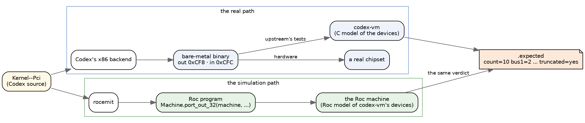
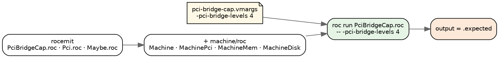
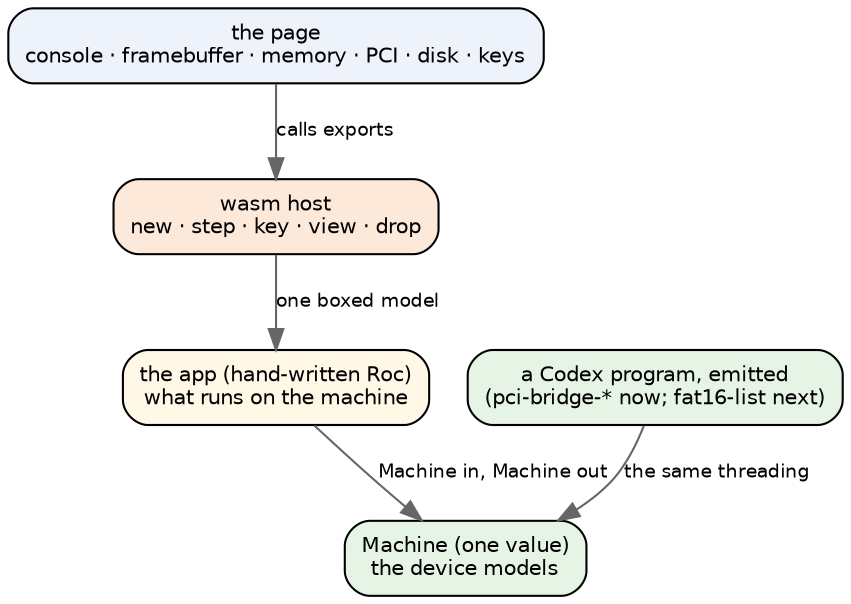
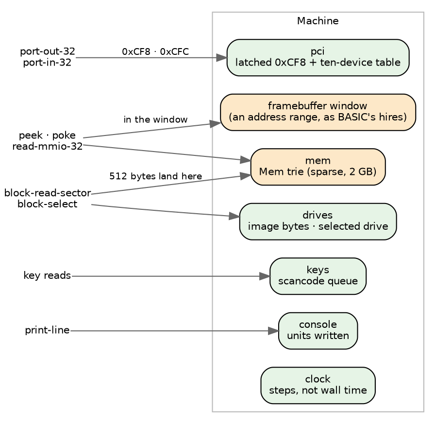
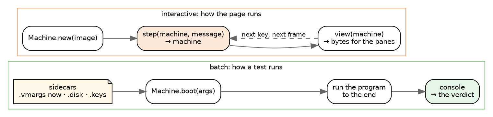
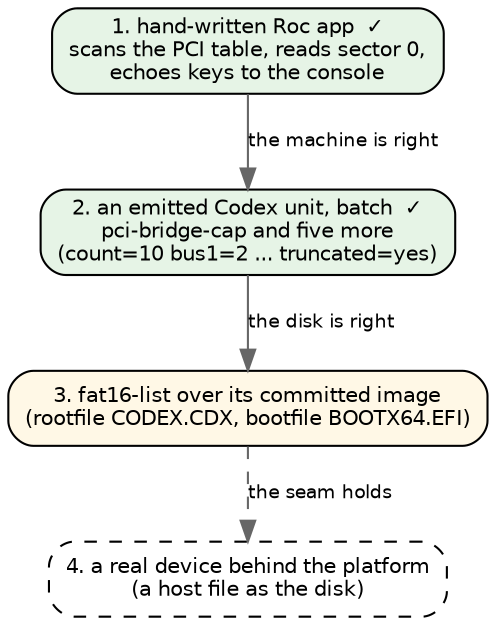

# A Roc machine emulator: the design, in pictures

*The devices plan in Roc: a machine with simulated devices, shown in a browser
and run under emitted Codex programs. Short on purpose. The pictures carry
the design.*

## Where Roc sits

**Roc is only ever the simulation.** One Codex source has two paths. The x86
backend emits the binary that runs on hardware, and Roc is nowhere on that
path. rocemit emits a Roc program that runs on the Roc machine, which plays
the part codex-vm plays for upstream's tests. Both answer to the same verdict.



## Step 2: an emitted program on the machine

`pci-bridge-cap` walks the PCI bus tree through `Kernel--Pci`, which reads
configuration space through two ports. In Codex:

```
pci-config-read-raw (addr) (offset) =
  let w = port-out-32 pci-config-addr addr
  in w + port-in-32 pci-config-data
```

rocemit emits it with the machine threaded through, exactly as written into
the unit's `Pci.roc`:

```roc
pci_config_read_raw : Machine.Machine, I64, I64 -> (Machine.Machine, I64)
pci_config_read_raw = |machine, addr, _offset| ({
	(machine3, machine__4) = ({
	(machine1, w) = Machine.port_out_32(machine, pci_config_addr, addr)
	({
		(machine2, machine__3) = Machine.port_in_32(machine1, pci_config_data)
		(machine2, (w + machine__3))
	})
})
	(machine3, machine__4)
})
```

The door answers from the device table, as codex-vm's `pci_read_config` does:

```roc
port_in_32 : Machine.Machine, I64 -> (Machine.Machine, I64)
port_in_32 = |m, port| {
	p = I64.to_u64_wrap(port)
	if p >= MachinePci.config_data and p <= MachinePci.config_data + 3 {
		(m, U64.to_i64_wrap(MachinePci.read(m.pci, p - MachinePci.config_data)))
	} else {
		crash("machine: port-in-32 from port ${U64.to_str(p)}, which no modelled device claims")
	}
}
```

**How it runs.** rocemit finds the definitions that reach a port by closure
over the call graph, the same closure that already threads `Mem`, and threads
`Machine` instead. The ladder sees `import Machine`, copies `machine/roc` in
beside the emitted modules, and passes the test's `.vmargs` as the command
line; `main!` begins `machine = Machine.boot(args)`.



**The results, on the seven units that read configuration space:**

| unit | `.vmargs` | verdict, and the Roc machine's output |
|---|---|---|
| pci-bridge-cap | `-pci-bridge-levels 4` | `count=10 bus1=2 bus2=2 bus3=2 bus4=0 truncated=yes` |
| pci-bridge-cap-under | `-pci-bridge-levels 3` | `count=9 bus1=2 bus2=2 bus3=1 bus4=0 truncated=no` |
| pci-bridge-backward | `-pci-bridge-levels 2 -pci-bridge-backward` | `count=6 bus1=2 bus2=0 bus3=0 bus4=0 truncated=no` |
| pci-bridge-deep | `-pci-bridge-deep` | `scan count=7 bus1=2 bus2=1 truncated=no` |
| pci-bridge-scan | `-pci-bridge` | `scan count=5 bus1=1 truncated=no` |
| pci-bus-master | none | `dev0-before=3 dev0-after=7 ... dev1-untouched=3` |
| diag-pci-map-judge | none | still refused, on `__heap-advance` |

**The flags move the answer.** The same emitted program under other command
lines:
- with no flags it prints `count=3 bus1=0`;
- with three levels it prints the cap-under verdict;
- with `-e1000` it stops: `machine: -e1000 is not a codex-vm flag this machine models`.

**What the machine models for this.** codex-vm's ten-device table:
- the three default devices;
- the bridge chain, added in codex-vm's order, so the cap drops the fourth
  level's endpoint as it does there;
- bus numbers at 0x18 on a bridge;
- command and BAR writes, and BAR sizing;
- 0xFF from the data port with the enable bit clear.

A port no modelled device claims stops the run by name.

## The layers

The machine is one Roc value. Everything that touches a device takes the
machine and hands it back. The browser only sees what the host copies out.



**Borrowed from BASIC:**
- one boxed model behind the platform;
- `status` and `resume` for a machine that is waiting on its input;
- `view` as a flat byte list the page slices;
- the persistent structures (`Vec`, the `Mem` trie).

**Written fresh:** the host and the page, with an export per device door.

## The machine

One record, as BASIC's `Devices` is and as codex-vm is. Each door dispatches
on what it is given: an address, a port, a sector.



**The clock counts steps, not wall time.** Then a run is reproducible, and
the verdicts that time things can be graded.

## Two ways to drive it

An emitted Codex program runs straight through, so it cannot stop halfway and
wait for a key. That gives two modes, and the demo needs both.



Batch mode is what the ladder needs: the keys are already in the queue, and
the disk is already attached.

Interactive mode is the games' shape (`step` is the only door, the model
holds the state). A program written that way can wait for a key without
stopping in the middle of itself.

## One frame of the page

```dot
digraph frame {
  rankdir=LR; bgcolor="transparent";
  node [shape=box style="rounded,filled" fontname="Helvetica" fontsize=10 fillcolor="#ffffff"];
  edge [fontname="Helvetica" fontsize=9 color="#666666"];

  js   [label="page\n(requestAnimationFrame)" fillcolor="#eef3fb"];
  step [label="roc_step(box, budget)\nrun until budget or waiting" fillcolor="#fde9d9"];
  key  [label="roc_key(box, scancode)" fillcolor="#fde9d9"];
  view [label="roc_view(box)\nflag · console · fb · mem page · pci · sector" fillcolor="#fde9d9"];
  draw [label="draw the panes;\nhighlight what the step touched" fillcolor="#e6f4e6"];

  js -> step -> view -> draw;
  js -> key [label="keydown" style=dashed];
  key -> step [style=dashed];
}
```



**Because the machine is a value, the step before is still in hand.** So the
memory pane can highlight exactly the bytes the last step wrote, and a "back"
button is a pop, as BASIC's is.

## The demo steps



- **Step 1 proves the machine and the page.**
- **Steps 2 and 3 prove the models against upstream's verdicts.** Step 2
  needed no run-time crash for hardware builtins: rocemit threads the machine
  through the units that reach a port, and the builtins it does not answer yet
  still refuse the unit by name.
- **Step 4 is the "real device" half:** the same doors, answered by the host.
  It is still a Roc program on a host, not bare metal.

## Where it lives

- **`roc-apps/machine/`**, beside `basic/`:
  - `roc/Machine.roc` and one module per device: `MachineMem`, `MachinePci`,
    `MachineDisk`. The prefix keeps them apart from the chapter modules rocemit
    writes, and rocemit refuses a chapter spelled like one.
  - `wasm/platform/`, with `host.zig` written fresh.
  - `web/machine.html`, previewed on `:9203/machine/`.
- **Batch runs are the ladder:** `tests/ladder.sh pci-bridge-cap`.
- **Configuration:** a batch run's machine is `Machine.boot(args)`, and
  `.vmargs` is the command line. `.disk` and `.keys` come with step 3.
