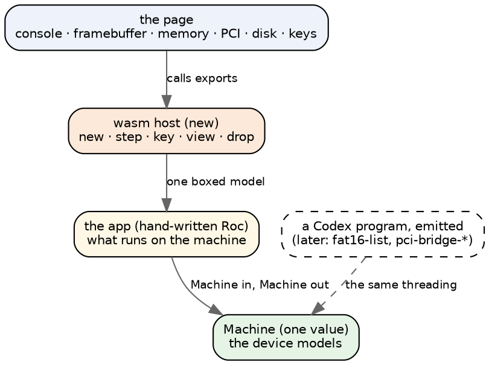
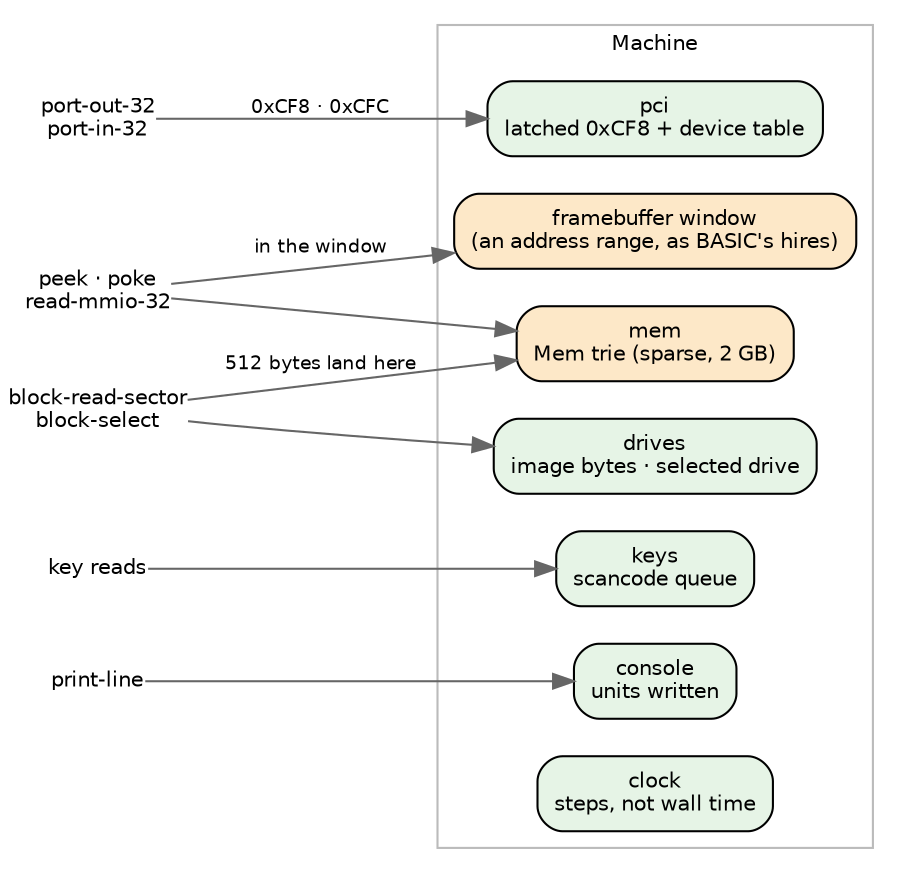
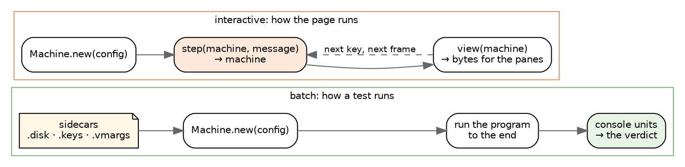
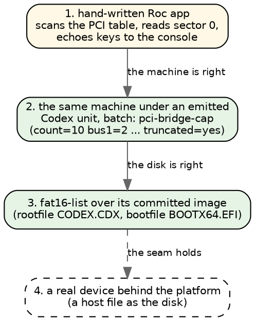

# A Roc machine emulator: the design, in pictures

*The first step of the devices plan: a Roc machine with simulated devices,
shown in a browser, before any emitted Codex program depends on it. Short on
purpose. The pictures carry the design.*

## The layers

The machine is one Roc value. Everything that touches a device takes the
machine and hands it back. The browser only sees what the host copies out.

**Borrowed from BASIC:**
- one boxed model behind the platform;
- `status` and `resume` for a machine that is waiting on its input;
- `view` as a flat byte list the page slices;
- the persistent structures (`Vec`, the `Mem` trie).

**Written fresh:** the host and the page, with an export per device door.

## The machine

One record, as BASIC's `Devices` is and as codex-vm is. Each door dispatches
on what it is given: an address, a port, a sector.

**The clock counts steps, not wall time.** Then a run is reproducible, and
the verdicts that time things can be graded.

## Two ways to drive it

An emitted Codex program runs straight through, so it cannot stop halfway and
wait for a key. That gives two modes, and the demo needs both.

Batch mode is what the ladder needs: the keys are already in the queue, and
the disk is already attached.

Interactive mode is the games' shape (`step` is the only door, the model
holds the state). A program written that way can wait for a key without
stopping in the middle of itself.

## One frame of the page

```dot
digraph frame {
  rankdir=LR; bgcolor="transparent";
  node [shape=box style="rounded,filled" fontname="Helvetica" fontsize=10 fillcolor="#ffffff"];
  edge [fontname="Helvetica" fontsize=9 color="#666666"];

  js   [label="page\n(requestAnimationFrame)" fillcolor="#eef3fb"];
  step [label="roc_step(box, budget)\nrun until budget or waiting" fillcolor="#fde9d9"];
  key  [label="roc_key(box, scancode)" fillcolor="#fde9d9"];
  view [label="roc_view(box)\nflag · console · fb · mem page · pci · sector" fillcolor="#fde9d9"];
  draw [label="draw the panes;\nhighlight what the step touched" fillcolor="#e6f4e6"];

  js -> step -> view -> draw;
  js -> key [label="keydown" style=dashed];
  key -> step [style=dashed];
}
```

**Because the machine is a value, the step before is still in hand.** So the
memory pane can highlight exactly the bytes the last step wrote, and a "back"
button is a pop, as BASIC's is.

## A first demo, and what it proves

- **Step 1 proves the machine and the page.** It needs no emitter change.
- **Steps 2 and 3 prove the models against upstream's verdicts.** They need
  step 0 of the devices plan: hardware builtins crash at run time instead of
  refusing the unit.
- **Step 4 is the "real device" half:** the same doors, answered by the host.

## Where it lives, and what I need from you

- **`roc-apps/machine/`**, beside `basic/`: `roc/Machine.roc` and one module
  per device, `wasm/platform/` (host.zig written fresh), `web/machine.html`.
  Preview on `:9203/machine/`.
- **The first subject.** The page in step 1: PCI table, sector 0 of a small
  image, a key echo. I think it is the smallest thing that shows every seam.
- **Config from the start:** `Machine.new` takes the sidecar files as they
  are (`.vmargs` text, `.disk` bytes, `.keys` text). Then step 2 needs no new
  plumbing.
