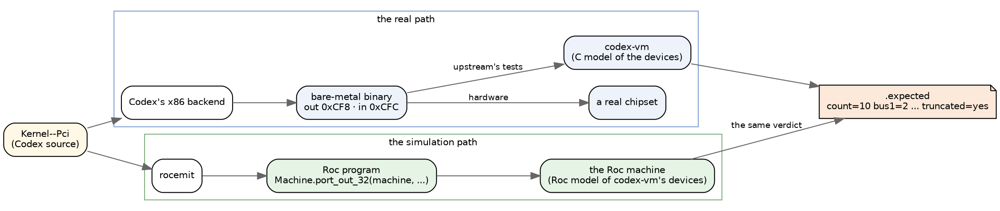
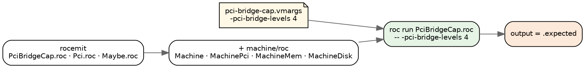
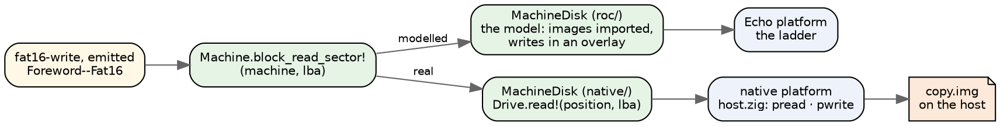
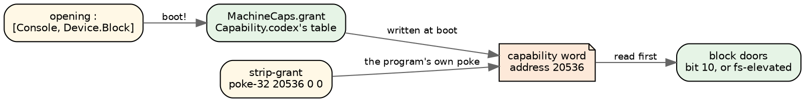
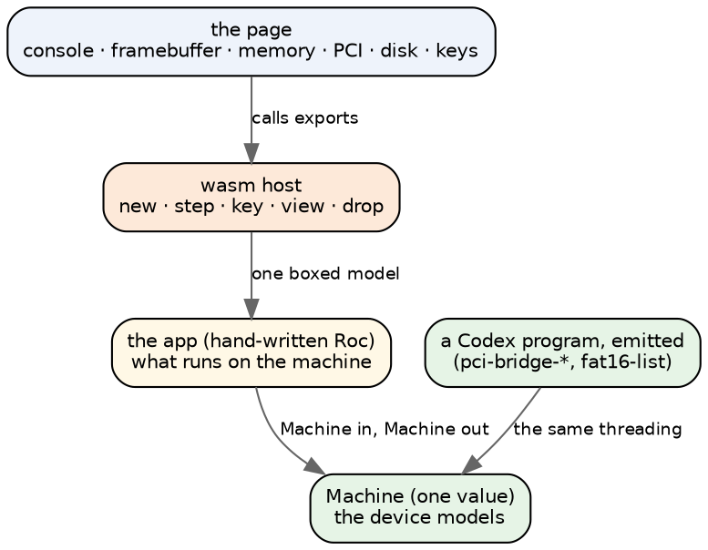
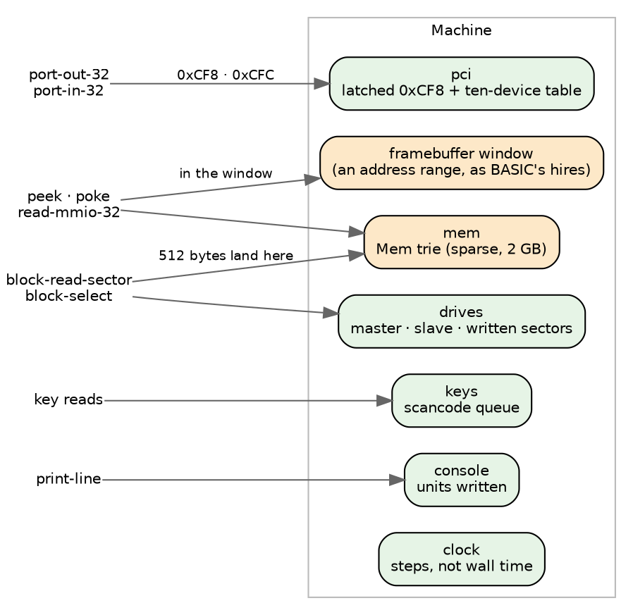
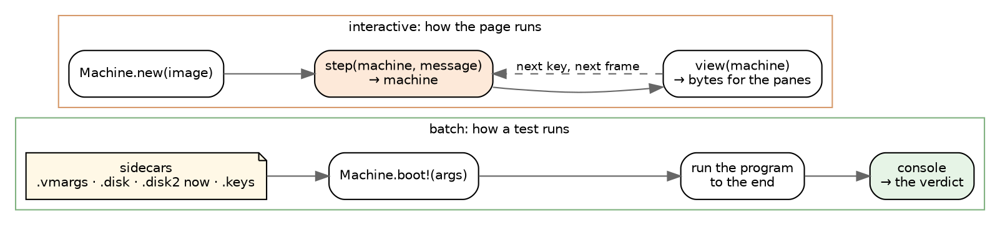
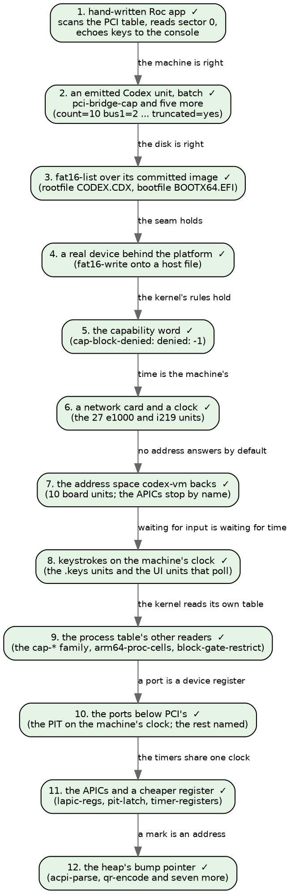

# A Roc machine emulator: the design, in pictures

*The devices plan in Roc: a machine with simulated devices, shown in a browser
and run under emitted Codex programs. Short on purpose. The pictures carry
the design.*

## Where Roc sits

**Roc is only ever the simulation.** One Codex source has two paths. The x86
backend emits the binary that runs on hardware, and Roc is nowhere on that
path. rocemit emits a Roc program that runs on the Roc machine, which plays
the part codex-vm plays for upstream's tests. Both answer to the same verdict.



## Step 2: an emitted program on the machine

`pci-bridge-cap` walks the PCI bus tree through `Kernel--Pci`, which reads
configuration space through two ports. In Codex:

```
pci-config-read-raw (addr) (offset) =
  let w = port-out-32 pci-config-addr addr
  in w + port-in-32 pci-config-data
```

rocemit emits it with the machine threaded through, exactly as written into
the unit's `Pci.roc`:

```roc
pci_config_read_raw : Machine.Machine, I64, I64 -> (Machine.Machine, I64)
pci_config_read_raw = |machine, addr, _offset| ({
	(machine3, machine__4) = ({
	(machine1, w) = Machine.port_out_32(machine, pci_config_addr, addr)
	({
		(machine2, machine__3) = Machine.port_in_32(machine1, pci_config_data)
		(machine2, (w + machine__3))
	})
})
	(machine3, machine__4)
})
```

The door answers from the device table, as codex-vm's `pci_read_config` does:

```roc
port_in_32 : Machine.Machine, I64 -> (Machine.Machine, I64)
port_in_32 = |m, port| {
	p = I64.to_u64_wrap(port)
	if p >= MachinePci.config_data and p <= MachinePci.config_data + 3 {
		(m, U64.to_i64_wrap(MachinePci.read(m.pci, p - MachinePci.config_data)))
	} else {
		crash("machine: port-in-32 from port ${U64.to_str(p)}, which no modelled device claims")
	}
}
```

**How it runs.** rocemit finds the definitions that reach a port by closure
over the call graph, the same closure that already threads `Mem`, and threads
`Machine` instead. The ladder sees `import Machine`, copies `machine/roc` in
beside the emitted modules, and passes the test's `.vmargs` as the command
line; `main!` begins `machine = Machine.boot(args)`.



**The results, on the seven units that read configuration space:**

| unit | `.vmargs` | verdict, and the Roc machine's output |
|---|---|---|
| pci-bridge-cap | `-pci-bridge-levels 4` | `count=10 bus1=2 bus2=2 bus3=2 bus4=0 truncated=yes` |
| pci-bridge-cap-under | `-pci-bridge-levels 3` | `count=9 bus1=2 bus2=2 bus3=1 bus4=0 truncated=no` |
| pci-bridge-backward | `-pci-bridge-levels 2 -pci-bridge-backward` | `count=6 bus1=2 bus2=0 bus3=0 bus4=0 truncated=no` |
| pci-bridge-deep | `-pci-bridge-deep` | `scan count=7 bus1=2 bus2=1 truncated=no` |
| pci-bridge-scan | `-pci-bridge` | `scan count=5 bus1=1 truncated=no` |
| pci-bus-master | none | `dev0-before=3 dev0-after=7 ... dev1-untouched=3` |
| diag-pci-map-judge | none | still refused, on `__heap-advance` |

**The flags move the answer.** The same emitted program under other command
lines:
- with no flags it prints `count=3 bus1=0`;
- with three levels it prints the cap-under verdict;
- with `-e1000` it stops: `machine: -e1000 is not a codex-vm flag this machine models`.

**What the machine models for this.** codex-vm's ten-device table:
- the three default devices;
- the bridge chain, added in codex-vm's order, so the cap drops the fourth
  level's endpoint as it does there;
- bus numbers at 0x18 on a bridge;
- command and BAR writes, and BAR sizing;
- 0xFF from the data port with the enable bit clear.

A port no modelled device claims stops the run by name.

## Step 3: a disk

`fat16-list` reads a 16 MB GPT image through `Foreword--Fat16`, and prints:

```
exists-present True
exists-absent False
rootdir EFI
rootdir end
rootfile CODEX.CDX
rootfile end
bootfile BOOTX64.EFI
bootfile end
extfilter CODEX.CDX
extfilter end
extnomatch end
```

**What it reaches, beyond memory:**
- `block-read-sector`, which on x86 bump-allocates 512 bytes, reads the sector
  into them over ATA, and answers the address;
- `block-sector-count` and `block-select`;
- `process-get-scope process-get-pid`, because every read checks the path
  against the running process's scope. x86 answers pid 0 for the boot program
  and an empty scope, which admits every path;
- `text-concat-list`, a plain text builtin rocemit had not mapped.

**How the image reaches a Roc program.** A program on the Echo platform reads
no files, so the image is a Roc file import. The ladder links the test's
`.disk` and `.disk2` in beside the emitted modules and writes a small module
that imports them; `Machine.boot` attaches its drives. A 16 MB image imports
in under a second.

```roc
import "drive0.disk" as drive0 : List(U8)
import MachineDisk

MachineMedia :: [].{
	drives : List(MachineDisk.Drive)
	drives = [Attached(drive0), Absent]
}
```



```dot
digraph disk {
  rankdir=LR; bgcolor="transparent";
  node [shape=box style="rounded,filled" fontname="Helvetica" fontsize=10 fillcolor="#ffffff"];
  edge [fontname="Helvetica" fontsize=9 color="#666666"];

  side  [label="fat16-list.disk\n16 MB, GPT + FAT16" shape=note fillcolor="#fff8e6"];
  link  [label="drive0.disk\n(a link)"];
  media [label="MachineMedia.roc\nimport \"drive0.disk\"" fillcolor="#fde9d9"];
  boot  [label="Machine.boot(args)\nattaches the drives" fillcolor="#e6f4e6"];
  read  [label="Machine.block_read_sector\n512 bytes into memory" fillcolor="#e6f4e6"];
  fat   [label="Foreword--Fat16\npeek-byte over the buffer" fillcolor="#fff8e6"];
  side -> link -> media -> boot -> read -> fat;
}
```

**What `MachineDisk` models, from codex-vm's IDE code:**
- the primary channel's master and slave. Drive 2 and above is on a channel
  codex-vm does not claim, so nothing is there;
- a position with nothing on it identifies as 0 sectors and reads 255 in every
  byte (`block-select-drives` pins both);
- on a present drive a read past the end answers zeros, and a write past the
  end changes nothing;
- writes land in an overlay of sectors, so a 512-byte write never copies the
  image.

**What the emitter needed:**
- the block and process builtins join the machine's doors;
- an effect the machine answers (`Device.Block`) is not a Roc effect, so a
  nullary `[Device.Block] T` unwraps to its `T`. A definition that reads the
  disk and prints still takes `=>`;
- an opening that declares a FileSystem or Network scope is refused. x86 would
  hand that scope to the process, and the machine answers the empty one.

**The image moves the answer.** The same emitted program with no drive, or
with a 128-sector image that holds no FAT, answers `exists-present False` and
empty listings.

**The family.** Of the units the block builtins held back, 25 now pass: the
fat16 set, four fat32 units, the Fat16, Fat32 and Gpt forewords,
`block-select-drives`, `block-sector-count`, `diskfacts-unpack-large`,
`truetype-render-test` and more. The Roc ladder went from 541 to 566 of 1,032,
with no pass lost. Three do not pass, each for a named reason:
- `cap-block-denied` strips the process's capability word and expects -1 from
  the next block call; the machine does not model capabilities;
- `fat16-source-cr` reads a byte of 255 back as text, the Text model rocemit
  still owes;
- `manifest-pin` wants a disk compiled at test time, so it is skipped.

## Step 4: a real device

**The same emitted program, on a real disk.** `fat16-write`, emitted by
rocemit, runs on a native platform whose block device is the host's:

```
$ machine/native/run.sh fat16-write.codex -disk copy.img
wrote True
exists True
readback Hello, disk!
size 12
wrote-bin True
bin 1 2 3 254
absent False
```

That is its verdict, and the file on the host changed under it (its checksum
went from `3e67e1fca739` to `8c85b2cccb23`). A second process, `fat16-list`
on the same file, finds what the first one wrote:

```
rootfile CODEX.CDX
rootfile HELLO.TXT
rootfile BIN.DAT
rootfile end
```

And a reader that shares nothing with Codex agrees: `fsck.fat` over the
image's FAT partition checks `/HELLO.TXT` and `/BIN.DAT`, and leaves the
filesystem unchanged.



**What keeps it one program.** The block doors are effects in both builds,
because a door the host may answer is one: `block_read_sector!`. The modelled
disk's doors are effects with pure bodies, which Roc accepts, and the page,
which is pure, calls the model's pure functions beneath them. rocemit gives
every machine-threaded definition `=>` and a `!` name. The two `MachineDisk`
modules are the only difference between a ladder run and a real one.

**The platform.** Echo's shape (a command line in, lines out) with a hosted
`Drive`: `open!`, `sector_count!`, `read!` and `write!`, by position. Its host
is a static library for x86_64-linux-musl, built against the Roc checkout's
builtins, which `roc run` links with the musl runtime from Roc's own fx test
platform. An emitted app has no header, so `run.sh` prepends the wiring Roc
gives a headerless app, pointed at this platform instead of Echo. Two things
the link needed: `std.debug`'s I/O is Roc's minimal shim, since zig's threaded
I/O calls into things this musl lacks, and compiler_rt is bundled.

**The two FATs.** `fsck.fat` also says the image's two FATs differ, and they
differ before the write too. In all eleven `fat16-*.disk` fixtures the second
FAT holds zeros in the two reserved entries where the first holds `0xfff8`
and `0xffff`. The write moved both copies in step (4,889 clusters in use in
each before, 4,891 after). Copying those four bytes across is all `fsck.fat`
needs to call the fixture clean.

Upstream's image builder wrote the reserved entries to the first FAT only
until Update 35, and has written every entry to both copies since
(`Set-Fat` in `build/build-img.ps1`). The fixtures all carry the old form,
including ones committed in August. No verdict can see it: the only reader
of the second FAT is fat16-alloc, and it reads the clusters it allocates.

## Step 5: the capability word

**cap-block-denied asks the kernel, not the disk.** It reads the block
device's size, clears its own grant, and asks again:

```
granted: 0
stripped: 0
denied: -1
```

On x86 every block syscall tests the current process's capability word
before it drives the device (`emit-block-elev-gate`): bit 10,
`cap-block-device`, or the filesystem servicer's elevation cell. The word
is memory, at offset 56 of process 0's entry in the process table at 20480,
which is address 20536. The boot writes the opening's grant there before the
program runs, and a program that pokes zeros over it has given the authority
away.



**The machine keeps the word the same way.** rocemit hands `boot!` the
effects the opening declares, `Machine.boot!(args, ["Console",
"Device.Block"])`, and `MachineCaps` expands them through
`Capability.codex`'s table as x86's boot does. `Device.Block` has no row of
its own, so it takes Device's, which grants the block-device bit and the
device bit. The block doors read the word first, and a denied door answers
what x86's helper answers, which is not uniform:

| door | granted | denied |
|---|---|---|
| `block-sector-count` | the sectors | -1 |
| `block-select` | 0 | -1, nothing selected |
| `block-read-sector` | the buffer, filled | the buffer, empty |
| `block-write-sector` | 0 | 0, nothing written |

The read helper hands back its buffer whatever the syscall said, and the
write helper answers 0 after every syscall.

**No new state.** The grant is a poke at boot, and the strip is the
program's own poke. The ladder moved by exactly this unit, to 567 of 1,032.
On the native platform with a 16 MB image attached, the same program prints
`granted: 32768` and then `denied: -1`.

**Two warning classes, gone.** Roc warns on an effectful function whose name
lacks `!`, and on a variable nothing reads. Both came from rocemit:

- **A `[Console]` definition took `=>` and kept a bare name.** There is one
  rule now: a definition whose signature takes `=>` is named with `!`, where
  it is defined and wherever it is referenced. That was 19 warnings in 12
  units.
- **A heap mark was read by nothing.** Codex takes a mark with
  `__heap-save` and hands it to `__heap-restore`. Roc's memory is counted, so
  the restore is emitted as `0`, and a binder read only by a restore is now
  `_h`. The same goes for an act's bind that nothing reads
  (`c <- fat16-write-file ...`).

The warnings left on the ladder are `unconditional condition` and `unused
branch`, which are Roc's compile-time evaluation reporting what it did not
take, plus 29 redundant patterns and one pattern variable declared twice
(db-csv-roundtrip), not yet examined.

## Step 6: a network card and a clock

**26 units crashed on a flag, and one failed on a clock that read zero.**
Upstream's e1000 and i219 tests run the kernel's driver (`Kernel--E1000e`)
against codex-vm's model of Intel gigabit Ethernet. Each test sets the model
up with flags in its `.vmargs`: `-e1000-no-link`, `-i219-swflag`,
`-e1000-mdio-window`, and others. The machine stopped at every one of them
with "not a codex-vm flag this machine models". e1000-tx-deadline got further
and failed: it times a wait with the HPET, the HPET's window was plain
memory, and so the clock read zero.

**`MachineE1000` is codex-vm's model** (`e1000_read`, `e1000_write`,
`e1000_mdic_exec`):
- **The register window** at 0xFE400000, which `peek-32` and `poke-32` reach
  through `Machine.load` and `Machine.store` while the NIC is on the bus.
- **The PHY** behind MDIC, with its page register and the three paged
  registers the model answers: 769.16 slow mode, 770.17 K1, 779.16 ULP.
- **The semaphore** in EXTCNF_CTRL, under `-i219`.
- **The rings.** The device reads descriptors out of the machine's memory,
  and writes frames and done bits back into it.
- **The PCI entry** at slot 3, `8086:100E`, or `8086:15B8` under `-i219`.
  Under `-nic-bme-clear` its bus-master bit stays clear.
- **Every fault flag the tests use.** The two that need the host's network
  stack, `-e1000-nat` and `-e1000-strict-filter`, still stop the run.

**The clock was the real question.** codex-vm's HPET counts the host's wall
clock, which is why these verdicts are bands rather than numbers.
e1000-link-deadline asserts that a bring-up with no link takes more than 7 s
and less than 15 s. The machine has no wall clock. Its clock moves only when
the program touches a device register: 100 µs for each read or write in the
NIC's window or the HPET's, and nothing for memory. `MachineHpet` counts that
clock.

The verdicts pin the constant from both sides:

| verdict | asks | why 100 µs fits |
|---|---|---|
| e1000-tx-deadline, control arm | a million memory reads, timed between two clock readings, in 0–5 ms | memory is free, and the second reading's three register reads are 0.3 ms |
| e1000-tx-deadline, clocked arm | a 20 ms wait, measured in 10–200 ms | reading the clock is cheap next to the wait, so the wait measures what it asked for |
| e1000-link-deadline | 3 s of negotiation budget plus 5 s of link budget, in 7–15 s | batches of 4,096 STATUS reads at 100 µs each spend the 5 s in tens of thousands of reads |
| e1000-mdio-window | 10 ms between CTRL.RST and the first MDIO access | the driver's settle loop reads the clock until 10 ms have passed |

**The first attempt charged the clock read itself, 10 ms a read.** Both
clocked arms passed and the control arm failed. One `hpet-ticks` reads three
registers, so two readings with nothing between them were already 30 ms
apart. The test's premise is that reading a clock is cheap and a batch of
register reads is not. Charging every register access, and memory nothing,
is that premise.

**All 37 pass.** That is the 26, e1000-tx-deadline, the three e1000 units that
passed before, and the PCI, disk and capability units as a regression set.
The full ladder went from 567 to 594 of 1,032, and nothing but those 27
moved. The native platform runs the same units with the same flags:
`machine/native/run.sh e1000-bringup.codex -e1000-inject 1` receives the
60-byte canned frame, as its verdict says it should.

## Step 7: the address space is what codex-vm backs

**23 units stopped on `read-mmio-32`.** The board HAL (`Foreword--Board`)
reaches peripheral registers through four MMIO builtins: `read-mmio` and
`poke-mmio` a byte at a time, `read-mmio-32` and `poke-mmio-32` a word at a
time. On x86 each one is a load or a store at base plus offset, nothing more,
so rocemit now emits them as the machine's `load` and `store`.

**The hard part was what answers at the address.** The machine answered every
address from memory, and two things made that dishonest:
- **The trie dropped the top address bit.** `MachineMem` had five levels over
  64-byte leaves, 2^31 bytes, and its index dropped every bit above that.
  `Stm32L4Board`'s system control block, at 0xE000ED00, would have been
  memory at 0x6000ED00.
- **Unmodelled devices read as RAM.** The timer tests read the local APIC and
  the IOAPIC, which codex-vm models and this machine does not. As memory they
  read back whatever was last written, and a test could pass on it.

**The machine now answers only what codex-vm backs:**

| address | what answers |
|---|---|
| below 3 GB | memory: codex-vm's default guest RAM |
| 0xD0000000, 0xE0000000, 0xFE000000 windows, under `-board-mmio` | memory, over any device window they cover, as codex-vm maps them |
| the e1000's window, with the NIC on the bus | `MachineE1000` |
| 0xFED00000 | `MachineHpet` |
| anything else | nothing: the run stops and names the address |

A stop names what is there when it knows: "a read at 0xFEE00030, the local
APIC's registers, which this machine does not model". The trie has six levels
now, 2^36 bytes.

**10 of the 23 pass:** board-types, the eight `hal-*` units and
qemu-virt-board. lapic-regs and hpet-interrupt stop at the APICs, by name. The
other 11 are refused by rocemit before any device: eight need the `Duration`
unit type, two `port-out-byte`, one a field store. The full ladder went from
594 to 604 of 1,032, and nothing outside the 23 moved.

**What the sixth level costs.** Built with `--opt=dev`, fat16-write runs in
0.28 s where five levels took 0.24 s. The full ladder took 1m53s, against
2m07s for the run before, so the cost does not show at that scale.

## Step 8: keystrokes on the machine's clock

**19 units stopped at the keyboard, and some of their verdicts depend on when
a key arrives.** KeyInput's `poll-key` makes three calls:
- `uefi-read-key-ex`, which asks UEFI's console first;
- `uefi-read-key`, its fallback, which reads the key cell at 28680 that the
  IRQ1 handler fills;
- `atomic-load` and `atomic-store`, which hold the modifier state.

Five tests also type. Each carries a `.keys` timeline of `ms:scancode` events,
which codex-vm delivers by the host's clock. keys-mods, for one, types Caps,
`a`, Caps, `a`, Ctrl, `a`, Ctrl-up, Enter.

**The doors are small:**
- `uefi-read-key-ex` answers -1 while the system table cell at 30704 is
  empty, as it is on codex-vm's bare-metal boot.
- `uefi-read-key` swaps the key cell with zero and answers the scancode byte.
- `atomic-load` and `atomic-store` read and write a qword at the address.

**The timeline was a question of time again.** codex-vm writes each scancode
into the cell once the host's clock passes its time, and a program waiting
for it spins. A polling loop on this machine touches no device register, so
the machine's clock would never move and no key would ever come. Instead, a
read that finds the cell empty moves the clock to the next keystroke's time,
and the next read finds that key. Keystrokes whose time has already passed
are written in order, so the cell holds the last one due, as it does under
codex-vm. The timeline reaches the Roc program the way a disk does: the
ladder imports the test's `.keys` into the `MachineMedia` it writes.

```dot
digraph keys {
  rankdir=LR; bgcolor="transparent";
  node [shape=box style="rounded,filled" fontname="Helvetica" fontsize=10 fillcolor="#ffffff"];
  edge [fontname="Helvetica" fontsize=9 color="#666666"];

  side  [label="keys-mods.keys\n500:58 · 900:30 · ..." shape=note fillcolor="#fff8e6"];
  media [label="MachineMedia.keys\nimported by the ladder" fillcolor="#fde9d9"];
  cell  [label="key cell 28680\nwritten when the clock\npasses a keystroke" fillcolor="#e6f4e6"];
  read  [label="uefi_read_key\nswap with zero" fillcolor="#e6f4e6"];
  poll  [label="KeyInput poll-key" fillcolor="#fff8e6"];

  side -> media -> cell -> read -> poll;
  read -> cell [label="empty: the clock moves\nto the next keystroke" style=dashed];
}
```



**What else the run turned up:**
- **An emitter bug, fixed.** The first run failed 19 units at compile time:
  `atomic-load` came out as `Machine.load(machine, 0, 8)`, with the address
  missing. The machine state is the first argument of every door, and the fix
  put the address back after it.
- **Three UI tests pin in-place list writes**, which Roc does not have.
  detail-pane and tree-view-nav each print what a caller still holding the old
  value sees. In data-table-rows, `dt-swap` writes the keys list in place and
  drops the answer, so the sort compares stale keys. The ladder names all
  three as divergences. The third also shows a gap in rocemit's in-place
  detector: it refuses a definition that writes a list parameter only when
  that definition answers something other than a list.
- **Eight SMP tests run on four cores.** codex-vm boots them with four
  (`.smp`), and they read what the application processors publish. On one
  core they printed `cores: 0`. The ladder now skips them by name.

**The full ladder went from 604 to 621 of 1,032.** Of the 17, five are the
timeline units and twelve more reach the keyboard builtins. The only other
changes are the three named divergences and the eight named skips.

## Step 9: the process table's other readers

**Six units read the capability word through the kernel's own builtins.**
Step 5 made the capability word memory. The `cap-*` family reads it back with
`process-get-cap`:
- cap-direction checks that `[FileSystem.Read]` grants the read bit and not
  the write bit.
- cap-audio checks that Audio buys its own bit, and neither Device nor the
  disk.
- cap-media-families checks that five media names reach five bits.

arm64-proc-cells walks the refusals: a pid past the table, then a
restriction and a scope set on that pid, and finally a restriction of its
own console-write bit. block-gate-restrict clears its own block bit and
checks that the next sector count answers -1.

**Four more builtins, plus a second scope reader, each a few lines,
answering as x86's helpers do:**

| builtin | answers |
|---|---|
| `process-get-cap pid` | the word at 20480 + pid·256 + 56; -1 past the 16-entry table |
| `process-restrict-cap pid bit` | clears the bit and answers 0; -1 without capability-admin (bit 14), or past the table |
| `process-set-scope pid text` | 0, under the same two refusals |
| `process-get-scope`, `process-get-network-scope` | the scope that was set, or the empty text |

**The boot writes a little more than the grant.** arm64-proc-cells reads the
boot process's first word and expects 2, running. The boot also grants
process 1 the console bit. Both are now written at boot. Under the machine,
rocemit threads the `Capability` effect the way it threads `Device.Block`,
since the machine keeps the table those builtins read.

**The full ladder went from 621 to 627 of 1,032.** Those six units moved,
and nothing else.

## Step 10: the ports below PCI's

**Nine units stopped on a byte-wide or word-wide port.** On x86,
`port-out-byte`, `port-in-byte`, `port-out-16` and `port-in-16` are each a
bare `out` or `in`, with no capability check. What answers depends on the
port, and codex-vm's I/O handler decides it.

**`MachinePorts` is codex-vm's port map, apart from PCI's two ports:**
- **Modelled.**
  - The PIT's three channels, its command register and the latch command.
    Each channel counts down from its reload value at 1,193,182 Hz, by the
    machine's clock: twelve HPET ticks make one PIT tick.
  - The speaker gate at 0x61.
  - The CMOS index at 0x70, and the CMOS status registers.
- **Named.** A port that another codex-vm device answers stops the run, and
  the message says which device. That covers the PICs, the serial ports, the
  PS/2 controller, the NE2000, VGA, Bochs VBE, the GPU rasterizer, the host's
  mailboxes, and the CMOS clock's time registers, which read the host's local
  time.
- **Nobody's.** On every other port a write is dropped and a read answers
  0xFF, as codex-vm's handler does.

The 32-bit port builtins reach the same map for any port other than PCI's.
Every port access now moves the machine's clock by the same 100 µs as a
register in an MMIO window. The e1000 timing units still land in their bands.

**`atomic-exchange` came along.** It swaps the qword at an address and
answers the old value, a sibling of step 8's `atomic-load` and
`atomic-store`, and input-metal needed it.

**What moved:**

| outcome | units |
|---|---|
| pass | cap-device-declared, grounds-port and occurrence-check, whose port calls never run; input-metal |
| stop by name | pit-latch and timer-registers at the local APIC; vbe-mode-set at Bochs VBE; heap-bracket-shape at the CMOS clock |
| now name the device | gpu-doorbell and gpu-ptx: "port 1056, which no modelled device claims" became "port 0x420, the COM3 mailbox" |
| refused further on | acpi-parse, act-tco-loop and gop-text-field at `__heap-advance`; cross-port-refused at `gpu-out` |

**The full ladder went from 627 to 631 of 1,032.**

## Step 11: the local APIC, the IOAPIC, and a cheaper register

**Four units stopped at the APICs.**
- **lapic-regs** reads the local APIC's version and id, and round-trips its
  spurious-vector register.
- **timer-registers** checks that the clocks move:
  - the HPET's counter runs, holds while the HPET is disabled, and reaches
    its comparator;
  - the local APIC's current count falls, at a rate set by the divisor
    rather than the initial count;
  - the PIT's count runs.
- **pit-latch** measures the local APIC's input rate against the PIT, and
  expects 100 MHz give or take ten percent.
- **hpet-interrupt** routes the HPET's timer through the IOAPIC, then waits
  for the kernel's interrupt handler to count the interrupt.

**`MachineApic` is codex-vm's model for the boot core.**
- **The local APIC** answers its id and version, and keeps the spurious-vector
  register, the interrupt command register, and the timer.
- **The timer** counts down from its initial count at 100 MHz, divided by
  the divisor, by the machine's clock. At zero it stays at zero: codex-vm
  re-arms a timer only on the application processors.
- **The IOAPIC** keeps its select register, its id and its 24 redirection
  entries.
- **The HPET's timer 0** is checked whenever the program touches the HPET.
  Once the counter reaches an armed comparator, the status bit is set and the
  timer's IOAPIC line is raised.

**No interrupt is delivered.** A raised line whose entry is unmasked, with a
real vector, would reach the kernel's device-interrupt handler, which stores
the vector at 36248 and counts it at 36240. The machine does not run that
handler, so hpet-interrupt stops at that point: "the HPET raised IOAPIC line 2
on vector 80, and this machine delivers no interrupts". Whether to model the
handler's two writes is still an open decision.

**A register access got cheaper: 10 µs, not step 6's 100.** timer-registers
arms the local APIC for 160 ms and spins 8,000 register reads between
samples. Its initial counts are one million and two million, and it expects
both to fall by about the same amount. At 100 µs a read, the spin takes
800 ms: the timer runs out, and the drops read as scaling with the count. At
10 µs the constant fits inside all three bands:

| verdict | asks for | at 10 µs |
|---|---|---|
| e1000-tx-deadline | two clock readings, with a million memory reads between them, 0–5 ms apart | 0.03 ms: memory is free and a reading is three register reads |
| timer-registers | 8,000 register reads inside a 160 ms period | 80 ms |
| e1000-link-deadline | a no-link bring-up lasting 7–15 s | about 500,000 STATUS reads spend the 5 s link wait |

pit-latch's measurement comes out right by construction, because both of the
clocks it compares count the machine's clock.

**The full ladder went from 631 to 634 of 1,032.** lapic-regs, pit-latch and
timer-registers pass, and hpet-interrupt now stops at interrupt delivery. No
other unit moved, and that includes all 27 e1000 units at the cheaper
register.

## Step 12: the heap's bump pointer

**30 units stopped at `__heap-advance`.** On x86 it moves the heap pointer
past `n` bytes and answers Nothing: it is `alloc-bytes` without the address.
It is now a memory builtin, `advance`, both in the machine and in the `Mem`
module rocemit writes.

**Two units then printed wrong answers, for the same reason.** acpi-parse
takes `b = __heap-save`, the bump pointer's current address, writes a
1,280-byte ACPI blob there, and reserves the space with `__heap-advance`.
rocemit had emitted `__heap-save` as 0, a choice made back when memory in Roc
had no heap to mark. So the blob went to address 0, the parser was handed a
null table, and every field read zero. qr-encode printed wrong
error-correction bits; the same change fixed it, though I never traced its
path.

**A heap mark is now the bump pointer wherever memory is threaded.** In any
definition or opening that threads the machine or `Mem`, `__heap-save` answers
`top` and `__heap-restore` rewinds to it, as x86's r10 does. Code with no
memory threaded has no heap, so there the mark stays 0. The rewind is real
now: the fat16 units bracket their sector buffers with a mark, and they still
pass with the memory reused.

**The full ladder went from 634 to 643 of 1,032.** acpi-parse, act-tco-loop,
fat32-cluster-guard, gop-stride, gop-text-field, hid-decode, mouse-decode,
nvme-encode and qr-encode pass. The other 21 get further, then stop on later
refusals: `port-in-16-block` (13), `net-send-raw` (6) and `__buf-write-bytes`
(2). safari, gpu and games still pass in full.

## The layers

The machine is one Roc value. Everything that touches a device takes the
machine and hands it back. The browser only sees what the host copies out.



**Borrowed from BASIC:**
- one boxed model behind the platform;
- `status` and `resume` for a machine that is waiting on its input;
- `view` as a flat byte list the page slices;
- the persistent structures (`Vec`, the `Mem` trie).

**Written fresh:** the host and the page, with an export per device door.

## The machine

One record, as BASIC's `Devices` is and as codex-vm is. Each door dispatches
on what it is given: an address, a port, a sector.



**The clock counts steps, not wall time.** Then a run is reproducible, and
the verdicts that time things can be graded.

## Two ways to drive it

An emitted Codex program runs straight through, so it cannot stop halfway and
wait for a key. That gives two modes, and the demo needs both.



Batch mode is what the ladder needs: the keys are already in the queue, and
the disk is already attached.

Interactive mode is the games' shape (`step` is the only door, the model
holds the state). A program written that way can wait for a key without
stopping in the middle of itself.

## One frame of the page


**Because the machine is a value, the step before is still in hand.** So the
memory pane can highlight exactly the bytes the last step wrote, and a "back"
button is a pop, as BASIC's is.

## The demo steps



- **Step 1 proves the machine and the page.**
- **Steps 2 and 3 prove the models against upstream's verdicts.** Neither
  needed a run-time crash for hardware builtins: rocemit threads the machine
  through the units that reach a device, and the builtins it does not answer
  yet still refuse the unit by name.
- **Step 4 is the "real device" half:** the same doors, answered by the host,
  and the file on the host is what changed. It is still a Roc program on a
  host, not bare metal.
- **Step 5 models the kernel as well as the devices:** the doors answer only
  a process whose capability word allows it, and the word is memory the
  program can write.

## Where it lives

- **`roc-apps/machine/`**, beside `basic/`:
  - `roc/Machine.roc` and one module per device: `MachineMem`, `MachinePci`,
    `MachineDisk`, `MachineE1000` and `MachineHpet`, plus `MachineMedia` for
    the attached images and `MachineCaps` for the capability word. The prefix
    keeps them apart from the chapter modules rocemit writes, and rocemit
    refuses a chapter spelled like one.
  - `wasm/platform/`, with `host.zig` written fresh.
  - `web/machine.html`, previewed on `:9203/machine/`.
  - `native/`: the native platform (`platform/`, a hosted `Drive` and its
    host), the host's `MachineDisk`, and `run.sh`.
- **Batch runs are the ladder:** `tests/ladder.sh fat16-list`, on the modelled
  disk.
- **A real run:** `machine/native/run.sh fat16-write.codex -disk copy.img`.
- **Configuration:** a machine is `Machine.boot!(args, effects)`: `.vmargs`
  is the command line, and the effects are the ones the opening declares. On
  the ladder `.disk`, `.disk2` and `.keys` are imported by the
  `MachineMedia.roc` it writes; on the native platform `-disk` and `-disk2`
  name files.
