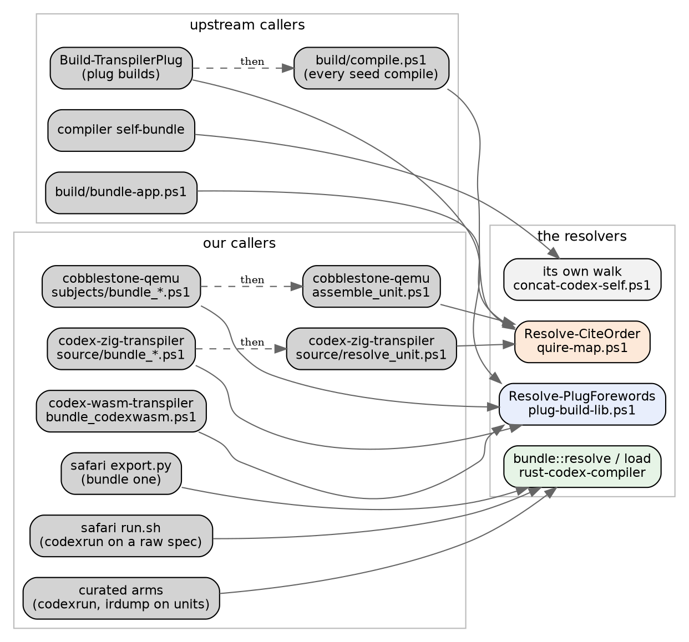
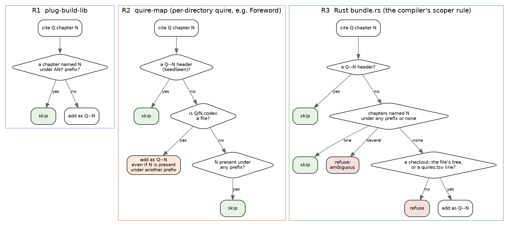

# The cite resolvers: a lay of the land

*2026-09-13, at Update 60 (`9fff850c`). Groundwork for moving resolution into
the Rust compiler. The ledger this summarises is cobblestone-qemu
`FINDINGS.md` section 3.*

A **cite** (`cites Foreword chapter ListUtils`) names a chapter a program needs.
A **resolver** turns a program into a **unit**: the program plus every chapter
its cites reach, dependencies first, each once. Everything downstream (the seed,
our native tools, the Rust front end) compiles a unit, never a bare file.

Four pieces of code in our chain resolve cites, and they do not agree on one
question: *is this chapter already there?*

## Who calls which resolver

Two things stand out. **Most units pass through two resolvers**: a bundler
(R1) assembles them, then the seed's compile step (R2) resolves them again. We
learned that the hard way: our transports skipped R2 until Update 59 broke them.
And **the Rust side is its own island** (R3). Nothing upstream calls it, and it
calls nothing upstream.

## When is a cited chapter "already there"?

| | presence is keyed on | adds ListUtils and Tuple unasked | a chapter it cannot find |
|---|---|---|---|
| **R1** plug-build-lib | the bare chapter name, asked FIRST (our PR 69) | no | exit 3 |
| **R2** quire-map | `Quire--Name` first; the bare name only when the file is missing. The manifest quires `Codex`, `Emit` and `Semantics` ask the bare name first | yes, every unit (Update 36) | throws |
| **R3** Rust | `Quire--Name` first, then the ONE chapter of that name under any prefix or none; several is refused. The compiler's own rule (ChapterScoper `find-slug-for-cite-name`) | yes, every unit | refuses. The checkout is the file's tree or a `quires.tsv` line, never a variable |
| **R4** self-bundle | `Quire\|Name` in its own queue, Foreword and Math only | no, though R2 adds them at compile | skips silently |

## What the disagreement costs, so far

**3a. Double bundling (R1 against R2).** A foreword a bundler lists under
another prefix (`Parsmi--Maybe`) satisfies R1, and R2 adds it a second time. It
hit codex-zig-transpiler's subject once: five chapters, 2,749 lines, now fixed
on our side. Upstream's own callers cannot hit it. R4 prefixes forewords with
their own quire, and `bundle-app` starts from a bare source.

**3b. The implicit pair is in every unit, and it shows.** fib uses neither `for`
nor a tuple, yet its unit carries both:

The answers do not change, so this costs transparency rather than correctness.
Pruning keeps type definitions and constructor lists, and the ids the checker
mints move, so anything keyed on ids or chapter lists sees a difference. The
QEMU checker was fooled by it once.

**R3's fallback is gone.** It re-resolved a short unit against `CODEX_ROOT`,
which `~/.bashrc` exported at an unrelated tree. Both the fallback and the
export are deleted; see below.

**3c. The scoper's bare-name fallback counts definitions** (read from code, not
measured). `find-slug-by-bare-name` answers only when exactly one entry
matches, and its cache holds one entry per DEFINITION. On that reading, a cite
that reaches its chapter by bare name finds nothing when the chapter defines
two or more names. `cite-override-quire.codex`'s chapter defines one. A single
experiment settles it: add a second definition and compile.

## What Rust resolution settled

R3 is rewritten (rust-codex-compiler `16e88f3`), and the four decisions came out
this way:

1. **The presence key is the compiler's.** A `Quire--Name`-only rule came first
   and refused too much:
   - the self-host subject, where `Parsmi--Build Settings` answers
     `cites Codex chapter Build Settings`;
   - all 128 curated and safari units, which carry a plain
     `Chapter: ListUtils`;
   - `cite-override-quire.codex`, which upstream's battery requires to
     compile.

   The scoper already had a rule for all three.
2. **The implicit pair is always added**, as `compile.ps1` adds it, so our
   headers can match R2's.
3. **The checkout is the file's own tree**, or a `checkout` line in the nearest
   `quires.tsv` for a project outside one.
4. **Gone:** `CODEX_ROOT`, `CODEX_QUIRES`, `CODEXC_RAW`. A file missing nothing
   is a unit and is read as it is.

Measured at U60, R3 beside R2 (`tools/resolver_agree.py`):

    1,293 programs under codex/test, apps/ out
      1,291  the same headers, in the same order
          2  both refuse: errors/missing-cite, errors/unregistered-quire-cite
    every unit the Rust arms read     unchanged, byte for byte
    the Roc ladder, 1,032 programs    ledger unchanged, 496 pass

The one case where R3 and R2 must differ is a Foreword chapter carried under
another prefix, and `codex/test` holds none. The check would list one as
"different chapters".
