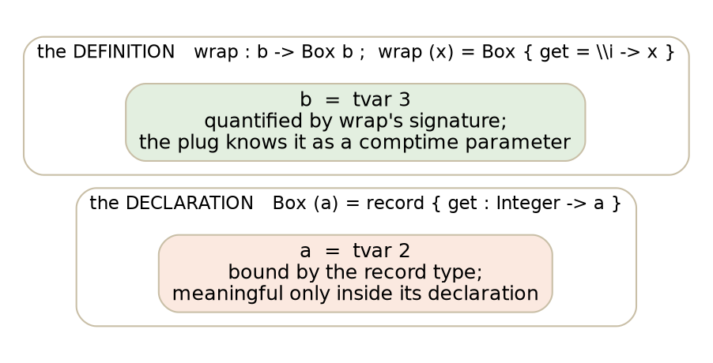
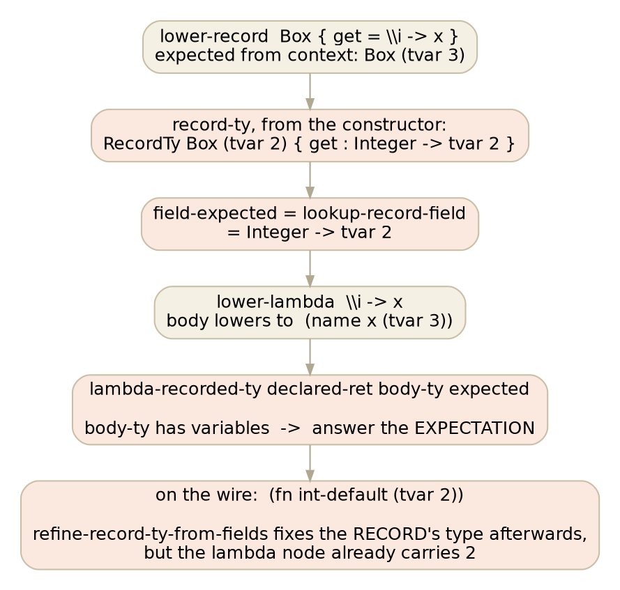
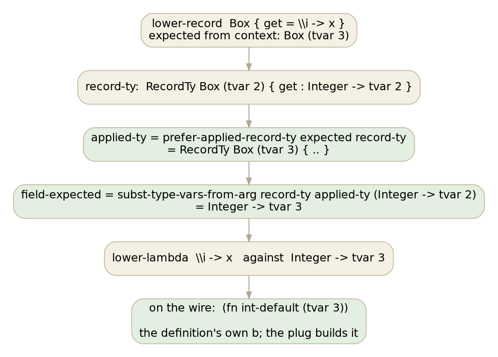
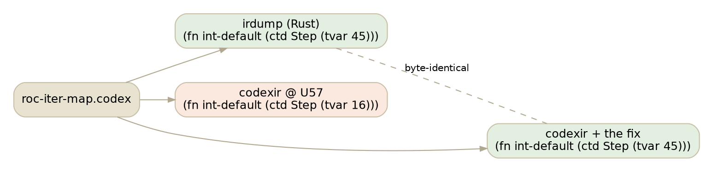

# The declaration's variable

The next pull request to Cobblestone is one definition in `IR/Lowering.codex`
and it closes the last red on the Roc corpus that was not already filed. This
is what it fixes, drawn.

## Two kinds of type variable

A polymorphic record declares a parameter. A polymorphic definition quantifies
a variable. They look the same on the wire, `(tvar N)`, and they are not the
same thing at all.

Inside `wrap`, only `tvar 3` has a binder. A `tvar 2` appearing anywhere in
`wrap`'s wire is a variable nobody introduced, and a typed plug says so:

    zig plug: unresolved type variable T2 of __lam_0

## Where the declaration's variable got in

`lower-record` looks the constructor up and strips its arrows, which yields the
record in its declared form: name, parameters, and fields whose types name
those parameters. Then it lowers each field value with the field's declared
type as the expectation.

The last box is the part that made this hard to see. `lower-record` does
know the applied arguments: after the fields are lowered it refines the
record's own type from them, and emits `(record-ty "Box" (args (tvar 3)))`
correctly. The repair runs one step too late for the field values, which were
lowered against the unrefined form and have already recorded what they were
handed.

Why a monomorphic use never showed it: with `wrap-int : Integer -> Box Integer`
the body's type is `int-default`, no variables, and `lambda-recorded-ty` takes
its third arm — substitute the declaration's parameter from the body — so the
lambda records `Integer -> int-default`. It is exactly the polymorphic body,
whose type is itself a variable, that trips the guard and keeps the
declaration's `a`.

## The fix

Compute the applied record type *before* the fields, and hand each field its
declared type with the declaration's parameters substituted by the applied
arguments.

`prefer-applied-record-ty` already existed; it was used only for the emitted
record type. `subst-type-vars-from-arg` already existed; it learns a mapping
by matching a declared form against an applied one and applies it to a
target. Neither is new. When the context supplies no arguments, the applied
type *is* the declared one, the mapping is the identity, and every
monomorphic record literal lowers to the bytes it always did.

## What it looks like from our side

The Rust front end never had this bug, because it never used the declared
field type as an expectation: it lowers the field value with no expectation
and reads the record's type from what the checker recorded. So the three Roc
iterator programs were a place where the two front ends disagreed and ours
built. With the fix in upstream's tree, a rebuilt `codexir` emits, for all
three, IR that is byte-identical to what ours had emitted all along.

The measurements that ride with the PR are the same shape as PR 139's: the
compiler self-hosts to convergence in one round, the QEMU fixed point holds,
and a census of all 1,269 corpus programs through a `codexir` carrying the fix
says exactly which programs change a byte and how. The pin is a test unit the
zig plug refuses before and prints after; the fidelity instrument cannot see
this shape, because a stale variable is legal-looking, and it says so in the
PR rather than pretending otherwise.

