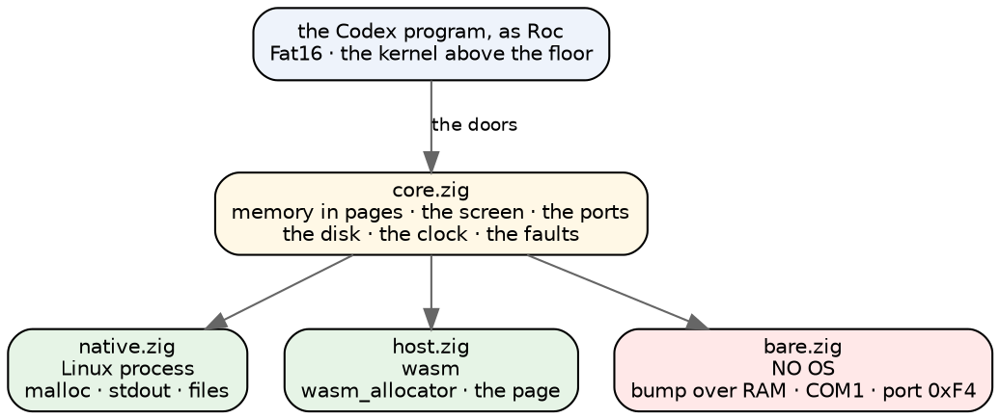
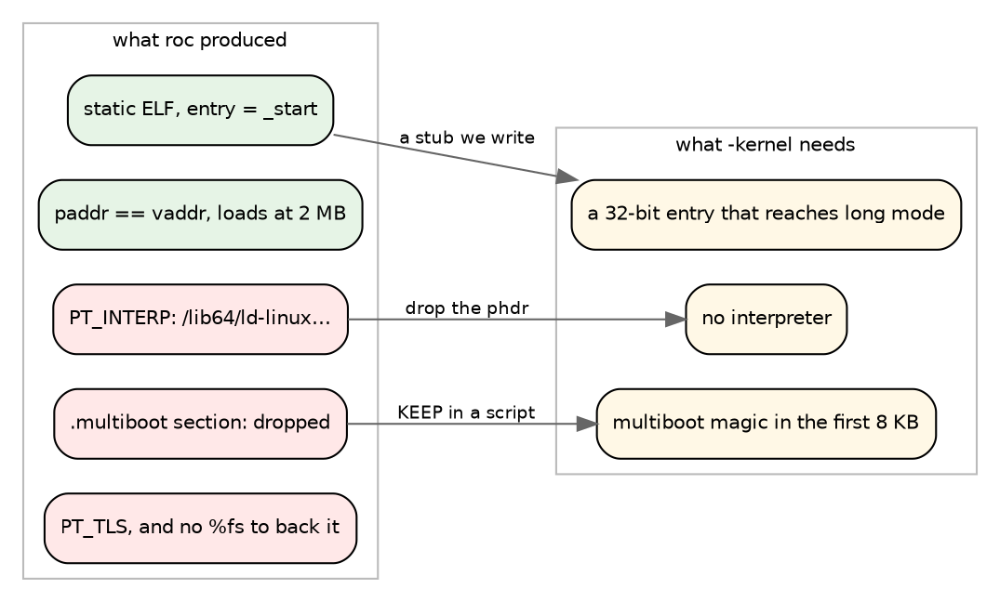
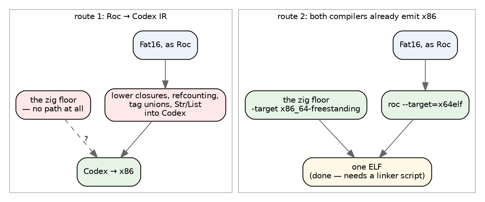
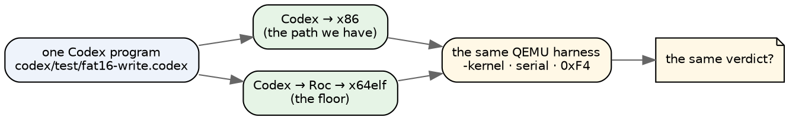

# The floor on bare metal

The question is how to get the hybrid — a zig floor with Roc on top of it — to
run natively under QEMU, the way Codex already does. Two routes were on the
table: teach the pipeline to go **Roc → Codex** at the IR level and reuse the
proven bare-metal path, or **tweak how zig and Roc produce x86** and boot the
result the way `f4_boot.py` boots a `.cdx`.

I went and measured instead of guessing, and the answer is lopsided enough to
be worth stating plainly up front:

**The second route is not a research project. Most of it already works, today,
and I have the ELF to show for it.** What is left is not compiler work at all —
it is about forty lines of linker script that Roc currently gives us no way to
pass.

The first route, I will argue, solves the wrong half of the problem.

## What the harness actually is

`cobblestone-qemu/codex_vm.py` has one function that starts a guest, and it is
smaller than I expected:

```
qemu-system-x86_64 -accel <accel> -kernel <kernel>
  -serial chardev:ch0  -serial chardev:ch1        # data and control, on sockets
  -device isa-debug-exit,iobase=0xf4,iosize=0x04  # the guest's own verdict
  -device loader,addr=0xfe8,data=<ram size>       # what codex-vm writes and QEMU does not
  -cpu max -display none -no-reboot -m <mb>
  [-device ne2k_isa,irq=9,iobase=0x300]           # only for kernels that drive it
```

Four facts in there matter for us:

- **`-kernel` means multiboot.** QEMU looks for the multiboot magic in the first
  8 KB of the file and, failing that, tries to parse it as a Linux image. A
  plain ELF is not bootable this way, however correct it is.
- **The console is a serial port**, which is nine lines of `outb`.
- **The verdict is a port write.** `isa-debug-exit` at 0xF4 ends the guest with a
  code, so a run has a pass/fail without anything parsing output.
- **The RAM size arrives at physical 0xFE8**, because codex-vm writes it there
  pre-boot and QEMU does not, and the boot stub reads it to set RSP.

So the harness is not Codex-specific in any way. It boots *a multiboot kernel*
and gives it a serial line and an exit door. Anything that is a multiboot kernel
can use it unchanged.

## What I found in Roc

Roc's target list has an entry I did not know about:

```zig
.x64elf, .x64v1elf => "x86_64-unknown-none-elf",
```

Freestanding x86-64. No OS. And the one thing it deliberately refuses:

```zig
// Generic ELF doesn't have a specific linker
.x64elf, .x64v1elf => return error.NoKnownLinkerPath,
```

That reads like a wall and is not one — `getDynamicLinkerPath` is about the ELF
*program interpreter*, the `/lib64/ld-linux-...` a dynamically linked binary
names. A bare-metal kernel has none by definition. The error is Roc saying "this
target is static," which is what we want.

Then the question is whether a *platform* may name that target, since a platform
header lists them:

```
targets: {
    inputs_dir: "targets/",
    x64musl: { inputs: ["crt1.o", "libhost.a", app, "libc.a"] },
    wasm32:  { inputs: ["host.wasm", app], exports: [...] },
}
```

`RocTarget.fromString` walks the whole enum, so yes: any name in it is legal
there. I added one line to the floor's platform —

```
x64elf: { inputs: ["host.o", app] },
```

— and asked for a build. Roc ran the entire pipeline and stopped at the link
with a shopping list rather than a refusal:

```
The platform's host inputs for target x64elf do not define these symbols
the application references.

    roc_alloc      roc_crashed    roc_dbg        roc_dealloc
    roc_disk_read  roc_disk_select roc_disk_write roc_echo_line
    roc_expect_failed  roc_heap_load  roc_heap_store  roc_realloc
```

Twelve symbols: Roc's six runtime hooks, and the six doors this program actually
reaches. That is a to-do list, not a wall.

## So I wrote the third root

The floor was already built around the idea that `core.zig` is the whole
platform and a *root* is the thin file saying how this particular machine
reports a crash and where its clock comes from. There were two roots. I added a
third, `platform/bare.zig`, 180 lines:



What a root has to answer turns out to be small: an allocator, a way to stop, a
clock, and two hooks this program does not use. On bare metal that is a bump
pointer over physical RAM above 16 MB (nothing is ever freed, which is what the
page table wanted anyway), the first serial port, and `rdtsc`.

Then I asked Roc to link it. **It did.**

```
ELF 64-bit LSB executable, x86-64, statically linked, not stripped
Entry point address: 0x23cd50        ← our own _start
LOAD 0x200000  R      LOAD 0x238f20  R E      LOAD 0x664438  RW
```

11.5 MB, entry at our boot stub, physical address equal to virtual address, a
Roc filesystem and a zig host in one freestanding image. Nothing about that
needed a new compiler direction.

## Where it actually stops

Being honest about the gap is the point of doing the experiment, so here is
exactly how far short of bootable that ELF is.



Three of those are ours to fix and one is not:

- **The long-mode stub is ours.** Multiboot hands control over in 32-bit
  protected mode with paging off; my `_start` assumes 64-bit. That is a known,
  bounded piece of assembly — a GDT, identity paging for the low few megabytes,
  and a far jump. Codex's own boot does exactly this already, so there is even a
  worked example in the tree to read.
- **`PT_TLS` is ours.** Roc and zig emit thread-locals; on bare metal nothing
  sets `%fs`. Either set it in the stub or arrange not to need it.
- **The multiboot header and the stray `PT_INTERP` are not ours**, and this is
  the whole remaining problem. Both are decided by the final link, and for a
  platform target **Roc drives that link**. My `.multiboot` section was dropped
  because nothing references it and there was no `KEEP` to say otherwise, and a
  `PT_INTERP` was emitted for a target that by Roc's own account has no
  interpreter. There is no `--emit-obj`, and `--keep-temp` left no object behind
  I could find, so I cannot take the pieces and link them myself.

That is a small, specific ask upstream: **let a platform target carry linker
arguments, or a linker script.** One field in the `targets:` block. It is
plausibly a smaller change than the relocation-order fix we already have open,
and it is the only thing between here and a bootable image.

## Why Roc → Codex is the wrong half

Now the route I would not take, and why — because the instinct behind it is
sound even though I think the conclusion is wrong.

The instinct is: we have a proven bare-metal path, with a ladder that checks it
rung by rung, so get onto that path. That is exactly the right thing to want.
But look at what the hybrid is made of:



Three objections, in order of how much they matter.

**It does not carry the zig half.** The whole thesis of the floor is that the
low-level machine is zig and the operating system above it is Roc. Roc → Codex
gets the Roc across and leaves the floor itself stranded. To finish the job you
would have to rewrite the host in Codex — at which point there is no floor, and
we are back to everything being Codex, which is the arrangement we deliberately
moved away from.

**It is strictly harder than targeting the machine.** Codex is small on purpose:
Integer, Text as CCE units, lists, records, chapters. Roc has closures,
refcounting, tag unions with payloads, specialization, and a `Str`/`List`
library with its own memory model. Lowering all of that *into Codex* means
writing a Roc backend whose target language cannot express most of what you are
lowering — you inherit Codex's constraints on top of x86's, rather than instead
of them. Roc's own dev backend already emits x86 and has for a while.

**It adds a language to the pipeline to remove a linker script.** That is the
trade, stated plainly. The remaining work on route 2 is a GDT, a page table, a
`KEEP` directive and one upstream field.

### The steelman, which is worth keeping

There is a real and valuable version of the instinct, and it is not a
conversion. Codex on bare metal is the **oracle**:



The same source, compiled two entirely different ways, booted on the same
machine, judged by the same console. We get that for free the moment route 2
boots — no conversion, no new direction, and it is a far sharper check than
either path alone. That is the payoff Steve was reaching for, and it arrives
through route 2 rather than instead of it.

## The recursive part, which I did not expect

The floor's doors are already the devices this machine has.

`Disk.read!(lba, addr)` on bare metal is an IDE controller at port 0x1F0. We
have a complete, tested specification of that controller's behaviour — down to
which register selects the drive and what a read past the end answers — in
`machine/roc/MachineIde.roc`, because we wrote it to emulate exactly the QEMU
machine we would now be running on. The NE2000 the harness can attach at 0x300
is `MachineNe2k.roc`. The clock is `MachineHpet.roc`.

So the bare-metal drivers do not have to be designed. They have to be
*transcribed*, from a Roc emulator we already trust, into the zig root that will
drive the real thing. **The emulator is the spec for the host that replaces
it.** Keeping `machine/roc` as the oracle looks like a better decision now than
it did when I argued for it.

## What I would build, in order

1. **The long-mode stub and the linker script**, written but not yet usable —
   proving the shape while the upstream ask is open. A `.multiboot` header
   first in the image, load at 1 MB where codex-vm loads a Codex kernel, no
   interpreter, `%fs` pointed at a static block.
2. **The upstream ask**: a linker script or linker arguments on a platform
   target. Small, general, and useful to anyone building a freestanding Roc.
3. **`fat16-write` on real hardware**, with `-drive` giving it a real disk
   through a transcribed `MachineIde`. Its verdict is already pinned six ways
   in `floor/verify.tsv`; bare metal becomes a seventh column, not a new kind
   of test.
4. **The differential run**: the same program the Codex way and the floor way,
   same harness, same verdict.
5. **The faults on real hardware.** This one is speculative and I like it: a
   fault mode that lives in the bare-metal root can misbehave at a real
   controller — which is much closer to what a disk actually does to an
   operating system than anything an emulator can stage.

And then the Raspberry Pi is a fourth root, with a real framebuffer instead of
a serial port, which is the same forty lines with different constants in them.

## The short version

- The harness is generic: a multiboot kernel, a serial line, and a port write
  for the verdict. It does not know or care that it has been booting Codex.
- Roc already has `x64elf` = `x86_64-unknown-none-elf`, a platform may name it,
  and **it links** — a static freestanding ELF with our own `_start`, built
  today.
- The floor's design paid off here without being asked to: bare metal is a third
  *root*, not a third platform, because `core.zig` never knew what was under it.
- What is missing is a linker script, not a compiler. Three of the four gaps are
  ours to close; the fourth is one field upstream.
- Roc → Codex would add a language to the pipeline, leave the zig half with no
  path, and lower a rich IR into a deliberately small one. The good idea inside
  it — reuse the proven path — is better served by making Codex-on-bare-metal
  the **oracle** for the floor, which route 2 hands us for nothing.
- And the drivers are already written, in Roc, as an emulator of the exact
  machine we would be booting.
