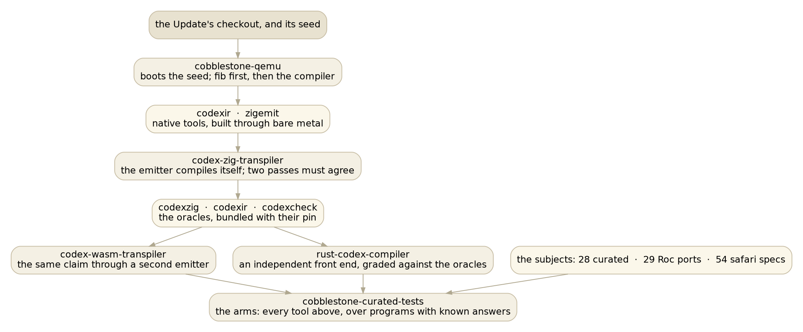
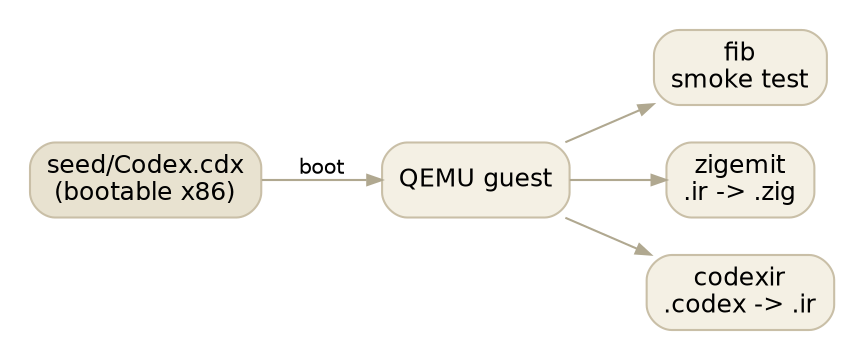
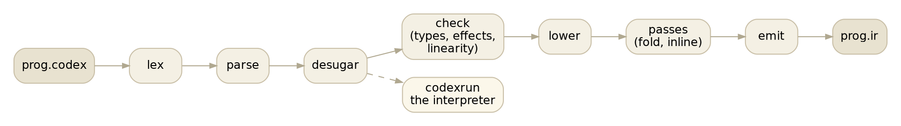
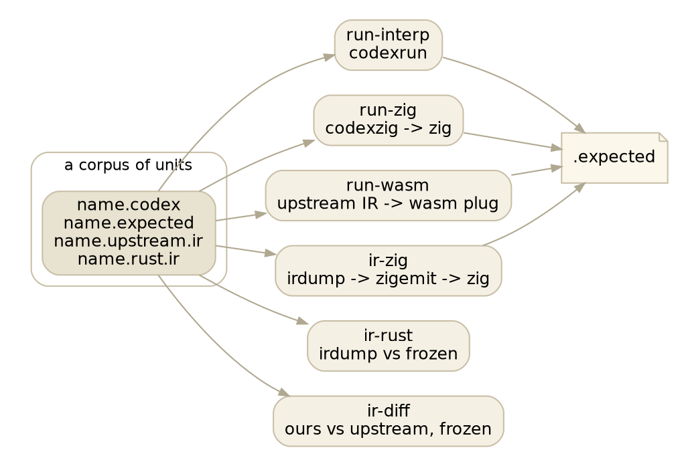

# The on-ramp

*Draft 2. For a human arriving cold. One section per repository we own, in
roughly the order they get used when a new Cobblestone Update lands.*

Cobblestone is Damian's self-hosted language, compiler and operating system,
written in its own language, Codex. Its canonical artifact is a bootable binary,
`seed/Codex.cdx`, that compiles Codex on bare metal with no host underneath it.
Every few days a new **Update** arrives as one large commit.

Validating an Update is the system's standing job, and it is why the sections
below come in the order they do. It is not the only job. The same repositories
are how we improve our own compiler until it is the reference for well-typed
IR, how we find and fix defects in the plugs we maintain, and how we port
programs into the language and keep them honest. Each of those has its own
essay; this page is the map. [The happy path through an
Update](/notes/the-happy-path-through-an-update.md) is the walk, stage by
stage, with what each stage proves and what it cannot.

## The ladder of trust

The repositories are not a menu. Each one's *output* is the next one's
*instrument*, which is why the order is forced rather than a matter of taste:
a defect at one rung silently poisons every measurement above it, because the
later rungs borrow the earlier rung's binaries.

The rule underneath it: **never let a rung consume an artifact whose pin it
cannot state.** Every borrowed binary here sits in a bundle beside a provenance
file naming the checkout it was built from, and every arm prints those lines
before its numbers. A green run that cannot say what it measured is not
evidence.

## cobblestone-qemu

**Run Codex on real x86 and tell me what came out.**

The seed compiler emits x86, not zig or wasm, so the only way to run it
faithfully is to boot it. This repository does that under QEMU and pulls the
result back over a ring buffer. It is the one arm where memory, the deck and
`address-of` are real rather than simulated, which makes it the tie-breaker
whenever two hosted arms disagree about something low-level. It is also the
first thing run on a new Update, because it needs nothing but the seed.

    export CODEX_ROOT=~/showell_repos/cobblestone-u58
    ./build.sh all          # fib, then zigemit, then codexir; stops at the first failure

What comes out are *native* tools: `codexir` is the whole front end stopped at
the IR wire, `zigemit` is the zig plug reading IR. Every later repository
borrows one or both. The check that matters at this rung is not the printed
number: it is the diff of the IR bare metal produced against the IR the native
tool produced from the same bytes, two roads that share a source and nothing
else.

## codex-zig-transpiler

**One binary, Codex in, zig out, that proves itself by compiling its own
source and getting the same bytes back.**

```dot
digraph {
  rankdir=LR; bgcolor="transparent"; pad=0.2;
  node [shape=box style="rounded,filled" fillcolor="#f4f0e4" color="#c9bfa7" fontname="Helvetica" fontsize=12];
  edge [color="#b0a890" arrowsize=0.7 fontname="Helvetica" fontsize=10];
  src  [label="codexzig-subject.codex\n(compiler + zig plug + driver)" fillcolor="#e8e2d0"];
  g    [label="three QEMU guests\n(the seed does the first pass)"];
  z1   [label="codexzig.qemu.zig"];
  bin  [label="codexzig\n(native binary)"];
  z2   [label="codexzig.native.zig"];
  eq   [label="byte-identical?" shape=diamond fillcolor="#fbf7ea"];
  src -> g -> z1 -> bin [label="zig build-exe"];
  src -> bin [style=dashed label="the same source again"];
  bin -> z2 -> eq; z1 -> eq;
}
```

The first pass has to come from the seed, because the seed is the only thing
that can compile Codex before a `codexzig` exists. The second pass is the new
binary reading the same source. If the two zig files agree, the emitter emits
the same bytes for its own source whether it runs on bare metal or as the
native program it produced. That is the invariant this repository exists for,
and it takes about seven minutes. The day-to-day loop skips the guests:

    ./bootstrap_native.py     # codexzig(n) -> candidate.zig -> codexzig(n+1) -> again.zig, until they agree

Two smaller tools ride on the same subject: `codexir` and `codexcheck`, the
front end stopped at the IR wire and at the checker's counters. Those are the
*oracles* the Rust compiler is graded against, and they live as a bundle at
`~/codexir` beside a provenance file naming the checkout they came from.

## codex-wasm-transpiler

**The same idea for WebAssembly, with a twist: the compiler is itself a wasm
module.**

`codexwasm` reads Codex and writes WAT, and node runs it. Its fixed point is
the same shape as the zig one, reached by two roads that share no code below
the IR: Codex to zig to wasm, and Codex to IR to the wasm plug. When both roads
produce the same module the plug is trusted. The repository also owns
`corpus_sweep.py`, which pushes a whole directory of IR through the plug,
assembles each module with `wat2wasm`, runs it, and grades the output. The
`run-wasm` arm below is that script with a different corpus.

## rust-codex-compiler

**A second, independent front end for Codex, written in Rust, that is now the
reference for what well-typed IR looks like.**

Two things nobody else in this list has. It is fast, seven milliseconds to
check a program the transpiled `codexcheck` takes 170 milliseconds on, so it
can run over thousands of programs in the time a guest takes to boot. And it
was written by reading upstream's compiler rather than copying it, so where
the two disagree, one of them is wrong and we get to find out which.

The layers are the driver's own, in the driver's order, and each has a tool that
stops there: `lexdump`, `parsedump`, `desugardump`, `checkdump`, `irdump`. The
one that matters most day to day is `irdump whole prog.codex`, which prints the
IR the way `codexir` does, so the two can be diffed byte for byte. `codexrun` is
an interpreter over the desugared tree, type-erasing, and it is what the specs
and the curated programs run on first.

The compiler compiles itself as its largest test, 2,869 definitions
byte-identical to upstream's, and that gate takes a minute:

    ./selfhost_gate.sh
    counters  EXACT on all five
    wire      identical 2869 of 2869   differs 0   MISSING 0

Being the reference means the byte-diff is a safety net rather than the judge.
Where we resolve a type upstream leaves as a hole, the zig plug decides who is
right, because it refuses to build a hole.

## cobblestone-curated-tests

**Small programs with known answers, and one script per way of running them.**

A unit is a program with its cites already resolved, beside the output it must
produce and, since this week, two frozen IRs: upstream's, re-frozen when the pin
moves, and ours, re-frozen only on purpose. Three corpora use the format: 28
programs cut from Cobblestone's own tests, 29 hand-ported from the Roc
language's test suite, and safari's 54 specs, exported. The arms take any of
them:

    arms/run-zig roc/units
    arms/ir-diff ~/showell_repos/safari-codex/units

Each arm prints which bundles it ran, then one verdict per unit, then a count.
The two strict arms are the ones ending in `-zig`: the zig compiler refuses a
program whose types were left unresolved, which the interpreter and the wasm
plug run straight past.

## safari-codex

**A driving screensaver, ported from Steve's original zig into Codex, that has
found more toolchain defects than anything else we own.**

It is real geometry, real physics and real drawing, fifty-four chapters, and
each chapter has a spec: a self-checking Codex program that carries its own
expected values and prints `ok N` for every seam it graded. The specs run on
the interpreter in seconds. Exported as units, they run through every arm above
from the outside. Because it is full of real numbers where the compiler's own
source has almost none, it finds what the self-host cannot; the untyped real
literal of yesterday was its catch.

    ./spec/run.sh          # the edit loop
    ./spec/export.py       # freeze the specs into units/

There is also a browser build: Codex to zig to wasm32, driven by this project's
own fork of the original blitter, served on :9200.

## What the ladder cannot see

Each rung is blind to something, and saying so is part of the report.

| rung | proves | cannot see |
|---|---|---|
| bare metal | memory, the deck, `address-of` are real | anything large, at routine cost |
| the fixed points | the emitter agrees with itself | a front-end defect both passes share |
| the Rust arm | an independent reading of every construct it implements | a construct it refuses |
| the arms | a program's answer, on every road | a program not in a corpus |

## codex-zig-ladder (retired)

**The dated work logs, and the record of what was sent upstream.**

This is where the whole effort started, as a ladder of rungs that compiled the
compiler stage by stage. The rungs are retired and the focused repositories
above absorbed what was worth keeping. It is still read for two things: the
`U<NN>.log` files, one per Update, which are the day-by-day account, and
`outbound/`, one file per pull request or issue sent to Damian.

## essay-repl-server

**Where the reasoning lives, on :9100, so a console reply can stay short.**

Every note here is a markdown file under `notes/`, pushed to git and served
immediately. Diagrams are graphviz, rendered in the browser. This page is one of
them.

---

*Not part of this system:* `angry-gopher` is lynrummy.com, deployed from this
box but nothing to do with Codex.

