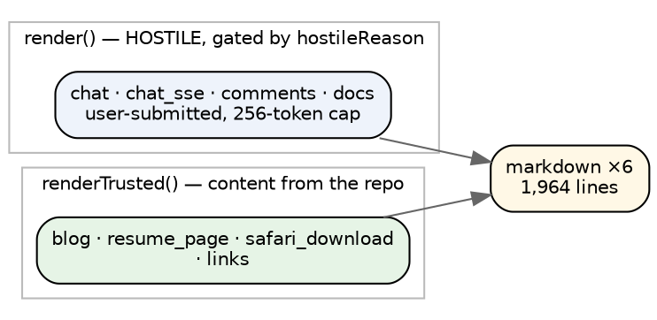
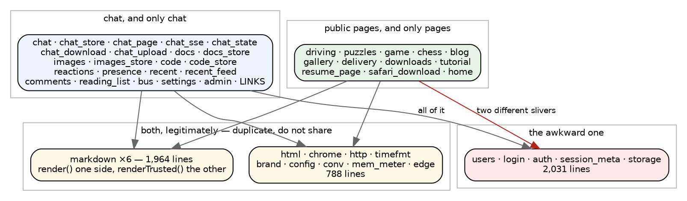

# The seams inside angry-gopher

Before splitting a codebase across two machines, it is worth knowing what is
actually holding it together. This is that survey — measured rather than
guessed, because the guesses so far have been wrong in instructive ways.

The rule it is measured against: **duplication between the two boxes is fine;
dead weight on either is not.** A module both sides genuinely use can exist
twice. A module one side carries and never calls is the thing to find.

`/learn` is already gone, and that deletion did more than remove a page — it
was the only thing outside chat that embedded chat's JavaScript, twelve modules
reused to run its demos and revealed as spoiler source. **No front-end asset now
crosses the chat boundary at all.**

## The correction: markdown is not only Docs

The hypothesis was that markdown belongs to Docs, and therefore to chat. It does
not, and the way it does not is the most useful thing in this survey — because
**the seam is already named in the API**.

Three entry points, two threat models: `render` for anything a person typed,
behind `hostileReason` at the door; `renderTrusted` and `renderTrustedReflow`
for prose that is in the repository. Every hostile caller is a chat surface.
Every trusted caller is a page — except `links`, which is not a page at all (see
below).

So **both boxes carry markdown, and neither is carrying dead weight**: the chat
box needs `render`, the public box needs `renderTrusted` for the blog, the
résumé and the Safari download page. 1,964 lines duplicated, with a line already
drawn through the middle of it by someone who was thinking about safety rather
than about deployment. That line is the seam.

## What is actually shared, and what only looks shared

**`links.zig` is misfiled.** It is `/chat/links`, "a per-user curated links
page", routed from inside `chat.zig`. It is not a page that imports chat; it is
part of chat that happens to sit in the pages bucket. Moving it is pure
bookkeeping, and it removes the only apparent cycle between the two halves.

**The small infrastructure is genuinely shared and genuinely small.** `html`,
`chrome`, `http`, `timefmt`, `brand`, `config`, `conv`, `mem_meter`, `edge` —
788 lines between them, no shared state, no reason not to have two copies.

## The awkward one is identity, and it is two different things

`users`, `login`, `auth`, `session_meta` and `storage` are 2,031 lines, and six
page modules reach into them. But not for the same reason, and the difference is
the whole of the refactor:

| page | what it asks for | what it needs |
|---|---|---|
| `chess`, `blog`, `home` | `users.getUserName(uid)` | **a name to print** |
| `puzzles` | `users.currentUserID`, redirects without one | **a user** |
| `game` | `currentUserID`, `touchUser`, 19 `storage` calls | **a user, and per-user state** |

The first three already handle absence: `if (uid.len == 0) ""`. Cut them off
from identity entirely and they render with an empty name. That is three edges
gone for nothing.

The last two are real. `/puzzles` refuses to work without a user and `/game`
stores a board per person. They are the two exceptions to "almost everything is
public" — and they want exactly the treatment Lyn Rummy is already getting: **a
name, no password**, resolved locally on the public box. They need *a* user, not
*the* user, and pretending otherwise is what drags the whole 2,031-line identity
stack across the boundary.

## Two edges still to decide

**`blog` imports `bus` and `comments`.** Blog posts have live comments, running
on chat's pub/sub. That is a genuine feature crossing the line. Either comments
move to the chat box and the blog links out to them, or blog comments become
static, or the blog moves. It is a product decision, not a technical one.

**`home` imports `chat`.** The index shows something chat-shaped. Same question,
smaller: either the index stops showing it, or it fetches it over HTTP like any
other client would.

## What I would do inside angry-gopher, in order

Each step is independently valuable, leaves the tree green, and is worth doing
even if the two-box split never happens.

1. **Move `links.zig` into the chat bucket.** Pure bookkeeping, no behaviour
   change, removes the only cycle.
2. **Cut `chess`, `blog` and `home` off from `users`.** They lose a name they
   already know how to live without. Three imports, three call sites.
3. **Give `puzzles` and `game` a local identity** — the Lyn Rummy treatment, a
   name and no password. This is the biggest one and the one that actually
   unpicks the identity stack.
4. **Split `markdown`'s callers along the line that already exists**, so that
   `render` and `renderTrusted` have visibly different customers. No code moves;
   it is about making the existing seam legible, probably as a comment at the
   top of `markdown.zig` naming who is on each side.
5. **Decide the blog-comments and home-index questions.** Product, not code.

Only after those does the tree have a clean cut through it — and at that point
the two-box split is mostly a matter of which modules each `build.zig` lists.

## The short version

- **markdown is not only Docs.** It has two entry points with two threat models:
  `render` for what people type, `renderTrusted` for what is in the repo. Every
  hostile caller is chat; every trusted caller is a page. Both boxes carry it and
  neither carries dead weight, because the split is inside the module's own API.
- `links.zig` is chat's, filed under pages.
- The small shared infrastructure — 788 lines — should simply be duplicated.
- **Identity is the only real entanglement.** Three pages want a name they can
  already do without; two pages want a user and should get a local one.
- Two edges are product decisions: blog comments on chat's bus, and the index
  showing chat.
- `/learn` is gone, and with it the last shared front-end asset.
