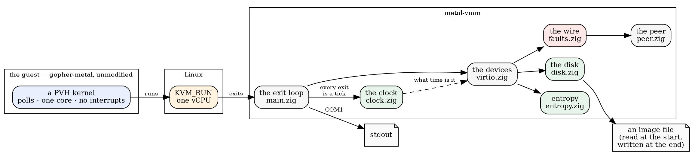
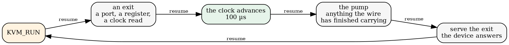
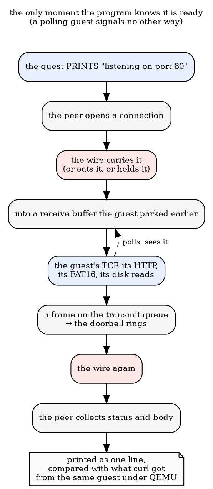
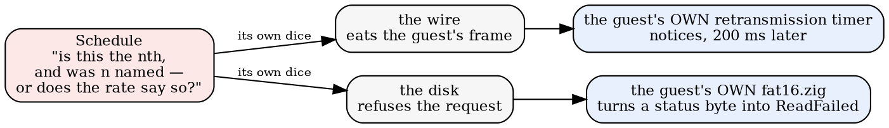
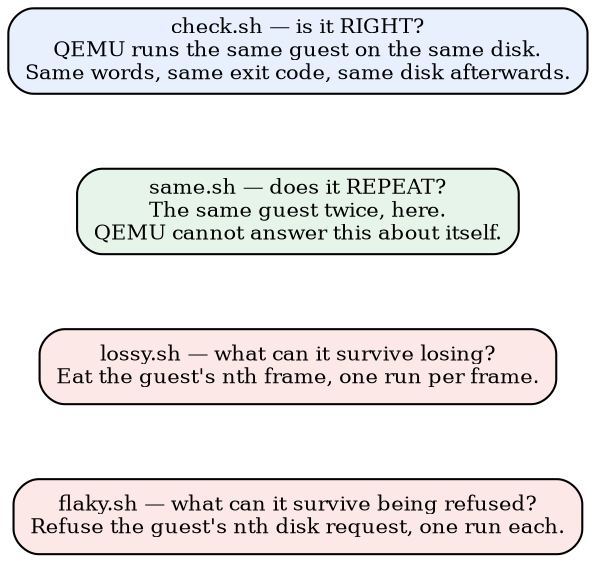

# The shape of a run

*2026-09-18 — metal-vmm, nine milestones in: who talks to whom, and what makes
any of it move*

The last essay was about one problem — the clock — and how it was solved. This
one is a map. Nine milestones in, `metal-vmm` has enough moving parts that the
interesting thing is no longer any single one of them but **how they are wired
to each other**, so this is mostly pictures.

## Who owns what

**Everything in the middle box is ours, and that is the entire claim.** The
guest reads nothing this program did not hand it: not the disk, not the wire,
not the entropy, and — since the last essay — not the time.

## What makes anything happen

Nothing in that picture is driven by a thread, a timer, or the host's clock.
There is exactly one thing that moves the machine, and it is the guest asking
for something.

That loop is the whole design. **Time is measured in questions**: the counter
moves 100 µs per exit and by nothing else, so the moment anything happens is a
function of what the guest did, not of what this box was busy with. The pump
runs at every exit because the guest polls memory and gives the program no
other moment to act.

Two consequences worth holding on to:

- **a guest that waits pays in questions, not seconds** — the `clock` probe
  waits for four real-time-clock seconds-edges and takes 1.3 s here against
  QEMU's 8.3;
- **a guest that waits without asking anything waits forever** — a spin on
  memory advances nothing. gopher-metal's DHCP does exactly that, which is why
  wire latency kills it.

## One request, end to end

The trigger at the top is the part nobody would guess. A polling guest never
returns control to say "I am ready now", so the peer waits until the guest
**prints** that it is listening. gopher-metal's own judge waits for the same
line, arrived at independently for the same reason.

## Where a fault gets in

There are exactly two seams a fault can enter through, and they ask the same
question, so they ask it in the same place.

**Picking the nth beats picking at random.** A rate explores by sampling; a
number explores exhaustively, and the table of "what happened when I took away
the nth" is a map rather than an anecdote. Refusing each of the `fat16` guest's
709 disk requests in turn took 1 minute 46 seconds, and every single run failed
cleanly naming the right layer.

Each seam gets its own generator, and a test holds them to it: turning the
wire's loss on must not change which disk requests fail. Two knobs that
interfere are two knobs you cannot reason about.

## Four questions, four instruments

The first two are oracles: they say whether the machine is trustworthy. The
second two are explorers: they only mean anything **because** the first two
pass. A sweep over a machine that does not repeat is a pile of anecdotes.

And the explorers have already earned it. `lossy.sh` found a real defect in the
guest on its first run: **gopher-metal's `dhcp.acquire` sends its DISCOVER once
and never retransmits.** Eat the first frame and the machine has no address.
Its TCP survives every other single-frame loss in the table, paying exactly the
200 ms its own `min_rto_ns` promises.

## What has been running on it so far

Probes. Small kernels that do one thing and print whether it worked — a disk
read, a lease, a fetch, a calibration. They were the right subject for building
a machine, because when a probe disagrees with QEMU the disagreement is three
lines long.

But a probe is a friendly guest. It asks for little, it holds no state, and its
error paths are shallow enough that refusing a disk request always ends the run.

**The next guest is `gopher.elf`**: angry-gopher's actual route table, compiled
from its own source, serving real HTTP over a FAT16 volume with the site's own
data on it — sessions, chat transcripts, images, a login. On Linux it is a web
application; here it is a 24 MB kernel with no operating system under it. It is
the thing all of this was built to be able to take apart.

That is the next run.
