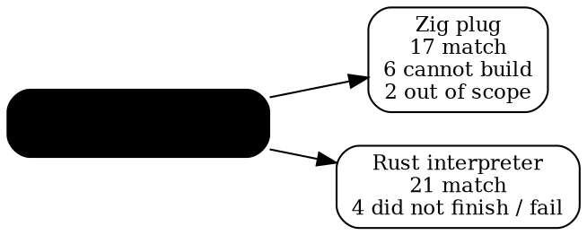

# Update 61's crypto, and why it is slow

*2026-09-22. What running U61's new crypto tests through our arms found, and a
measured answer to "why is this slow even in native Zig?"*

## The short version

- Update 61's crypto is **right everywhere we could run it.** No program
  printed anything other than upstream's expected output, on any arm.
- What we found is **plumbing**, all of it older than U61: two holes in the Zig
  plug that U61's new tests happen to walk into, and one hole in our own
  interpreter.
- **The slowness is mostly us.** Our arms build Zig in Debug mode. The same
  program built ReleaseSafe runs **15.6 times faster** with identical output.
  After that, the remaining cost is SHA-256 written over lists, and a surprising
  30% spent zero-filling memory.

## What we ran

U61 added or changed 34 test programs, and most of them are the nine crypto
"repair sets" red's audit landed: Ed25519, X25519, HMAC/HKDF, AES-GCM, RSA-PSS,
ECDSA, PBKDF2, ChaCha20-Poly1305, CryptoBig. Upstream's release notes are
candid that these got "bounded development proofs" and that "no full release
battery was run for these landings". Upstream judged them on bare metal and C#.

We took the 25 that have expected output and ran each through two more
executors: the Zig plug (`codexzig`, native) and our Rust interpreter
(`codexrun`).

**Every program that ran printed exactly what upstream expects.** RSA-PSS,
ECDSA P-256, AES-GCM, HKDF, HMAC, PBKDF2 and CryptoBig all match on Zig; the
interpreter matches 21. No arm disagreed with upstream about a single output
line. That is the headline for the crypto itself.

## What did not run, and why

| program(s) | arm | cause | whose |
|---|---|---|---|
| `x25519-vector-test`, `ed25519-sign-test`, `ecdsa-p384`, `cdx-binary-test` | Zig | the Zig plug has **no emitter for `bit-not`** | upstream's plug, older than U61 |
| `key-manager-test` | Zig | an unused `x <- ...` in an `act` block emits a constant Zig rejects | upstream's plug, older than U61 |
| `aesgcm-test` | interpreter | an act-level `let` loses its scope after its own line | **ours** |
| `vault-crypto-test`, `crypto-vectors` | interpreter | too slow: stopped / hit the 300 s cap | ours, and expected |
| `identity-sign` | both | `key-status`, a kernel identity service | out of scope |
| `quotes-gate`, `quotes-parse` | Zig | quotation checking is a driver stage our tools do not run | out of scope |

**`bit-not`.** It is a declared builtin, the wasm plug emits it (`xor -1`), and
the Zig plug simply never learned it. SHA-512 uses it, so everything that signs
or verifies with Ed25519 or X25519, or hashes with SHA-512, cannot build on Zig.
The fix is one line beside `bit-and`, `bit-or` and `bit-xor`. Measured: of six
programs that could not build, five now match -- the four crypto tests and
`tco-bitop-loop`, a battery test that already exercises `bit-not` on bare metal.

**The unused `do-bind`.** Our PR 138 taught the Zig plug that an unused `let`
must be silenced (`_ = x;`) or Zig refuses the program. An `act` block's
`x <- effect` is a different code path -- two of them, in fact, a normal one and
a tail-position twin -- and neither got the rule. Fixed in both; a four-line
test program shows it (fails to build on U61, matches with the fix).

**Our interpreter and act-level `let`.** In Codex, a `let` statement inside an
`act` scopes over the rest of the block. Our lowering knows this (it is spelled
out in `lowering.rs`); the interpreter's own compiler does not, so
`aesgcm-test` dies with "undefined name `empty-result`" halfway through. A
Rust-side fix, not a finding.

## Why it is slow, measured

The question that started this: `vault-crypto-test` took **62 seconds** (measured, Debug)
as a native Zig program. The work it does is real -- it derives a key with
PBKDF2 at 100,000 iterations, three or four times. Each iteration is an HMAC,
which is two SHA-256 calls on 96-byte messages, which is four SHA-256
compressions. So:

    100,000 iterations x 4 compressions x ~3.5 derivations  ~=  1.4 million compressions

Optimized C does that in roughly a third of a second. We were two hundred times
slower -- roughly 45 microseconds a compression. Here is where the factor went:

| build | time | same output? |
|---|---|---|
| **Debug** (what our arms build: `zig build-exe` with no `-O`) | **61.8 s** | yes |
| **ReleaseSafe** (optimized, keeps safety checks) | **3.97 s** | yes |
| ReleaseFast (optimized, no safety checks) | 2.37 s | yes, but not legitimate -- see below |

**First cause: Debug mode, a factor of 15.6.** Zig's default build does no
optimization and checks every add, subtract, multiply and index at runtime. The
Debug profile is exactly that: the top entries are tiny helper functions
(`rotr32`, `cx_list_at`, `cx_shru`, `cx_shl`, `w32`, `mask32`) that an
optimizer would inline into nothing, each paying a real call.

**Why not ReleaseFast.** The Zig plug implements Codex's rule that plain
Integer arithmetic traps on overflow by emitting Zig's ordinary `+ - *` and
letting Zig's safety checks do the trapping. ReleaseFast removes those checks,
so it would quietly turn a Codex trap into undefined behaviour. ReleaseSafe is
the fastest build that keeps the language's meaning.

**Second cause: the shape of the Codex code, the remaining ~10x.** At 3.97 s we
are at about 2.8 microseconds a compression, roughly ten times optimized C. The
ReleaseSafe profile:

| where | share |
|---|---|
| SHA-256 itself (everything inlined into it) | 52% |
| **`memset`** | **30%** |
| list growth (`ensureTotalCapacityPrecise`) and `memcpy` | 9% |
| the bump allocator | 3% |

Codex SHA-256 holds bytes as a `List Integer` -- eight bytes per byte -- builds
the message schedule and the padding with `list-push`, allocates a fresh state
record for every one of the 64 rounds, and does 32-bit rotation in 64-bit
arithmetic with masks. All of that is honest Codex; none of it is a bug. It is
what a hash written over immutable lists costs.

**The one number that looks like a bug is the 30% in `memset`.** Something is
zero-filling memory on a hot path -- in a hash, which should be all arithmetic.
Candidates: a list created with capacity being cleared, or Zig's safe-mode
filling of `undefined` memory. That is worth one more look before anyone
concludes the cost is inherent.

## What it means

- **For the arms:** our numbers are Debug numbers. Moving the arms to
  ReleaseSafe would make every crypto test fast enough to run routinely, at the
  cost of a slower `zig build-exe` per program. That is a choice for us, and a
  cheap one to measure.
- **For upstream:** nothing here says their crypto is wrong or slow on bare
  metal -- we have not timed bare metal. The `memset` share is the one lead that
  might be theirs (the Zig plug's list or allocator code) and is worth sending
  once it is attributed.
- **For U61 verification:** two small Zig plug fixes go out as PRs, each with a
  test, and `u62-candidate` collects them.
