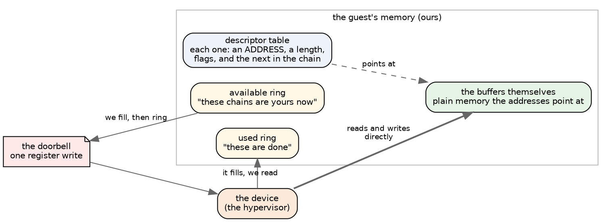
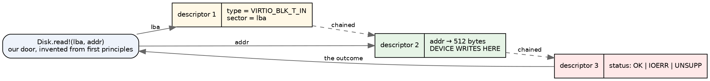
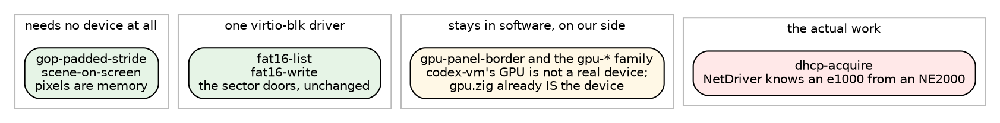
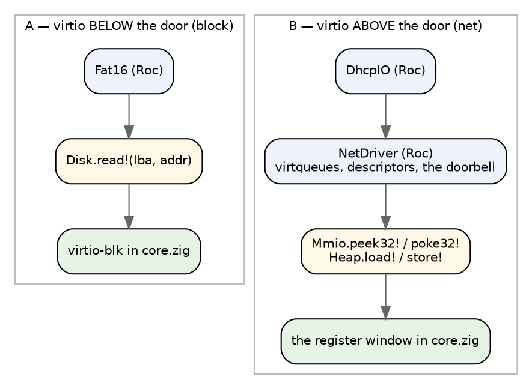

# virtio is the device set

The last essay got a Roc filesystem and a zig floor linked into one freestanding
ELF, and stopped at a linker script. This one is about the question underneath
that: once the image boots, *what hardware is it talking to?*

The answer I want to argue for is **virtio**, and the argument turns out to be
much stronger than "it is convenient." Our door design already is virtio, by
accident, because we derived it from the same constraint the standard was
derived from.

## What virtio is, if you have not had to care

A virtual machine has to be given devices. The old way is to pretend to be
real hardware: QEMU emulates an IDE disk controller from 1994, register for
register, because that is what an operating system already knows how to drive.
It works and it is slow and tedious on both sides — the hypervisor fakes
hardware quirks nobody wants, and the guest drives a device whose interface was
designed around cables.

virtio is the other way: a device interface designed on the assumption that both
ends are software and can cooperate. There is no pretending. It is a published
standard, every hypervisor implements it, and it is small.

The whole mechanism is one structure, the **virtqueue**, which lives in the
guest's own memory:



You write descriptors that say *where in memory* the data is, put the chain on
the available ring, and write one register to ring a doorbell. The device reads
and writes your memory directly and puts the finished chain on the used ring.

That is the whole thing. virtio-blk, virtio-net and virtio-gpu are each just an
agreement about what the buffers in those chains contain.

## Why aim at this layer

**One image, many machines.** This is the practical reason and it is decisive.
A bare-metal PC in 2026 has NVMe, a specific NIC, ACPI tables and PCIe
enumeration, and a *different* set of those on the next machine. virtio is
identical on QEMU, on Firecracker, on Cloud Hypervisor, on DigitalOcean, on GCP,
on AWS Nitro. Write it once and the same kernel image runs locally under QEMU
and on a provider, unchanged.

**The hypervisor writes the hard drivers.** We never write an NVMe driver or
touch a real network card. Somebody else already did, correctly, and virtio is
the interface to their work.

**It is small.** virtio-blk is a header struct of three fields, a data buffer,
and a status byte. There is no negotiation of link speed, no PHY, no EEPROM, no
reset quirks.

## The accident: our door already is a virtio request

Here is the part that made me want to write this essay.

When the floor was designed, rule 2 was *payload never crosses the seam,
addresses do* — derived from a performance argument about copying sectors into
Roc values. That gave us:

```
Disk.read!  : U64, U64 => U64      # lba, addr -> outcome
Disk.write! : U64, U64 => U64
```

A virtio-blk request is a three-descriptor chain:



`lba` is the header's sector field. `addr` is the data descriptor. The outcome
we invented — `done`, `absent`, `past the end`, `refused` — is the status byte,
which virtio-blk spells `VIRTIO_BLK_S_OK`, `_IOERR`, `_UNSUPP`.

We did not copy this. We arrived at it because the same constraint was operating
on us that was operating on the standard's authors: **a device that has to be
handed a payload is a device that copies, and a device given an address is not.**

And there is a third line of evidence pointing the same way. The fault work
turned up that `block-read-sector`, the Codex builtin, answers an address and
*nothing else* — there is no channel in it for "this sector did not arrive," so
a Roc kernel on our floor cannot notice a failed read. **virtio-blk has that
channel and always has**: the status byte is mandatory, one per request. The
thing our fault injection proved was missing is the thing the industry
standardised twenty years ago. That is about as strong a signal as design work
gets that the door is cut in the right place.

## What the machine/batch programs actually need

This is the question worth answering concretely, so I went and counted. Here is
every device door each program's own modules call — not what the platform
defines, what the program *reaches*:

| program | device doors it calls |
|---|---|
| `gop-padded-stride` | **none** — `load!` and `store!` only |
| `scene-on-screen` | **none** — `load!` and `store!` only |
| `fat16-list` | `block_read_sector!`, `block_write_sector!` |
| `fat16-write` | `block_read_sector!`, `block_write_sector!` |
| `gpu-panel-border` (and the `gpu-*` family) | `port_out_32!` |
| `dhcp-acquire` | `net_send_raw!`, `net_recv_raw!`, `net_status`, `port_in_32!`, `port_out_32!` |



Four of the six need **no new device code at all**, and that is not luck — it
falls out of the ladder.

**The two screen programs touch nothing.** A framebuffer is memory; the program
writes pixels into it. Whether those pixels reach a human is the *host's*
problem, not the program's, and the floor already publishes the GOP geometry
cells itself rather than taking them from a machine. On virtio the host would
hand them to `virtio-gpu`'s scanout — or to QEMU's `ramfb`, which is simpler
still — and the Roc above never learns anything happened.

**The two FAT16 programs need one driver, behind the door they already use.**
`Disk.read!` is answered by a byte array in the native root, by a page-supplied
buffer in the browser root, and by a virtqueue in a virtio root. The Roc is
identical in all three. We have in effect already done this port: the floor's
`Disk.roc` models no IDE controller anywhere, and `fat16-write` passes its
verdict six ways on it.

**The GPU family is already ours.** codex-vm's GPU at ports 0x400-0x417 is not
real hardware — it is an invention, and `gpu.zig` implements it in software on
our side of the seam. It does not become a virtio question. (A real
`virtio-gpu` could accelerate it one day; nothing requires that.)

**`dhcp-acquire` is the one that is real work**, and it is real work precisely
because it stands on the low rung: `NetDriver` pokes registers and knows which
card it is talking to.

## The one that does not port, and what to do about it

Three options, and I think the ordering is clear.

**Emulate an NE2000 in the floor, over a real virtio-net.** The Codex program
changes not at all; the floor grows a small device model. This is exactly what
`machine/roc` already does, moved down a layer. It is a legitimate stepping
stone and I would not be ashamed of it — but it means writing *and maintaining*
an emulator forever so that one program need not be edited.

**Give Roc a frame-level door and delete the driver.** Rejected in the first
essay and still rejected: if the floor sends frames, `DhcpIO` is 81 lines and
there is no operating system left to prototype.

**Port `NetDriver` to virtqueues, in Roc.** This is the one I would pick, and
the reason is that it is *the same kind of code it already is*. NetDriver's job
today is: lay out a ring of descriptors in memory, fill one, write a register to
tell the card, and later walk the ring looking for what came back. A virtqueue
is a ring of descriptors in memory that you fill, and a doorbell register, and a
used ring you walk. The skill transfers exactly; the device is simpler than an
e1000; and the interesting part of the OS — rings, ownership, notification —
stays in Roc where we wanted it.

The cost is honest: `dhcp-acquire` on virtio is a *different program* from
`dhcp-acquire` on an NE2000, because its driver chapter differs. That is fine —
it is a driver, and drivers are per device. But it means the ladder's
codex-vm-compatibility check and the virtio run are two different runs, not one.

## Where virtio lives: below the doors, or above them

This is the design question, and it is the ladder question again with new
clothes.



**A for block, B for net**, and the reason is the same one that decided the
altitudes in the first place: put the seam where the traffic is low and the
interest is low. Nobody wants to prototype a block driver — FAT16 wants sectors,
179 transfers for a whole program. Everybody wants to prototype a network
driver, because that is where ring buffers and notification and ownership live.

Note what A costs us that is worth naming: with virtio-blk *below* the door, the
Roc side cannot inject a fault into the ring, and cannot experiment with request
reordering or queue depth. If that becomes interesting, block moves to B too —
and the floor is built so that is an addition, not a rewrite. That is the point
of a ladder.

## mmio or pci, and which machine is which

virtio comes in two discovery flavours, and the difference matters more than it
sounds.

**virtio-mmio** is a set of registers at a known physical address. There is a
magic value (`0x74726976`, "virt") at offset zero, a device type, a queue
selector and a doorbell. No enumeration, no buses. QEMU's `microvm` machine and
Firecracker use this, and it is about as simple as a device interface gets.

**virtio-pci** is the same devices behind PCI configuration space, which means
enumerating a bus to find them. This is what a general-purpose cloud VM gives
you. We are not starting from nothing there either — `machine/roc/MachinePci.roc`
already models the 0xCF8 latch, the device table and the BAR writes, because
codex-vm has PCI and we emulated it.

| where it runs | flavour | what we would need |
|---|---|---|
| QEMU `-M microvm`, Firecracker | mmio | registers at a fixed address; simplest possible |
| QEMU full PC (today's harness) | pci | bus enumeration, which we have modelled |
| DigitalOcean, GCP, AWS | pci | the same, plus whatever the provider's image format wants |

I would start at mmio and add pci when a provider demands it, because mmio is
the shortest path to something booting, and the virtqueue code — which is the
actual work — is identical under both.

The harness change is small. Today `cobblestone-qemu` boots with `-kernel`, two
serial sockets, `isa-debug-exit` and optionally `-device ne2k_isa`. A virtio run
swaps the last for `-device virtio-blk-device` and `-device virtio-net-device`
and keeps everything else. The verdict still comes out of port 0xF4.

## A refinement of what I claimed last time

In the bare-metal essay I wrote that the emulator is the spec for the host that
replaces it — that `MachineIde.roc` tells us how to write the IDE driver. That
is true if we target the PC devices QEMU emulates, and going virtio makes it
only half true, so let me be precise about which half.

The **doors** survive exactly: `Disk.read!(lba, addr)` means the same thing
whatever answers it, which is why FAT16 does not care. What does not survive is
the device behind them. `MachineIde.roc` stops being the specification for our
block driver, because there is no longer an IDE controller under it; the
virtio standard is. `MachineNe2k.roc` likewise.

What `machine/roc` remains, and this is not a small thing, is the specification
for **codex-vm compatibility** — the thing the ladder checks, and the reason the
batch page's programs can be compared against upstream's verdicts at all. It is
the oracle for "does this behave as Codex expects," not the blueprint for the
hardware we would actually drive.

## What I would do, and what I would measure

1. **virtio-blk over mmio in `core.zig`**, behind the existing `Disk` door, and
   run `fat16-write` under QEMU `-M microvm`. Its verdict is already pinned six
   ways in `floor/verify.tsv`; this makes a seventh column, not a new kind of
   test. That single run proves the whole thesis, because it proves the Roc did
   not change.
2. **The counters, again.** The measurement that decided the seam was crossings
   per protocol event: 179 disk transfers for a clean `fat16-write`. Those 179
   become 179 virtqueue chains. If that number moves, something is wrong with
   the driver, not with the design.
3. **`NetDriver` on virtqueues, in Roc**, and `dhcp-acquire` against QEMU's user
   networking. This is the one that is genuinely new code, and the one worth
   doing carefully, because it is the demonstration that the interesting half of
   an operating system can live up there.
4. **The faults follow.** A refused virtio-blk request is `VIRTIO_BLK_S_IOERR` —
   a real status byte on real plumbing, rather than a mode in our host. The same
   fault vocabulary, one layer more honest.

## What could go wrong

**Interrupts.** Everything above assumes we can poll a used ring. That is fine
for a batch program and gets thin for a server, where you want to sleep until
something arrives. That is what `wait!` was always for, and it is where the
clock door stops being decorative.

**Memory the device can reach.** virtio descriptors carry *physical* addresses.
Our floor hands out addresses from a page table it owns, and with paging off and
identity mapping those are the same number — which is why starting without
paging is the right call. The day we want paging, this becomes a real
consideration rather than a footnote.

**And the honest one:** none of this is needed for anything we currently do.
The batch page runs in a browser, the checker runs natively, and both are fine.
virtio is what makes the floor *deployable* — which matters exactly as much as
wanting to deploy it.

## The short version

- virtio is a device interface designed for two pieces of software, not for
  cables. The whole mechanism is a ring of descriptors in our own memory plus a
  doorbell register.
- It is the only device set that is the same on QEMU, Firecracker and every
  cloud, so it is one image and many machines, and we never write a driver for
  real hardware.
- **Our door already is a virtio request.** `Disk.read!(lba, addr)` maps
  one-to-one onto a virtio-blk chain, and the outcome we invented is its status
  byte — the same failure channel the fault work proved `block-read-sector` does
  not have.
- Of the six `machine/batch` programs, **two need no device at all** (pixels are
  memory), **two need one virtio-blk driver behind a door they already use**,
  one is software we already own, and **one is real work**.
- That one is `dhcp-acquire`, and it is real work because its driver stands on
  the low rung — which is the correct outcome, since the driver is the part
  worth having in Roc.
- Block goes below the door, net goes above it. Start at mmio.
