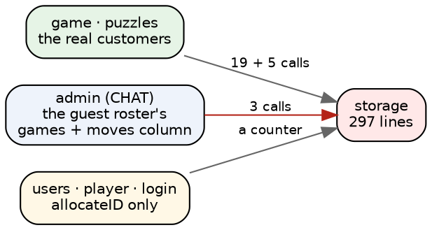
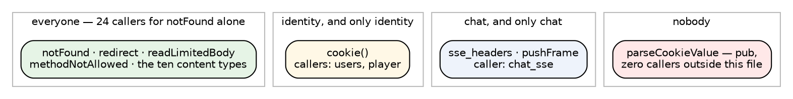
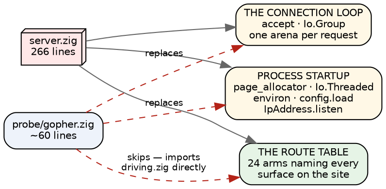

# What the two boxes actually share

The last survey listed nine modules as "the small shared infrastructure —
788 lines between them, no shared state, no reason not to have two copies."
That list was assembled by reading names and guessing. This one is a script
that walks every `@import` in all 63 modules, sorts the importers into the chat
side and the page side, and keeps only what both sides reach.

The answer is smaller than 788, larger than 788, and in a different place.

**Seven modules are imported from both sides. Four of the nine I named are not
shared at all, and the biggest genuinely-shared one is not on my list.**

## The measurement

```
 lines  module           chat pages  other importers
   774  markdown            4     3  markdown_bench markdown_hostile_probe markdown_regression_test
   297  storage             1     2  config login player users
   183  http               13    13  login player server users
   141  mem_meter           2     2  server
    98  edge                3     1  http server
    45  timefmt             4     1
    35  html                8     5  chrome login player
  1573  TOTAL
```

And the four that are not shared, despite being filed as infrastructure:

| module | lines | who actually imports it |
|---|---|---|
| `chrome` | 144 | chat, chat_page, chat_links, docs, images, code, recent, settings — **chat only** |
| `conv` | 30 | chat, chat_page — **chat only**, and it imports `chat_store` |
| `brand` | 38 | server — **pages only** (`/images`, the binary's own brand assets) |
| `config` | 82 | server — **neither**; it is process startup |

`chrome.zig`'s own first line says what it is: *"the chat-subsystem page shell
— the one shared chrome that wraps every authenticated sub-nav page."* It says
chat in the docstring and it sits in the infrastructure bucket. `conv.zig` is
worse in the useful way: it is a module I called shared that imports chat's
store. Neither is a design problem. Both are `links.zig` again — a file in the
wrong drawer, and moving them is bookkeeping.

That is 212 lines I claimed both boxes would carry that only one box wants.

## The one I missed

`storage.zig`, 297 lines, is the game store: puzzle sessions and Lyn Rummy
boards on disk. It is emphatically a page-side module — and `admin.zig`, which
is chat's, reaches into it three times.



Two different reasons, and they want different answers:

- **`admin` wants to display Lyn Rummy stats.** That is a genuine feature
  crossing the line, exactly like blog comments on chat's bus. Once the boxes
  separate, the roster either drops the games column or fetches it over HTTP.
- **`users`, `player` and `login` want `allocateID`** — "read a number from a
  file, add one, write it back." A twenty-line primitive that happens to live
  in the game store because the game store needed it first. It should be its
  own thing, and then identity stops importing the game store at all.

I filed `storage` under identity in the last survey because the identity
modules import it. They import twenty lines of it.

## `http` has a line drawn inside it, like `markdown` did

183 lines, 13 importers on each side — the most genuinely shared module in the
codebase. But the sharing is not uniform:



The Server-Sent Events half — the headers plus `pushFrame`, and the careful
two-flush comment explaining why the order matters — has exactly one caller in
the whole codebase, and it is `chat_sse.zig`. `cookie()` has exactly two, and
both are identity modules. `parseCookieValue` is `pub` and nothing outside
`http.zig` calls it.

This is the same shape `markdown` turned out to have: a module whose name
reads as one thing, with the seam already cut inside it by whoever was
thinking about the problem rather than about deployment. The difference is that
`markdown` named its two halves (`render` / `renderTrusted`) and `http` did not.

## Only one of them cannot cross

Of everything in the shared set, exactly one module fails to work on a machine
with no operating system, and it is `config.zig`: it takes a
`std.process.Environ.Map`, reads `GOPHER_CONFIG` out of it, and opens a file at
a path the environment named. There is no environment on bare metal and no
path until a volume is mounted.

Everything else crosses untouched. `edge`'s rejection counters are atomics, and
atomics are fine with one thread. `mem_meter` wraps whatever allocator it is
handed. `timefmt` is arithmetic — Howard Hinnant's civil-date conversion, which
exists precisely *because* the game and chat both needed it and were carrying
private copies. `html` is thirty-five lines of escaping.

## The obstacle is not in the shared set

Here is the thing the survey was really for, and it is not one of the seven.

`server.zig` is 266 lines doing three unrelated jobs:



The bare-metal kernel already proves the shape. `probe/gopher.zig` replaces the
startup (virtio, DHCP, a TCP listener, `Io.mount` on a FAT16 volume) and the
connection loop (one `std.http.Server` over a reader and a writer) in about
sixty lines — and then **skips the route table entirely** by importing
`driving.zig` and calling `driving.handle` directly. That works for one page.
It does not work for chat, which is twenty-four arms and a bus.

So the cut that matters is not between chat's modules and the pages' modules.
It is inside `server.zig`, between *how this process starts* and *what this
site serves*. A route table that is a function of `(request, io, alloc, bus)`
and nothing else can be called from a Linux `main` or from a kernel's `kmain`.
Today it cannot, because it is welded to the thing that owns the socket.

## What I would do

1. **Move `chrome` and `conv` into the chat bucket, and `brand` into the pages
   bucket.** Bookkeeping, no behaviour change, 212 lines stop pretending to be
   shared.
2. **Lift `allocateID` out of `storage`** into its own small module. Identity
   stops importing the game store; `storage` goes back to being the pages'.
3. **Name `http`'s halves** the way `markdown` names its two — or split the SSE
   half out, since it has one caller. Delete the `pub` on `parseCookieValue`.
4. **Split `server.zig` into a router and a host.** This is the one that
   actually unblocks running chat on metal, and it is worth doing even if that
   never happens: a route table you can call is a route table you can test.
5. **Decide `admin`'s games column** — the same product question as blog
   comments, now with a second instance.

`config` needs no decision yet. When the chat box boots itself, it will read its
roots from somewhere that is not an environment variable, and that is a
five-line module on the metal side, not a change to this one.

## The short version

- **Seven modules are shared, not nine, and they total 1,573 lines** — more
  than double what I said, because I missed `storage` and counted only one of
  `markdown`'s six files.
- **`chrome`, `conv` and `brand` are not shared at all.** Two belong to chat,
  one to the pages. Same misfiling as `links.zig`.
- **`storage` is shared for two unrelated reasons**: admin displays game stats
  (a product decision) and identity borrows a counter (a twenty-line lift).
- **`http` has an internal seam** — SSE with one caller, cookies with two, and
  one dead `pub` — exactly the shape `markdown` had.
- **`config` is the only module in the set that cannot cross** to a machine
  with no operating system.
- **None of that is the obstacle.** `server.zig` is: 266 lines welding process
  startup to a 24-arm route table. The kernel already replaces the startup in
  sixty lines and dodges the routing by calling one page directly.
