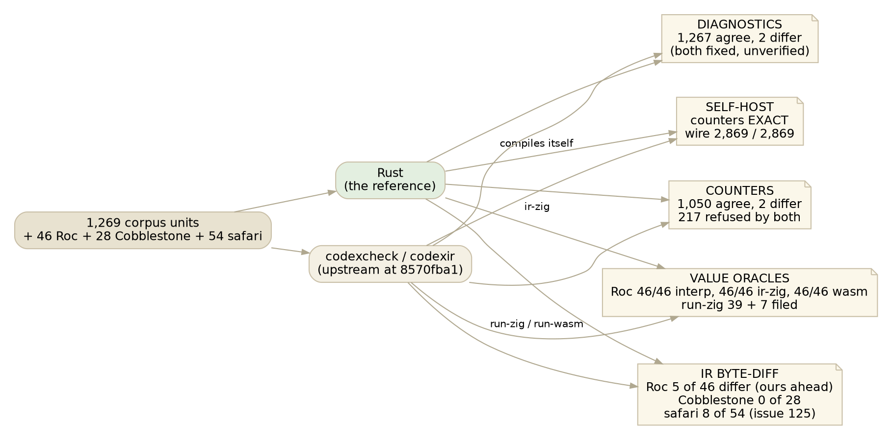

# Where Rust stands against upstream

*2026-09-11, afternoon. The numbers as they are today, every one of them
re-run this morning, and then the gaps that are still open with a name on
each.*

The question is simple and has four different answers depending on which
instrument you hold up: how far is the Rust compiler from Cobblestone's, and
in which direction? Every instrument below is run from the same pins: the
corpus and the oracles at `8570fba1`, the Roc, Cobblestone and safari units in
their frozen state, and our compiler at `3044651` on `zonk-and-default`,
with one commit after it (`e8b479d`) that the last gate run has not yet
seen.

## The four numbers, and what each one can see

**Diagnostics: 1,267 agree, 2 differ, zero invented.** The corpus check gate
runs both checkers over every corpus unit and compares the error count and
the first CDX code. Two days ago this stood at 1,107 agree; the 160 that
closed were the effects axis, the proof normalizer, the resolver's rules, the
chapter scoper, narrowing, punctuality, the cost model, the class rules, and
the parser's own refusals with upstream's codes. The two left are one unit
each with a `.` beginning a line, where upstream reports the same CDX1071
twice because every postfix layer of its expression parser reaches the same
dot. That is fixed in `e8b479d`, verified on the two units and on 400 clean
ones, and chain 14 is running now to say whether the gate reads 1,269 / 0.

Zero invented matters more than the count. Of the 1,269 units, 217 are
upstream's negative tests, programs the compiler must reject, and the gate
now says we reject each of them with the same first code. A checker rule
that raises is only shippable through this gate, because the well-typed
corpora cannot see an invented error, and every one of this week's rules
went through it.

**Counters: 1,050 agree, 2 differ.** The counter gate compares the checker's
mint counters, next type-variable id, next row id, and the number of typed
expressions, on every unit the oracle accepts. Yesterday morning this was
1,036 / 16. The eleven that closed today were, each, one cause read off the
oracle with a matrix of minimal units: upstream's type-class desugaring
(derived Show/Eq/Ord definitions, dictionary parameters and call-site
dictionaries, and the primitive `__show_Integer/Boolean/Text/Real` wrappers a
chapter gets the moment one definition takes a derived dictionary), a
class's own name read past its superclass, the bare `Integer wrapping`, unit
conversions, effect operations the builtins already bind, and five builtins
whose declared types our generated table could not spell, unsized vectors
among them. Both of the two that remain are two variables short and both
are now localized: nrf52840-drivers is a section title containing the words
`instance ID)` that upstream's class scanner reads as an instance
declaration and synthesizes a dictionary for; edge-mesh-planes is one
definition, `update-session-resolved`, a record literal with eleven fields
inside a recursive list walk, not yet read.

**Self-host: exact.** The compiler compiles upstream's compiler, 2,869
definitions, and the counters and the wire agree byte for byte. This is the
regression net and no more: it has almost no real literals, no nested
patterns, no Text literal patterns, and it stayed exact through every hole
the other instruments found this week.

**The IR byte-diff: ahead on Roc, level on Cobblestone, ahead on safari.**
Our IR against codexir's, frozen per unit. Cobblestone's 28 own programs are
byte-identical. Five of the 46 Roc ports differ, and each is a place our IR
carries a type where upstream's leaves a variable: the empty-list orphan
(`roc-alias-empty`), the no-payload constructor of a polymorphic sum
(`roc-poly-nopayload-variant`), and the three iter units, where a closure
field's parameter carries the applied argument rather than the record
declaration's parameter. Eight of the 54 safari units differ on one bit of
a real literal, ours correctly rounded, upstream's hosted parser
double-rounding (issue 125, fixed on their bare metal, not yet in the
plugs). Every one of the thirteen is filed or sent: COMPILER-74 and PRs 139,
140, 141 on the Roc side, issue 125 on the safari side.

**The value oracles: the Roc ports say the IR is right.** All 46 Roc programs
print Roc's own answer through the interpreter, through the zig plug fed OUR
IR, and through the wasm plug. Fed upstream's IR, the zig plug matches 39 and
refuses or misprints 7, every one filed under the PRs above and none of them
ours. All 28 Cobblestone programs match through the zig plug. This is the
instrument the whole reference decision rested on: two front ends can agree
on a wrong answer, and a plug can pass a program it should refuse, but a
mature compiler's expected value for a program written to probe a type
corner is not something both sides drift into together.

## What is still open

Each of these is a gap we know the shape of. None is hidden behind a green
number.

- **Generalization.** A definition used at two types, `my-id (x) = x` at
  Integer and at Text: upstream rejects at check, we pin the first use and say
  nothing when the second cannot compile. This is phase 3 of the Roc
  curriculum and the largest open piece of the engine. The polymorphism ports
  so far (`roc-poly-closures`, `roc-poly-capture-id`) pass because they use
  each generic at one type.
- **The driver's policy on a rejected program.** The checker can say no, and
  the check gate proves it says no in the same places upstream does, but the
  IR pipeline still lowers and emits when the checker raised, and `codexrun`
  never asks the checker at all. Upstream halts. This is a decision, not a
  bug, and it is unmade.
- **Bidirectional checking** (phase 2 of the curriculum): an expected type
  flowing down into an empty list, a lambda, a constructor. Today these work
  through unification after the fact; the ports that would force an explicit
  check mode are not written yet.
- **Two constructs lowering refuses:** `lazy` and vector patterns. Three of
  1,269 corpus programs, unchanged since the previous essay.
- **The unit wire.** unit-smoke's IR differs from codexir's in the
  `__unit-N` lets that wrap a unit-typed value. Counter-exact, wire
  different, an arms matter.
- **Four builtin types the generated table cannot spell:**
  `run-process-full` (a record type with inline fields) and the three
  session-channel operations. No corpus unit's counters depend on them; the
  first will matter the day a desk unit reads a field of a process result.
- **Two counter units** named above, both two variables short.
- **Two things learned about upstream and not yet sent:** the section-title
  instance scan, and the doubled CDX1071. The first is a defect worth a row;
  the second is only a curiosity.

## What the week changed in the method

Every one of today's eleven counter closures came from the same move: build
four or five programs of a few lines each, run both checkers, and read the
delta as a function of what changed. The primitive-wrapper rule was invisible
in the real unit and obvious in a six-line one, where it showed as a constant
cost per chapter that did not depend on the body, the type variable, or how
many definitions asked for it. The oracle's own binding list then named the
wrappers. Nothing in this was curve-fitting a count; each fix is upstream's
rule, cited, and the counter agreeing is the check that the rule was read
correctly.

The other thing the week settled is which instrument to trust for what. The
byte-diff is a net; the counters are a very fine net for the checker; the
diagnostics gate is the only one that can see an invented error; the Roc
ports are the only ones that can see both front ends being wrong together.
The plug is a type oracle with holes, and the holes it has are filed.

| repo | branch / revision | role |
|---|---|---|
| rust-codex-compiler | `zonk-and-default` `3044651` (+ `e8b479d`, chain 14 running) | the reference |
| cobblestone-u58 / `~/codexir` | `8570fba1` | upstream's checker and IR, the oracles |
| cobblestone-curated-tests | `94c470a` | Roc 46, Cobblestone 28; frozen IRs and filed gaps |
| safari-codex `units/` | 54 exported specs | the third corpus |
