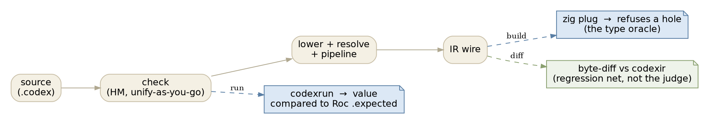
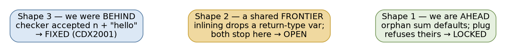

# Where the reference stands

A short while ago we made a real decision: the Rust compiler stops being a
byte-for-byte *copy* of `codexir` and becomes the **reference** for well-typed
Codex IR. [Being the reference](/notes/being-the-reference.md) argued that call
as a trade — what it frees, what it still binds, what we'd have to replace. This
is the reckoning: with the decision made and a batch of work behind it, where do
we actually stand?

The one-line answer: the decision is holding, it has already paid for itself once
in a way I did not expect, and the safety net we worried about losing is still
green.

## What the decision actually changed

Before, one oracle judged everything. `codexir` — the same compiler stopped at
the IR wire, built from our own u58 candidate — was the gold, and correctness
*was* byte-identity to it. That is a wonderful regression detector and a terrible
ceiling: it means the best we can ever be is exactly as good as the thing we
copy, including where that thing leaves a type unresolved.

Now correctness is judged by **behavior**, through two oracles, and byte-identity
is demoted from "the definition of right" to "a regression alarm we expect to
trip on purpose sometimes."

- **The value oracle is `codexrun`** — our own interpreter — checked against the
  Roc ports' recorded `.expected` output. Same program, same answer: that is the
  golden invariant that keeps internal boldness safe.
- **The type oracle is the zig plug.** It reads our IR and *refuses a hole* — a
  type variable that never got resolved is a program it will not build. So "did
  we resolve every type we should have" gets an unarguable yes/no from a tool we
  do not control.
- **The byte-diff to `codexir` is kept**, but its job changed. It is no longer
  the arbiter of correct; it is the cheap, total detector that tells us *a
  definition moved* — and then we decide, deliberately, whether that move was an
  improvement or a regression. That decision is the new cost, and it is the cost
  [being the reference](/notes/being-the-reference.md) warned we were signing up
  for.

Underneath, the machine that does the resolving is the one the
[node-by-node essay](/notes/how-types-reach-every-node.md) walks through: a
shared substitution table, `fresh`/`unify`/`deep_resolve`, and — new on this
branch — an explicit, named **zonk-and-default** phase that defaults a
definition's genuinely unconstrained variables at the end of its check, instead
of leaving them for something downstream to trip over.

## What the discovery loop found

With the two oracles in place, the way to make progress is not to read code and
reason — it is to feed the compiler small programs whose answers are unarguable
and watch where the oracles disagree. That loop sorted every divergence into
three shapes, and the sorting was the finding
([the full account is here](/notes/three-shapes-of-divergence.md)).

- **Shape 3 was the one that mattered, and it inverted my sense of where we
  stood.** We thought the risk of being the reference was *over*-reaching. The
  loop found the opposite: our checker was quietly *under*-reaching. `n + "hello"`
  produced `check-errors 0` — the checker did not miscount the error, it did not
  *see* one — and left the interpreter and the plug to discover the program was
  broken. The cause was reasonable and load-bearing and false: "a `false` out of
  a partial unifier is our ignorance, not the program's fault" is exactly right
  for the self-host corpus the checker grew on, where every program is well-typed,
  and exactly wrong the moment you feed it a bad one. **A reference for well-typed
  IR has to be able to say NO**, and ours could only shrug. That is fixed now: a
  unify failure between two fully concrete types of different heads raises
  `CDX2001`; everything with a variable still on it stays the gap it was. I did
  not argue it was safe — I measured it (an env-gated log of every cross-head
  conflict over the self-host, the curated 28, the 29 Roc ports: zero on
  well-typed code once same-head integer-range mismatches were excluded), then
  shipped it, and the byte gate stayed identical.

- **Shape 1 is the decision working as designed.** `is-some None` has an orphan
  type variable no context pins; our zonk-and-default resolves it and our IR
  builds and runs, while upstream leaves it free and its own plug refuses the
  program. Where we resolve a type they leave open, *ours is the correct one* —
  and the proof is that ours builds where theirs will not. Locked as tests so it
  cannot silently regress.

- **Shape 2 is the honest open frontier.** When a polymorphic helper is inlined,
  its return-type variable can slip into the caller uncaught — inlining recovers
  variables only by matching parameters to arguments, and a variable that lives
  only in the return type has nothing to match. Both we and upstream stop here.
  The tempting fix — default any leftover variable after the pipeline — I tried,
  and it turned the byte gate red on 59 definitions: the self-host has
  *monomorphic* definitions whose bodies legitimately carry variables `codexir`
  keeps, so "leftover variable means orphan" is false. I reverted it. The real
  fix needs the check phase's mint-provenance carried forward, or the expected
  type flowed down into the inlined body — not a blunt sweep. Naming why the easy
  fix is wrong is itself progress.

## The safety net, in numbers

The thing [being the reference](/notes/being-the-reference.md) was most anxious
about was losing the free, total regression detector. We didn't. As it stands on
the `zonk-and-default` branch:

- **Self-host gate GREEN**: all five checker counters exact, and the IR wire
  identical on 2,869 of 2,869 definitions — the compiler compiling itself, byte
  for byte, *after* all of the above landed. The CDX2001 change moved no IR byte
  because diagnostics are never read by lowering or emit.
- **228 unit tests**, including the shape-1 lock and three that pin the CDX2001
  distinction (a concrete head mismatch errors; a range mismatch does not; a
  mismatch with a variable stays a gap).
- **Roc: 29 of 29** through the plug; the value oracle agrees end to end.

So we bought the freedom to diverge *and* kept the net. The one place we spent
the net deliberately — shape 1 — we replaced with tests, which is exactly the
trade the essay said we'd have to make: where you stop grading by byte-identity,
you owe a behavioral test in its place.

## What being the gold standard demands next

The decision is not a state, it is an obligation, and it has a to-do list.

- **Shape 2, properly.** Carry the checker's mint-provenance past the pipeline,
  or make inlining type-aware by flowing the expected type down. Either puts us
  ahead the way shape 1 already is, on a case where the whole language currently
  stops.
- **The remaining phases.** Bidirectional checking and generalization/
  monomorphization are still ad-hoc where they exist. The curriculum orders the
  Roc files by which phase each one forces; the next break tells us which to make
  explicit.
- **A driver-level policy for `check-errors > 0`.** The checker can say NO now,
  but `codexrun` is type-erasing and still runs an ill-typed program to a runtime
  error. Deciding that the driver refuses a program the checker rejected is a
  separate, unmade call — and being the reference eventually means making it.
- **The discipline, every time.** The shape-3 win was not the three-line code
  change; it was measuring safety before shipping. Every future divergence from
  `codexir` has to clear the same bar: proven safe on the corpora, or backed by a
  test that replaces the byte-match we gave up. That discipline is what keeps
  "reference" from decaying into "we changed it and hoped."

We set out to stop copying and start being correct. One decision later, the
clearest evidence it was right is that the loop it enabled immediately caught the
compiler being *wrong* in a direction we weren't even looking — and the net we
were afraid to lose held while we fixed it.

