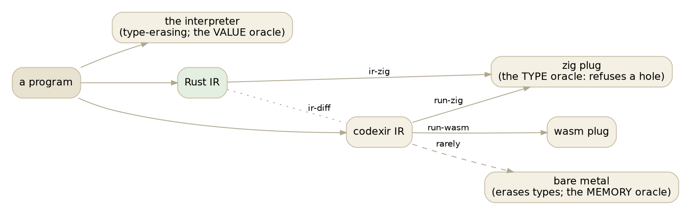

# Where typed IR stands

*2026-09-10, evening. A lay of the land, written while a long rung runs. Less
a report than a set of positions worth arguing about.*

Two days ago we decided the Rust compiler is the reference for well-typed IR
rather than a copy of upstream's. This is what that has turned up since, sorted
by who is ahead, and then the more interesting question: where might both be
wrong, and how would we know?

Every arrow is a comparison we can run in seconds, and no single one is an
oracle for everything. The interpreter grades values and cannot see a type.
The zig plug grades types and, we learned this evening, has holes of its own
below the IR. Bare metal is authoritative about memory and identity and erases
the very thing we are asking about. Agreement between Rust and codexir is a
regression net and nothing more: two front ends can agree on a wrong answer,
and this week they did, on a real literal for two hours and on nested patterns
for as long as those ports existed.

## Where Rust leads

Each of these is a place our IR carries a type upstream's leaves as a hole or
gets wrong, backed by a test on our side and, where it fits, a PR on theirs.

- **An unconstrained variable is defaulted at the end of a definition's
  check** (zonk-and-default). Upstream never resolves it; the plug refuses the
  program. Registered upstream as COMPILER-74 with the specimen
  `list-length (make-empty 0)`. Two Roc ports sit on it.
- **A helper's return-type variable takes the call site's type when inlined**
  (shape 2). Sent as PR 139; upstream's copy now agrees with itself but still
  refuses, because of the point above.
- **A record field's expectation carries the applied arguments, not the
  declaration's parameter.** Rust never had this bug because its lowering
  reads what the checker recorded rather than re-deriving from declared types.
  Sent as PR 140; its census moved six programs, two of them class dictionaries
  upstream had been circling for weeks.
- **A concrete-vs-concrete type conflict is CDX2001**, not a silent gap. Upstream
  already did this; we caught up, and being the reference means saying no.
- **Real literals round correctly.** Upstream's hosted parser double-rounds
  (issue 125, fixed on their bare metal, not yet in the plugs). Eight safari
  units differ from upstream's IR on exactly this and will close when Update 58
  lands.

## Where Cobblestone leads

Honest inventory, because the essays so far have mostly told the other story.

- **Generalization.** `my-id (x) = x` used at Integer and Text: upstream
  rejects at check, we pin it to int-default and then say nothing when the Text
  use cannot compile. Two honest answers exist and we give neither. This is
  phase 3 of the curriculum and the largest open piece of the engine.
- **The driver's policy on a rejected program.** Our checker can say no now,
  but `codexrun` runs the program anyway. Upstream halts. An unmade call.
- **Chapter-scoped names.** Upstream mangles a definition name that appears in
  two chapters; we look up by name and refuse `rsa-verify` and `edge-mesh-mint`.
  Two units, deferred deliberately, still owed.
- **Diagnostics we do not raise.** CDX2068, CDX6002 on ten punctual units,
  CDX3002. Refusals with a reason are inventory; these are the inventory.
- **The 35 counter families.** Induction forms where we over-mint, the desk
  rows, fork/par, class deriving. Parked on purpose while we validated the
  Update, and still parked.
- **Constructs we do not lower at all.** `Lazy`, vector patterns. Three of
  1,269 corpus programs.
- **Two hundred and seventeen programs both front ends refuse**, and that is
  the right answer: read this evening, they are upstream's negative tests,
  programs the compiler must reject. Fifteen undeclared effects, thirty-odd
  linear-value misuses, nine parse resyncs, type mismatches, circular proofs,
  a text literal open at end of line. The question that matters for them is
  whether we refuse with the *same diagnostic*, and that is the corpus check
  gate's number, 1,096 agree and 173 differ at the last run. The 173 are the
  inventory, not the 217.

## Where both may be wrong

This is the section the reference decision was really about. Once the
byte-diff is a net rather than a judge, the question "who is right" needs an
oracle that is neither front end, and we have exactly two: the interpreter for
values and the zig plug for types. Both have limits that this week made
concrete.

**The plug is the type oracle and it had holes below the IR.** Nested
constructor patterns were compiled as wildcards by both hosted plugs. The IR
was right on both front ends; the interpreter was right; the plugs agreed with
each other and were wrong together. Nothing above the plugs could have seen
it, and the only reason it surfaced is that a Roc port's expected value
disagreed. A type oracle with a hole is worse than none, because it passes
programs it should refuse.

**Agreement can be accidental.** A first-batch port matched a three-deep nested
pattern and printed the right answer on every arm, because a compiler that
reads the nested part as `_` still takes that arm for that input. It was green
for an hour. The fix was two more inputs that must fall through. The general
form: **every unit that exercises a discriminating construct needs an input
the construct must reject.** We do not have that discipline and we should.

**The self-host is blind to whole classes.** It has almost no real literals, no
nested patterns, no Text literal patterns, no polymorphic record literals with
closure fields. It is byte-exact through the zig plug and it was byte-exact
while all of those were broken. Its strength, 2,869 definitions of the
compiler's own idiom, is also exactly its blind spot: it tests the language the
compiler's author writes in.

**The counters are exact and prove less than they seem.** Substitution counts
and mint counts did not move when real literals stopped typing as `error`,
because unification with `error` costs what unification with `real` costs.
Exact counters were never sufficient; this week they were not even sensitive.

**And things we have not looked at.** Effect rows on the wire have had one
finding and no corpus aimed at them. Linear types have a gate and no Roc
whetstone, because Roc has none. Records with `revised` and `__record-set`
spines. The `noexpect` marker, which COMPILER-32 says still reaches the wire
from `lower-lazy`. Each of these is a place where both front ends could be
carrying the same wrong type and no arm would say so.

## The Roc ports

Forty-six, up from twenty-nine this morning. Grouped by what happened:

| batch | ports | what they found |
|---|---|---|
| the original 29 | closures, iterators, aliases, folds | alias-empty (COMPILER-74); the three iterator ports (PR 140); two zig plug discards (PR 138) |
| today's first ten | closure-returning shapes, recursive sums through lists and records, mutual recursion, a match | nothing: green on every arm, both front ends agreeing |
| today's seven | nested tags, multi-payload, `when` inside arithmetic, captures, or-patterns, a polymorphic builtin in a `let`, a no-payload variant | the nested-pattern miscompile in both plugs; one more COMPILER-74 specimen |

Two things stand out. The curriculum's ordering did what it was for: the phase
2 and 3 files (recursive data, polymorphism, match lowering) are where the
finds came from, and the first ten going green was not a waste, it is the
floor we now know the closure and recursive-sum territory stands on. And the
rate is not uniform: Roc's *targeted* cases, the ones named for a Roc issue or
a regression number, hit harder than the descriptive ones. Roc's own bug
history is a map of where a compiler for this kind of language goes wrong, and
we have ported eleven of its 167 such cases.

What Roc cannot give us: list patterns and guards (Codex has neither), string
interpolation, Roc's `inspect` format, anything about effects or linearity.
What it gives cheaply: every corner of structural typing, closures and
recursion, with a mature compiler's answer attached.

## Directions, open-ended

None of these is decided. They are the ones I would argue for.

1. **Port the targeted cases next**, `eval_regression_repros` and
   `eval_issue_tests`, before any more descriptive ones. Sixty-odd of the 167
   are portable. Each is a place Roc's compiler was wrong once.
2. **Adopt the fall-through rule for units.** A unit that exercises a `when`,
   a guard-like `if`, or a literal pattern carries an input the arm must
   reject. Cheap to add now to the 46; cheaper still to require at port time.
3. **Read the 173 diagnostic disagreements**, by code. The 217 turned out to be
   an afternoon of one minute: negative tests, refused on purpose. The pile
   worth reading is the programs where both sides refuse and name a different
   defect, or where one refuses and the other compiles.
4. **Generalization.** Probe 03 is the case. Either implement let-polymorphism
   for undeclared definitions, or reject as upstream does. The second is a
   day; the first is the phase the curriculum was written to reach.
5. **A diagnostics diff over the Roc corpus.** We compare IR and values; we do
   not yet compare which programs each front end *rejects* and why. The
   corpus check gate does this for the 1,269; the Roc units are not in it.
6. **Aim a corpus at effects.** Roc has no whetstone for rows. Cobblestone's own
   handler tests are the nearest thing; a curated set of those, run through
   the arms, would put the third axis of the type engine under the same light.
7. **Process.** Two things bit twice today and both have a rule now: a
   verification longer than a coffee break gets a heads-up first, and a verdict
   comes from an arm or a saved file, never from a shell one-liner. A third
   worth writing down: a bundle built with a fix under test lives in `~/runs/`
   beside its provenance, and the arms take it by environment variable. That
   pattern carried three PRs today without anyone confusing which plug was
   which.

The reference decision is holding, and the clearest evidence is still the
uncomfortable kind: the loop it enabled keeps catching the compiler being
wrong in directions we were not looking, including the arm we call the oracle.

