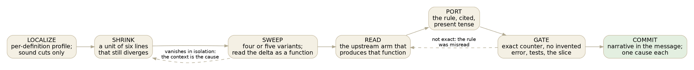

# Working against an imperfect oracle

*2026-09-11. An open-ended essay about process, written to be argued with.
The aim is to find the principles under this week's work that are general
enough to keep, and to say which ones I am unsure of.*

Steve's observation was that compiler work against an oracle is where I get
into a flow, and that the flow is not the whole story: there are disciplines
on top of it that make the work go faster still. I think that is right, and
that the two are separable. Flow is what happens when the loop is fast and
the verdict is binary. The disciplines are what keep the loop fast and the
verdict binary when the world is trying to make them slow and fuzzy. So the
essay is really about what an oracle is, what makes one usable, and what to
do when it is not.

## Two projects, two kinds of oracle

Safari had a nearly perfect oracle: a pure-zig screensaver, thoroughly
eye-tested, whose every behaviour could be captured as a value. The port to
Codex took about a calendar day, and the method was the plain one: write the
tests first, one per behaviour, from the oracle's answers, then make them
pass. The oracle did not move, the tests did not lie, and every green was a
real green. Nothing about that method is novel and nothing about it needed
to be.

The compiler work has no such oracle. Upstream is Damian's evolving project;
it is right about most things, wrong about some, and it changes under us at
every Update. There are three tools on our side (Rust, the zig plug, the wasm
plug) and none is authoritative. What we have instead is a set of
instruments, each of which is an oracle for one thing and blind to others:
the interpreter grades values and cannot see a type; the zig plug grades
types and has holes below the IR; the counters grade the checker's every
mint and cannot see whether a mint was right; the byte-diff is a net; the
diagnostics gate is the only thing that can see an invented error; the Roc
ports are the only thing that can see both front ends being wrong together.

The first principle, then, is not about any one instrument. **An imperfect
oracle is used by naming what it cannot see, and holding up a second one
there.** Most of the week's mistakes that got caught were caught by the
instrument that was not the one being optimized. The invented CDX2003 was
caught by the diagnostics gate while the counters were exact. The plugs'
wildcard bug was caught by a Roc port's expected value while the byte-diff
was clean. If you can say what a green number cannot see, you know which
other number to look at before you believe it.

## The loop

Here is the loop that closed eleven counter divergences in a day, as a
graph, because it is the thing worth generalizing.

Each node has a discipline attached, and each discipline exists because
skipping it cost something this week or last.

**Localize with sound cuts.** The per-definition profile truncates the
program at definition boundaries and runs both sides on the same bytes. That
is sound because both sides see the same truncated program; a cut in the
middle of a definition is not, and neither is a delta between two prefixes
one side refused. When the profile said "this one definition, two ids", the
search space went from a 12,000-line unit to eight lines.

**Shrink until the divergence is a function of one thing.** A six-line unit
with a class constraint and an empty body still showed the +8. That is the
moment the problem becomes tractable, and it is also the moment to resist
reading the real unit any further. The real unit has a hundred confounders.

**Sweep, and read the delta as a function.** Four or five variants, run in
one command, answered in forty seconds. The primitive-wrapper rule announced
itself as: constant per chapter; independent of the body; independent of the
type variable's name; +8 for Show, +12 for Ord, additive; independent of how
many definitions asked. That is a specification. Nobody could have written
it by reading the real unit, and once it was written, the upstream code that
produced it was a grep away.

**When the divergence vanishes in isolation, the context is the cause.** The
nrf definition was exact in every minimal unit until the section title that
followed it in the real file was included. The instinct to declare "it was
never there" is wrong; the right move is to widen the minimal unit one
neighbour at a time until it comes back. The memory note that says "a
divergence that vanishes in isolation was never there" is half right and I
would like to sharpen it: it was never *in the definition*.

**Read the arm, never curve-fit the count.** Every fix this week is a cited
upstream rule. The counter agreeing afterwards is the check that the rule was
read correctly, not the goal. The one time I nearly fit the count (adding the
wrappers as "eight ids somewhere") the oracle's own binding list said what
they were, and the rule turned out to have a subtlety the count could not
have shown: it triggers on the pre-rewrite list, but two of the three paths
mutate the definition in place, so only the third path leaves a constraint to
find. A curve-fit would have been right on the corpus and wrong on the next
unit.

**Gate before commit, and the gate is binary.** Exact or not. No invented
error on the slice or not. Tests green or not. A partial-credit gate is how
a wrong rule gets shipped, because "closer" feels like progress. The
generated builtin table got a gate of its own: the regenerated diff may
contain only the lines the change was meant to touch, and the commit is
refused otherwise. That gate caught the probe dropping effect names that the
table had carried by hand.

**One cause per commit, and the narrative goes in the message.** The source
stays present-tense and says what is; the commit says what was found and how.
Upstream rewrites narrative and breaks text-matching probes, so this is not
only taste. It is also what made the day's log easy to write: the log is
the commit messages, in order, with the numbers.

## The disciplines that are not in the loop

Some of the speed came from things outside the loop, and they are the ones
I think generalize furthest.

**Keep the loop fast, physically.** Debug builds in the fix loop, release
builds only for the gates. Minimal units in the scratchpad. The oracle's
answer in forty seconds. A chain of four gates launched in the background
with a wait on the file it writes, never on a process pattern. One heavy
job at a time, so the numbers are not noisy and the machine is not the
bottleneck. When the loop is slow the temptation is to batch changes, and
batching is how two causes get confused for one.

**Keep a ledger of filed gaps so a known gap does not re-alarm.** The arms'
`arm-gaps.tsv` says: this unit, through this arm, differs for a reason that
is filed and is not ours, and the expected value stays correct. Without it,
every run of the Roc arms would re-discover the same seven plug holes and
somebody would re-investigate them. The counter gate has no such ledger and
I think it should: nrf52840-drivers is a known upstream quirk and will show
as "diverge" forever, indistinguishable from a regression.

**Do not copy a defect into the reference.** The section-title instance scan
is a real upstream behaviour and the counter would agree if we mirrored it.
We should not. The reference is what upstream should be, and the gap is a
row to file, not a rule to port. This is the one place where "read the arm
and port it" has an exception, and the exception needs a person to decide
it. I parked it and said why rather than deciding alone.

**Write the log and the memory at the breaking point, not at the end.** Both
were updated before the last chain finished, with the chain's expected
result written as expected, then corrected to the actual when it arrived.
The session that resumed after compaction, and the one after the venue
change, both started from a log that said exactly where things stood.

**The essay is a thinking partner, not a report.** The previous essay's
inventory of "where Cobblestone leads" was the backlog this week worked
from, and writing today's found the driver-policy gap was still open, which
I had half-assumed was closed. The act of writing "what can this instrument
not see" is what produces the next instrument.

## What I am unsure of

These are the questions I would like to argue about, because they decide
what goes into the working principles.

1. **How long is a -2 worth?** Two counter units are two ids short each.
   One is upstream's defect, one is unread. The method above says the unread
   one is an hour: localize (done), shrink, sweep, read. But the marginal
   value of the last two ids is not obviously an hour's worth, and the
   generalization gap in the engine is worth days. When is exactness the
   goal and when is it a distraction? My instinct is that exactness on an
   instrument is worth having once, so that every later divergence is a
   signal, and worth abandoning if the residue is upstream's.

2. **Should counter divergences that are upstream's get the same ledger the
   plug gaps have?** I think yes, and it is a small script change: a
   `counter-gaps.tsv` beside the units, a `differs-filed` verdict, and the
   gate exits green with the row printed.

3. **Is "shrink, sweep, read" the method, or only the method for a counter?**
   It worked for diagnostics too (the CDX1071 count was two because two
   postfix layers reach the same dot, found by reading, not sweeping). For
   the wire it is harder because a wire diff is not a number, but the
   per-definition localization still applies. For a value oracle like
   safari's it collapses to "write the test". I suspect the general form is:
   find the smallest program on which the two sides disagree, and make the
   disagreement one-dimensional before reading any code.

4. **When does a minimal unit lie?** Twice this week it did: once by cutting
   the context (nrf), once by my own malformed unit (the oracle refused it
   for a missing `end` and I read the refusal as a finding for a minute).
   The rule I want is: a minimal unit is only evidence once the oracle
   accepts it cleanly, and only about the thing that varies across the
   sweep.

5. **What is the equivalent of the Roc ports for the parts of the engine
   that have no external oracle?** Generalization has Roc's monomorphization
   corpus. The driver's policy on a rejected program has nothing external;
   it is a decision. Bidirectional checking has ports not yet written. The
   principle "hold up a second oracle" needs a second oracle to exist, and
   for some of the remaining gaps the honest answer is that the second
   oracle is Steve.

## What I would put in the memory, provisionally

If we agree on them, these are the lines:

- An instrument is used by naming what it cannot see; believe a green only
  after looking at the instrument that could see its failure.
- Localize with sound cuts, shrink to a few lines, sweep a matrix, read the
  delta as a function, then read the code that produces the function. The
  count is the check that the rule was read right, never the goal.
- A divergence that vanishes in isolation has moved into the context; widen
  the minimal unit one neighbour at a time.
- A minimal unit is evidence only once the oracle accepts it cleanly.
- Every gate is binary; a partial-credit gate ships wrong rules.
- Filed gaps live in a ledger beside the units, so a known gap is a printed
  row and not a re-investigation.
- Do not port a defect into the reference; file it, park it, name the
  person who decides.
- Fix the generator, then gate the regenerated diff on the lines the change
  was meant to touch.
- Keep the loop physically fast: debug builds in the loop, chains in the
  background, one heavy job, wait on files.
- Log and memory at the breaking point, with the pending result written as
  pending.

| repo | branch / revision | role |
|---|---|---|
| rust-codex-compiler | `zonk-and-default` e8b479d | the week's subject |
| cobblestone-curated-tests | 94c470a | the arms and the filed-gap ledger |
| safari-codex | units, 54 | the perfect-oracle comparison |

